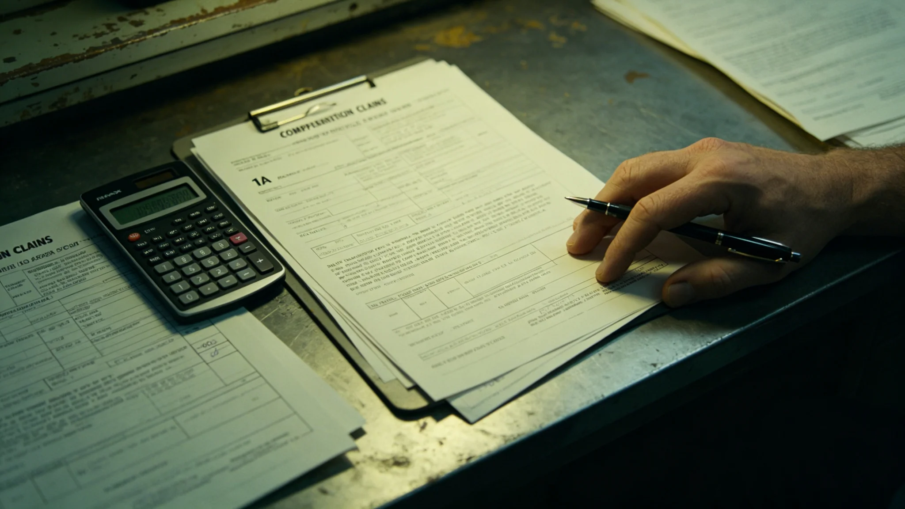

# 跨星系货运调度AI预测偏差赔偿与货主申诉制度修订公报

**发布机构**：联合体法律协调司与航道调度总署　**文件编号**：LAW-COMP-3448-001　**日期**：3448年3月28日　**文件等级**：跨星系强制

调度AI"衡陆"自3402年第七次修订（见GS-3402-01）以来，预测偏差事件逐年下降。但3450年旺季压港（见GS-3450-01）前，货主对AI舱位预测偏差的申诉长期无明确赔偿标准。法律协调司提请修订，制定本制度。

## 一、赔偿分级

| 偏差类型 | 赔偿比例 | 申诉时限 |
|---|---|---|
| AI预测舱位可用，实际不可用 | 退运费+赔运费10% | 72小时 |
| AI预测准点，实际延误超4小时 | 赔运费5% | 48小时 |
| AI预测航线安全，实际改道 | 赔工质差价 | 72小时 |
| AI误判优先级（见GS-3404-01） | 全额退运费+赔20% | 即时 |

## 二、申诉流程

| 步骤 | 时限 | 经手 |
|---|---|---|
| 货主提交申诉 | 72小时内 | 调度总署收件窗口 |
| 调度总署裁决 | 7天 | 调度总署仲裁员 |
| 不服提交法律协调司 | 7天 | 货主 |
| 法律协调司终裁 | 30天 | 法律协调司 |

全部在运货主自动适用新制度，无需重新签约。

## 三、申诉登记台账（原行摘录）

> 申诉登记台账 · 3448 · 台账编号 申-3448-全
> 3448-05　舱位预测偏差　货主：星际物流A公司　工单：申-3448-001　裁定：全额退运费+赔10%　签收：签名略
> 3448-06　舱位预测偏差　货主：鲸港货运B公司　工单：申-3448-002　裁定：全额退运费+赔10%　签收：签名略
> 3448-07　舱位预测偏差　货主：比邻星b承运C公司　工单：申-3448-003　裁定：全额退运费+赔10%　签收：签名略
> 3449-08　延误超4小时　货主：跨星系贸易D公司　工单：申-3449-004　裁定：赔5%　签收：签名略
> 3449-09　改道差价　货主：鲸港物流E公司　工单：申-3449-005　裁定：赔差价　签收：签名略
> 3450-03　改道差价　货主：星际物流F公司　工单：申-3450-006　裁定：赔差价　签收：签名略
> 3450-05　优先级误判　货主：比邻星b承运G公司　工单：申-3450-007　裁定：全额退运费+赔20%　签收：签名略
> 3450-06　旺季压港　货主：跨星系贸易H公司　工单：申-3450-008　裁定：赔15-20%　签收：签名略
>
> 全年8件，全部裁定。台账无争议栏——裁定既已签收，无人再问。

## 四、首年案例统计

| 类型 | 件数 | 赔偿 |
|---|---|---|
| 舱位不可用 | 3 | 运费+10% |
| 延误超4小时 | 1 | 5% |
| 改道差价 | 2 | 差价 |
| 优先级误判 | 1 | 20% |
| 旺季压港 | 1 | 15-20% |

3450年旺季压港（见GS-3450-01）单笔赔偿总额一千四百万，为制度建立以来最大单笔。

## 五、赔偿资金来源

赔偿资金从调度总署年度预算中列支，不向货主额外收取。

## 六、岗位按语

> 法律协调司注：赔偿制度不是为了让货主满意，是为了让调度总署不敢大意。AI出错不可怕，可怕的是出错了没人担。有了赔偿，总署才会把AI的每一个预测当回事。

---

**编制**：法律协调司　**会签**：航道调度总署
**日期**：3448年3月28日
