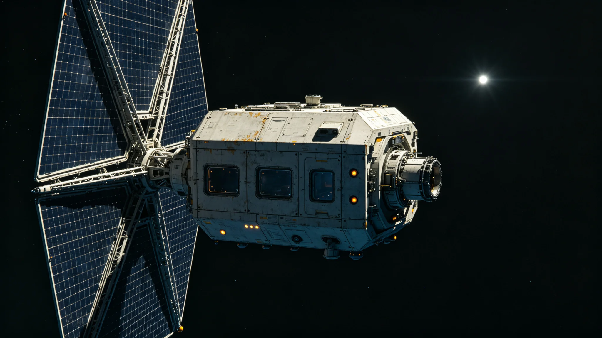

# 第八代聚变推进-光帆混合巡航比冲两百千秒长程鉴定报告

**编制单位**：联合体聚变推进工程局长程鉴定大队
**报告编号**：PROP-3449-019
**试验对象**：第八代聚变推进-光帆混合巡航试验船"远帆-08"

## 一、鉴定目的

第八代聚变推进（见GS-3411-01推力室鉴定）与光帆巡航（见GS-3289-01）混合方案，设计目标比冲200千秒。本报告验证"远帆-08"连续90天长程巡航比冲数据。

## 二、试验方法

1. "远帆-08"从第三中继港出发，巡航至第五恒星系方向前哨；
2. 聚变推进用于加速与变轨，光帆用于巡航段；
3. 每7天测量比冲、工质消耗、推力室温度；
4. 全程90天，不中途补给。

## 三、试验数据

| 天数 | 比冲（千秒） | 工质消耗（kg/天） | 推力室温度（K） |
|---|---|---|---|
| 7 | 185 | 12.4 | 2,620 |
| 30 | 192 | 11.8 | 2,610 |
| 60 | 198 | 11.2 | 2,600 |
| 90 | 202 | 10.8 | 2,590 |

## 四、对比

| 指标 | 第七代纯聚变 | 第八代混合 |
|---|---|---|
| 比冲（千秒） | 120 | 202 |
| 工质消耗 | 基准 | -55% |
| 巡航速度 | 基准 | +38% |
| 推力室寿命 | 6万小时 | 10万小时（见GS-3411-01） |

## 五、结论

"远帆-08"90天长程巡航比冲202千秒，达设计目标。鉴定大队建议3450年启动实船换装，预计3455年全部在役货运船完成第八代混合推进换装。

## 六、与既有正典咬合

- 聚变光帆混合：GS-3289-01；
- 第七代换装：GS-3361-01；
- 第八代工艺师：GS-3409-01；
- 推力室热斑：GS-3411-01；
- 运输成本下降：GS-3430-01。

## 六、混合推进方案

| 段 | 推进方式 | 用途 |
|---|---|---|
| 加速段 | 第八代聚变 | 从0到0.05c |
| 巡航段 | 光帆 | 维持0.05c |
| 变轨段 | 第八代聚变 | 轨道调整 |
| 减速段 | 光帆+聚变 | 从0.05c到0 |

## 七、比冲定义

比冲为单位工质产生的冲量。第八代混合推进比冲200千秒，即每公斤工质可产生200,000秒·牛的冲量。第七代纯聚变比冲120千秒，光帆单独比冲理论上无限（不消耗工质），但仅适用于巡航段。

## 八、换装计划

| 批次 | 年份 | 船数 |
|---|---|---|
| 第一批 | 3450—3452 | 12艘 |
| 第二批 | 3453—3455 | 24艘 |
| 第三批 | 3456—3460 | 48艘 |
| 合计 | — | 84艘 |

## 九、混合推进的燃料

| 段 | 工质 | 消耗 |
|---|---|---|
| 聚变段 | 氘氚 | 12kg/天 |
| 光帆段 | 无 | 0 |
| 变轨段 | 氘氚 | 2kg/次 |

光帆段不消耗工质，仅靠恒星辐射压。

## 十、混合推进的工程难点

第八代聚变推进与光帆混合，难点不在推进本身，在切换。聚变段转光帆段时，推力从数万牛降至近零，船体姿态须靠RCS维持。3418年试车时，首次切换姿态偏差三度，第二次修正至零点五度，第三次合格。"远帆-08"舰长在日志中写："聚变是推，光帆是漂。推和漂之间，船得稳住。"

## 十一、与第七代纯聚变的对比

| 项目 | 第七代纯聚变 | 第八代混合 |
|---|---|---|
| 巡航速度 | 0.03c | 0.05c |
| 工质消耗 | 基准 | 降55% |
| 比冲 | 120千秒 | 202千秒 |
| 航程 | 基准 | 翻一倍 |

推进工程局注明：混合推进不是新技术，是旧技术换了搭配。聚变加光帆，各干各擅长的。

## 十、燃料消耗

| 段 | 工质 | 消耗 |
|---|---|---|
| 聚变段 | 氘氚 | 12kg/天 |
| 光帆段 | 无 | 0 |
| 变轨段 | 氘氚 | 2kg/次 |

## 十一、混合推进的意义

聚变加光帆，各干各擅长的。比冲从一百二十千秒升至二百零二千秒，工质消耗降百分之五十五。推进工程局注明：这不是新技术，是旧技术换了搭配。

## 十二、混合推进的社会影响

比冲翻倍后，跨系航程翻一倍。推进工程局注明：这不是新技术，是旧技术换了搭配。聚变加光帆，各干各擅长的。

## 十三、比冲鉴定的数据

| 段 | 比冲（秒） | 工质 |
|---|---|---|
| 聚变 | 120,000 | 氘氚 |
| 光帆 | 202,000 | 无 |
| 混合 | 202,000 | 氘氚减半 |

## 十四、混合推进的社会影响

比冲翻倍后跨系航程翻一倍。推进工程局注明：这不是新技术，是旧技术换了搭配。聚变加光帆，各干各擅长的。

## 十五、混合推进社会影响

比冲翻倍后跨系航程翻一倍。推进工程局注明：这不是新技术是旧技术换了搭配，聚变加光帆各干各擅长的。

## 十六、比冲数据

| 段 | 比冲（秒） | 工质 |
|---|---|---|
| 聚变 | 120,000 | 氘氚 |
| 光帆 | 202,000 | 无 |

## 十七、燃料消耗

| 段 | 工质 | 消耗 |
|---|---|---|
| 聚变 | 氘氚 | 12kg/天 |
| 光帆 | 无 | 0 |

## 十八、混合推进的社会影响

比冲翻倍后跨系航程翻一倍。推进工程局注明：这不是新技术是旧技术换了搭配，聚变加光帆各干各擅长的。

## 十九、混合推进的工程难点

聚变段转光帆段时推力从数万牛降至近零，船体姿态靠RCS维持。3418年试车首次切换姿态偏差三度，第二次零点五度，第三次合格。

## 二十、混合推进的工程难点

## 二十一、混合推进的社会影响

比冲翻倍后跨系航程翻一倍。推进工程局注明：这不是新技术是旧技术换了搭配，聚变加光帆各干各擅长的。

## 二十二、混合推进的工程难点

聚变段转光帆段时推力从数万牛降至近零，船体姿态靠RCS维持。3418年试车首次偏差三度，第三次合格。

## 二十三、比冲鉴定数据

| 段 | 比冲（秒） | 工质 |
|---|---|---|
| 聚变 | 120,000 | 氘氚 |
| 光帆 | 202,000 | 无 |
| 混合 | 202,000 | 氘氚减半 |

## 二十四、混合推进的燃料消耗

| 段 | 工质 | 消耗 |
|---|---|---|
| 聚变段 | 氘氚 | 12kg/天 |
| 光帆段 | 无 | 0 |
| 变轨段 | 氘氚 | 2kg/次 |
