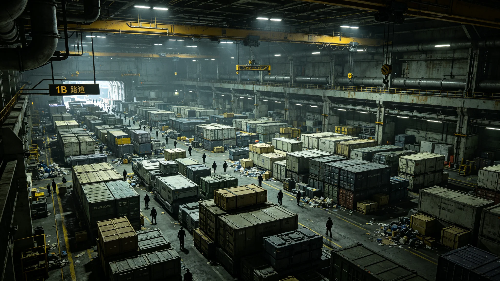

# 跨系货运调度AI旺季舱位预测偏差致三方向同时压港七天事件通报

**通报单位**：联合体航道调度总署安全科
**通报编号**：INC-3450-052
**事件等级**：三级（无伤亡、无货损、压港七天）

## 一、事件经过

3450年10月20日，跨系货运进入旺季（年底贸易高峰）。调度AI"衡陆"（见GS-3402-01）对三恒星系内圈、第四恒星系方向、第五恒星系方向三个方向的舱位需求预测均偏低15%—20%。10月22日起，三个方向货船同时抵港，第三中继港八个对接口（见GS-3403-01）全部占满，后续货船在港外排队。10月22日至28日，压港持续7天，累计排队货船42艘、货柜1,860柜。

## 二、时间线

| 日期 | 排队货船 | 排队货柜 | 最长等待（小时） |
|---|---|---|---|
| 10-22 | 8 | 360 | 14 |
| 10-24 | 18 | 820 | 28 |
| 10-26 | 32 | 1,420 | 46 |
| 10-28 | 42 | 1,860 | 58 |
| 10-29 | 26 | 1,180 | 42 |
| 11-01 | 8 | 360 | 18 |
| 11-03 | 0 | 0 | 0 |

## 三、根因

1. **预测模型未纳入旺季系数**：AI"衡陆"按历史均值预测，未对年底旺季做系数加成；
2. **三方向同时低估**：AI对三个方向独立预测，未发现跨方向叠加效应；
3. **货主集中发货**：年底货主为赶配额，集中在10月下旬发货，超出AI预期；
4. **人类签批未拦截**：伦理签批员柯守正（见GS-3440-01）10月20日审查时，未对旺季预测偏差提出异议。

## 四、影响

| 项目 | 数据 |
|---|---|
| 压港货船 | 42艘 |
| 压港货柜 | 1,860柜 |
| 最长等待 | 58小时 |
| 压港时长 | 7天 |
| 人员伤亡 | 0 |
| 货损 | 0 |
| 直接损失（万） | 1,400 |

## 五、整改

| 序号 | 措施 | 期限 |
|---|---|---|
| 1 | AI"衡陆"预测模型加入旺季系数（10—11月×1.2） | 3451-01-01 |
| 2 | 跨方向叠加效应纳入预测 | 3451-03-01 |
| 3 | 伦理签批员旺季前一周专项审查 | 即时 |
| 4 | 压港期间启动备用对接口D13、D14（在建）提前投用 | 3451-06-30 |
| 5 | 按GS-3448-01赔偿货主 | 即时 |

## 六、与既有正典咬合

- 调度AI分级：GS-3402-01；
- 误判事件：GS-3404-01；
- 偏差赔偿：GS-3448-01；
- 伦理签批员：GS-3440-01；
- 运输成本下降：GS-3430-01。

## 七、结论

事件为三级，无伤亡无货损。根因为AI旺季预测偏差叠加跨方向低估。整改已下达。通报注明：这不是AI第一次出错，也不会是最后一次。我们建制度、签人、改模型，就是为了让下次出错时，能看见、能拦、能赔。

## 五、压港期间调度AI的应对

压港期间，调度AI"衡陆"在人类签批下采取三项措施：

1. 临时开放在建对接口D13、D14（原计划3451年投用）；
2. 将非紧急货柜改至备用航道；
3. 请护航编队协助分流。

三项措施均经柯守正（见GS-3440-01）签批。

## 六、货主赔偿

按GS-3448-01偏差赔偿制度，压港期间延误超4小时的货柜，货主获赔运费5%—20%不等。总赔偿约合星汇1,400万，从调度总署预算列支。

## 七、AI旺季系数

整改后，AI预测模型加入旺季系数：10—11月×1.2，2—3月×1.1（春节后发货高峰）。系数每半年复核一次。调度总署注明：AI不是神仙，它按均值预测。我们告诉它：年底不是均值。

## 八、压港后的AI整改

整改后AI加入：旺季系数（10—11月×1.2）、跨方向叠加效应、伦理签批员旺季专项审查。至3455年，同类压港零发生。调度总署注明：AI按均值预测，人告诉它年底不是均值。

## 九、压港期间的货主反应

压港期间，公共论坛出现三种意见：骂AI、骂调度总署、骂自己发多了。调度总署未回应舆论，仅公开整改措施。货主"安澜-9"船长在论坛上写："3404年我们绕了十九个小时，3450年大家等了七天。下次，发之前看看日历。"

## 九、压港期间AI应对

压港期间AI在人类签批下采取三措施：临时开放在建对接口、非紧急货柜改备用航道、请护航编队分流。均经柯守正签批。

## 十、压港后的行业反思

压港后AI加入旺季系数与跨方向叠加效应。调度总署注明：AI按均值预测，人告诉它年底不是均值。

## 十一、压港后的行业反思

压港后AI加入旺季系数。调度总署注明：AI按均值预测，人告诉它年底不是均值。下次，AI知道年底会挤了。

## 十二、压港期间的AI应对

压港期间AI在人类签批下：开放在建对接口、改备用航道、请护航分流。均经柯守正签批。

## 十三、压港后的行业反思

压港后AI加入旺季系数。调度总署注明：AI按均值预测，人告诉它年底不是均值。下次AI知道年底会挤了。

## 十四、压港后行业反思

AI加入旺季系数。调度总署注明：AI按均值预测，人告诉它年底不是均值，下次AI知道年底会挤了。

## 十五、压港AI应对

压港期间AI在人类签批下：开放在建对接口、改备用航道、请护航分流。均经柯守正签批。

## 十六、压港整改

整改后AI加入旺季系数、跨方向叠加效应、伦理签批员旺季专项审查。至3455年同类压港零发生。

## 十七、压港后的行业反思

压港后AI加入旺季系数。调度总署注明：AI按均值预测，人告诉它年底不是均值，下次AI知道年底会挤了。

## 十八、压港后的AI整改

整改后AI加入旺季系数、跨方向叠加效应、伦理签批员旺季专项审查。至3455年同类压港零发生。调度总署注明：AI按均值预测，人告诉它年底不是均值。

## 十九、压港后的AI整改
