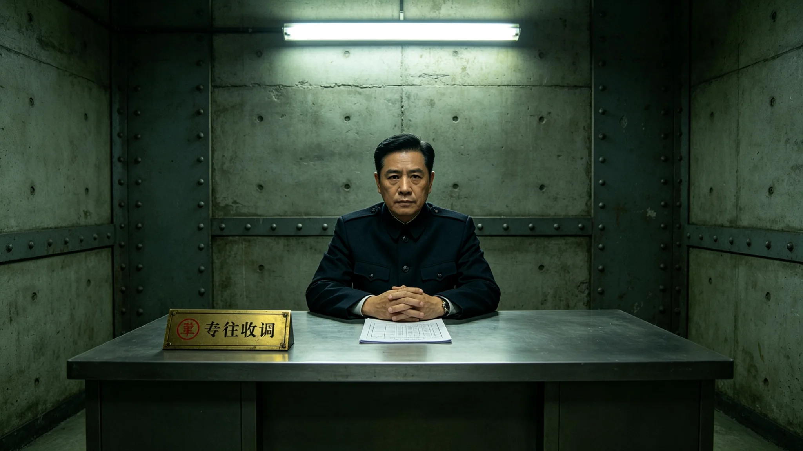

# 三恒星系文明联合体第七任秘书长骆元洲就职考勤与体检档案

**档案类别**：高级公职人员就职人事卷
**建档单位**：联合体人事档案署
**建档日期**：3451年3月1日

## 一、基本身份登记

骆元洲，男，生于3408年，鲸鱼座τ星地下城第七居住层本籍，父籍比邻星b，母籍老地球方向迁徙第三代。3430年毕业于跨星系公共行政学院深时间治理专业，3431年起历任跨星系迁徙管理署科员、副主任、鲸鱼座τ星地下城生态分局局长、联合体生态闭环总评估办公室副主任。3451年2月，经联合体公民大会跨星系差额选举当选第七任秘书长，3451年3月1日就职，任期十年（3451—3460）。

登记照附卷。登记照备注栏写：本人拒绝对登记照作任何磨皮、调色与背景替换，理由为"就职照应与就职者当日脸色一致"。

## 二、就职前三年考勤摘录

| 年度 | 应到工作日 | 实到 | 迟到 | 早退 | 病休 | 公出 |
|---|---|---|---|---|---|---|
| 3448 | 251 | 251 | 0 | 0 | 3天 | 41天 |
| 3449 | 251 | 250 | 1 | 0 | 0 | 58天 |
| 3450 | 251 | 251 | 0 | 1 | 2天 | 63天 |

考勤备注：3449年唯一一次迟到，系鲸鱼座τ星地下城深地升降机换层检修致通勤延误，考勤系统自动记录，本人未申请改判。3450年唯一一次早退，系其母病危陪护，按《公职人员亲属重病陪护规程》登记，非违纪。

## 三、就职前体检摘要

3451年2月联合体中心医院体检报告摘要：

- 身高174厘米，体重71公斤，BMI 23.5；
- 静态心率58，血压118/76；
- 骨密度DEXA：腰椎T值-1.1，股骨T值-0.9，属长期低离心重力居住者正常区间，较3445年同项目下降0.05；
- 端粒长度检测：按3448年公布的《寿命延长人群端粒基线》评定，处于同龄段中位偏下；
- 视力矫正后左眼1.0右眼1.0，长期用眼监测提示其日均屏幕读数11.2小时，已发用眼疲劳警示；
- 精神科会谈：会谈记录附卷，结论为"无任职禁忌症，建议任内每半年复查一次睡眠结构"。

体检医师签注：本人体征平稳，无拒检、无补检。其主动要求将骨密度与端粒数据一并公开，理由是"秘书长的身体应和秘书长的预算一样可查"。

## 四、签名与涂改记录

就职文书签名页附卷。签名页复印件显示：骆元洲在就任誓词"我将延续而不僭越"一句下，原有一个被划去的"开拓"二字，笔迹为其本人。档案署按《高级公职人员笔迹归档规程》将涂改处原样留存，未作替换。档案署备注：涂改处显示其在拟稿时曾倾向于"开拓"，最终改为"延续"。此涂改不影响誓词效力，仅作人格物证存档。

## 五、处分与奖励记录

就职前公开记录：

- 3437年，任迁徙管理署科员期间，因一批迁徙人口换籍材料装订错格，记工作差错一次，当年取消评优；
- 3442年，任生态分局副局长期间，辖区一段深地真菌分解链短期波动处置及时，记嘉奖一次；
- 3446年，任生态闭环总评估办公室副主任期间，因一份百年评估报告引注错引一处archive_id，作书面检讨，未记过；
- 3449年，获跨星系公共服务奖章第三级。

档案署注明：上述记录均为原始考勤、原始体检、原始签名与原始处分。骆元洲本人未要求隐去3437年差错与3446年检讨。

## 六、就职当日履职声明（笔录摘）

3451年3月1日就职宣誓后，骆元洲对联合体公民代表说：

"我今年四十三岁。按现在的寿命表，我任满十年时五十三岁，往后还有很长的在职与不在职时间。我不打算把这十年过成一个'时代'。我只做三件事：把上一代建好的闭环看住，把第三代人要接的班交代清楚，把那些今天没出问题、但五十年后可能出问题的地方找出来。"

笔录末注：其发言时长十七分钟，未提任何个人愿景口号，未承诺任何"跨越""腾飞"。议事厅现场计时显示其发言语速平稳，无明显停顿。

## 七、对其继任安排的早期签字

3451年4月，骆元洲在《第三代领导人任期轮换时间表》上签字，将本人十年任期划分为两段，每段结束前十二个月启动下任遴选。签字附言："秘书长不是职位，是一段交班。坐得越稳，越要提前把下一段路指给后人。"

档案署按《高级公职人员任内档案规程》将此卷封存，任期内每半年补录考勤、体检与处分，卸任时整卷移交联合档案馆。本卷至此建档完成。

## 八、就职首季签阅文件摘录

档案署另附其就职首季（3451年3月至5月）签阅文件摘录：

- 3451年3月12日，签阅《地下城市生态闭环千年评估立项请示》，批"准立项，按百年节奏，不赶"；
- 3451年3月28日，签阅《跨星系养老床位互认公约草案》，批"原则同意，三年过渡"；
- 3451年4月15日，签阅《寿命延长后退休制度修订草案》，批"在职比例跌破五十，不能再拖"；
- 3451年5月6日，签阅《长期居住者健康登记制度修订》，批"贴片终身不摘，数据可查"；
- 3451年5月20日，签阅《生态多样性保护名录修订》，批"少一种要写出来，不能瞒"。

签阅备注：骆元洲首季签阅文件四十四份，其中十一份批"缓办"，三份批"再议"，无一份批"速办"。档案署注明：其批语最长不超过二十字，从不写"高度重视""全力推进"一类话。

## 九、对其体检与考勤的公开说明

骆元洲就职时按其要求，将本卷附体检与考勤摘要在联合体公民门户公开。公开说明栏写：秘书长的身体和考勤不是隐私，是公共物品。本卷其余涉亲属与家庭部分按《公职人员隐私分级规程》作限阅处理。

---

**归档编号**：PER-7TH-3451-001
**建档人**：联合体人事档案署 科员 任知微
**日期**：3451年3月1日
