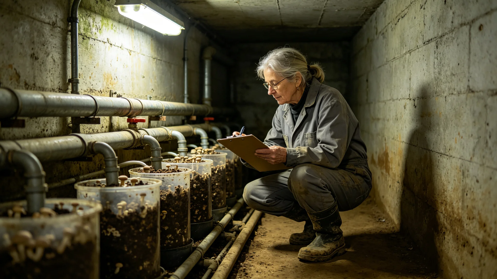

# 鲸鱼座τ星地下城生态闭环总评估首席生态官沈百合三十年巡检与体检档案

**档案类别**：技术公职人员长期履职卷
**建档单位**：鲸鱼座τ星地下城生态分局
**建档日期**：3452年6月15日

## 一、身份与岗位

沈百合，女，生于3400年，鲸鱼座τ星地下城第三居住层本籍，三代均为深地生态维护工。3422年入地下城生态分局任巡检员，3440年起任生态闭环总评估首席生态官，至3452年在岗三十年。其岗位职责为：每季度巡检地下城七居住层的真菌分解链、水培循环、伴生昆虫群落与碳氧平衡四项闭环指标，签发季度稳态公报。

## 二、三十年巡检里程摘录

| 时段 | 巡检层数 | 签发公报 | 现场采样 | 提出整改 | 被驳回 |
|---|---|---|---|---|---|
| 3422—3431 | 三至五层 | 40期 | 1200次 | 11项 | 2项 |
| 3432—3441 | 五至七层 | 40期 | 1500次 | 18项 | 3项 |
| 3442—3452 | 全七层 | 44期 | 1800次 | 22项 | 4项 |

巡检备注：沈百合三十年累计步行巡检里程约合地球赤道一圈半，全部在深地廊道内完成。其巡检从不乘坐自动化巡检车，理由为"车过的时候，真菌分解链的气味就闻不到了"。分局按规程未强制其乘车，仅为其配备了带背带的采样箱。

## 三、被驳回的整改与处分记录

沈百合任内提出51项整改，被驳回9项。档案附卷九份驳回书摘要：

- 3429年，其建议将五层一段水培营养液更换周期由十四天缩短为十天，分局以成本为由驳回；
- 3435年，其建议在七层增设一组伴生昆虫监测探头，分局以预算为由驳回；
- 3443年，其建议暂停六层一段种植架扩种，分局以扩种工期为由驳回；
- 3448年，其建议对深地真菌分解链启动第五代评估，分局以"百年监测刚完成"为由驳回。

档案署注明：3448年被驳回的第五代评估建议，于3452年由其本人再次提交，本批已获准立项（见GS-3495-01）。沈百合在两次提交之间未作任何申诉，仅在原驳回书背面用铅笔写了一行小字："再等四年。"

## 四、体检摘要（三十年关键节点）

| 年份 | 肺功能FEV1 | 嗅觉阈值 | 膝关节 | 备注 |
|---|---|---|---|---|
| 3422 | 3.8升 | 正常 | 正常 | 入职 |
| 3432 | 3.6升 | 正常 | 轻度磨损 | 十年 |
| 3442 | 3.4升 | 正常 | 中度磨损 | 二十年 |
| 3452 | 3.2升 | 正常 | 中度磨损，已配护具 | 三十年 |

体检医师签注：沈百合长期在高湿度、高真菌孢子浓度的深地廊道工作，肺功能呈缓慢线性下降，仍在安全区间。其嗅觉三十年保持正常，是分局连续三任首席生态官中唯一一位未出现嗅觉钝化者。医师备注："此人靠鼻子吃饭，鼻子三十年没坏，是闭环的运气。"

## 五、签名与签发物证

沈百合签发的124期季度稳态公报均附其手写签名。档案抽查显示：其签名在3422年为连笔，3440年后逐渐改为工整正楷，3450年后在签名下方固定加一行小字"本季度无闭环断裂"。3446年某季度，因六层一段真菌分解链短期波动，其在签名下方写的是"本季度闭环未断，已记整改"，未写"无闭环断裂"。档案署注明：这是其三十年间唯一一次未写"无闭环断裂"的季度签发。

## 六、家庭与代际

沈百合之母沈秀兰，3390—3445年在同分局任巡检员，已于3445年退休。其女闻知秋，生于3428年，现任地下城生态分局采样员。三代人均在同一分局。档案署按《公职人员亲属同岗回避规程》核查：母女二人岗位不构成直接上下级，无回避冲突。沈百合在其女入职当年的考勤表背面写："她自己考进来的，我没打招呼。"

## 七、三十年工作总结（口述笔录摘）

3452年6月，分局为其三十年履职作口述笔录。沈百合说：

"闭环这东西，你天天看，它没事。你哪天不看了，它就出事。我三十年没让它出事，不是因为我多能干，是因为我没偷懒。深地下面没有太阳，你偷懒一天，真菌就替你记一天账。我今年五十二，按寿命表还能再干二十年。我打算把第五代评估做完，把七层的伴生昆虫群落摸清，然后把位子让给我女儿那辈。我不退休，我交班。"

笔录末注：其口述时长二十六分钟，未提任何个人荣誉，未说"我热爱这份工作"。分局在场记录员备注：其说话时手里一直攥着一支采样管，管中是当日从七层采的真菌样本。

## 八、被再次驳回与再次提交的第五代评估

档案署另附3448年至3452年间沈百合与分局的往来备忘录七份。3448年首提第五代评估被驳后，其每年6月重复提交一次，四次年签原文均为同一行："建议启动深地真菌分解链第五代评估。"3452年第五次提交，分局批准立项，立项文号ECO-5TH-3452-001。沈百合在批准书背面写："四年。它没变坏，是我多等了四年。"

分局注明：四次年签均由其本人亲签，无一次委托代签。

## 九、巡检工具箱物证

沈百合三十年使用的巡检工具箱附卷。箱内物品：采样管十七支（其中三支标签已磨白）、背夹式录音器一台（电池更换记录二十一次）、便携嗅探管两套、手写巡检本十一册。巡检本内页显示：其每到一段掌子面，必在本上记一行日期、一层号、一句气味描述。最早一册记于3422年，最后一册记于3452年，笔迹由潦草渐趋工整。

---

**归档编号**：ECO-B7-3452-007
**建档人**：鲸鱼座τ星地下城生态分局 档案员 顾时雨
**日期**：3452年6月15日
