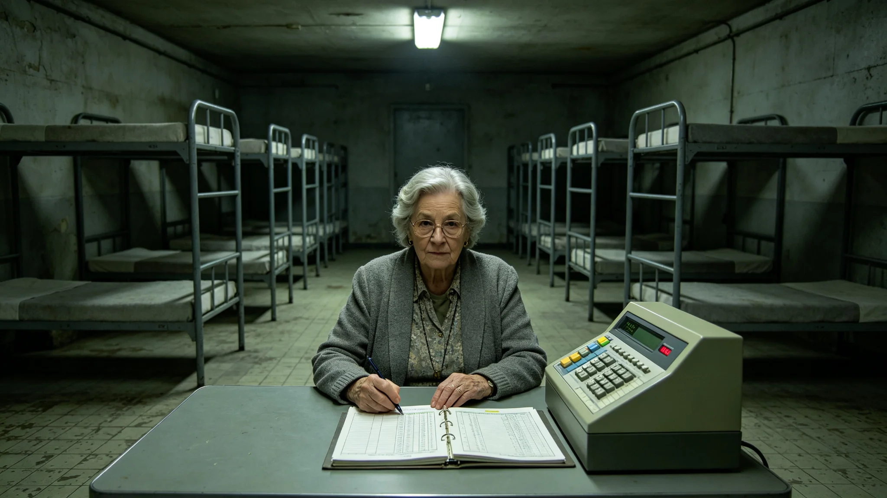

# 跨星系养老体系首任总管卫慕三十年舱位调度与体检档案

**档案类别**：公共服务公职人员长期履职卷
**建档单位**：联合体跨星系养老事务总署
**建档日期**：3453年9月20日

## 一、身份与岗位

卫慕，女，生于3395年，比邻星b轨道养老环本籍，父籍老地球。3418年入联合体养老事务总署任舱位调度员，3433年起任跨星系养老体系首任总管，至3453年在岗三十五年。其岗位职责为：统筹三恒星系各养老环、养老舱段与跨星系养老航线的床位调度、陪护人力分配与生命支持维护排程。

## 二、三十年舱位调度数据摘录

| 时段 | 在管床位 | 年调度人次 | 陪护人力 | 床位空置率 | 投诉 |
|---|---|---|---|---|---|
| 3418—3427 | 1.2万 | 约3千 | 400人 | 8.1% | 年均11起 |
| 3428—3437 | 3.8万 | 约1.2万 | 1300人 | 5.4% | 年均7起 |
| 3438—3453 | 9.6万 | 约3.4万 | 3200人 | 3.2% | 年均4起 |

调度备注：卫慕任内推动养老床位从"按星区分"改为"按健康状态分"，将低活力、中活力、高活力三类老人分舱居住。此改革于3436年试点，3441年全推，床位空置率从8.1%降至3.2%。其本人在改革备忘录上签字时附言："老人不是货物，不能按籍贯堆；按身体分，他们才互相认得。"

## 三、处分与奖励记录

- 3424年，任调度员期间，因一批跨星系养老航线舱位错配，致十二名老人误乘，记工作差错一次；
- 3431年，推动低活力老人集中舱试点，记嘉奖一次；
- 3439年，因一份养老床位年度预算漏列一项陪护人力成本，作书面检讨；
- 3447年，获跨星系公共服务奖章第二级；
- 3451年，其主管的养老航线一次生命支持故障（见GS-3474-01），无人员伤亡，其主动在事故复盘会上作首份检讨，未被记过。

档案署注明：3451年事故复盘会上，卫慕首份检讨未推给下属，其原话为"床是我排的，生命支持是我签的，出了事我先认"。

## 四、体检摘要

| 年份 | 年份 | 骨密度T值 | 静态心率 | 备注 |
|---|---|---|---|---|
| 3418 | 入职 | 0.0 | 62 | 正常 |
| 3433 | 任总管 | -0.6 | 60 | 轻度下降 |
| 3443 | 十年总管 | -1.0 | 59 | 配护具 |
| 3453 | 三十五年 | -1.3 | 57 | 端粒中位 |

体检医师签注：卫慕长期在0.65g离心重力养老环工作，骨密度下降速率符合长期居住者基线。其端粒长度按《寿命延长人群端粒基线》评定为同龄段中位。医师备注："此人调度了一辈子别人的床位，自己的床位还排得很满。"

## 五、签名与调度单物证

卫慕三十年签发的养老舱位调度单均附其手写签名。档案抽查显示：其签名在3418年为紧凑小楷，3433年后逐渐放大，3450年后在每张调度单右下角固定画一个极小的圆圈。档案署询问其圆圈含义，卫慕答："那是一张床。每张调度单右下角都该有一张床，提醒自己排的是人，不是数字。"

## 六、家庭与代际

卫慕之母卫兰，3370—3435年在比邻星b养老环任陪护员，3435年退休后入住其女主管的低活力集中舱，3448年辞世。卫慕在其母入住当年的调度表上，将母亲的床位排在距护士站最近的一间，但未排到自己直管的楼层。档案署按《公职人员亲属同岗回避规程》核查：其母床位由下属调度，卫慕本人未参与具体排床。卫慕在母亲辞世后的口述笔录中说："她住进来那年，我没给她开后门。她走的那年，我也没给自己开后门。"

## 七、三十年工作总结（口述笔录摘）

3453年9月，总署为其履职三十五年作口述笔录。卫慕说：

"跨星系养老这件事，说白了就是让活得久的人，老得有地方去。我们这代人寿命延长了，退休不退场，那养老就不能只在一个星区。我这三十五年，把床位从一万张排到九万张，把航线从三条排到十二条。我今年五十八岁，按寿命表还能再干二十多年。我不打算干到干不动，我打算干到把这套体系交给下一个总管，然后自己也去排一张床——排在低活力舱，不占护士站最近那间。"

笔录末注：其口述时长三十一分钟，未提任何个人成就。总署在场记录员备注：其说话时手边放着一摞当周的调度单，说到"排一张床"时，随手在一张空白调度单右下角画了那个小圆圈。

## 八、3451年生命支持故障处置摘录

3451年某跨星系养老航线生命支持故障（见GS-3474-01），无人员伤亡。档案附卫慕在事故当夜的调度单：其于故障发生后四十七分钟内，将同航线三百一十二名老人分流至邻近两站备用床位，另调两艘封闭加压转运舱接驳。调度单右下角照例画了那个小圆圈。事故复盘会首份检讨其本人签出，检讨原文末句："床是我排的，生命支持是我签的，三百一十二位老人一夜没地方睡，是我的账。"

总署注明：该次分流无一人在转运中出现生命体征恶化，事后被写入《跨星系养老航线应急分流规程》第三版。

## 九、调度室物证

卫慕三十年使用的调度台附卷。台面左侧摞着当周调度单，右侧一只磨损磁吸水杯，杯底茶渍积成深色环。台角贴一张手写便签，字迹已泛黄，原文："排的是人，不是数字。"便签未落款，未日期。总署注明：此便签系其3436年改革失败后贴于调度台，二十年间换过两次台，便签随之搬了两次。

---

**归档编号**：ELD-INT-3453-012
**建档人**：联合体跨星系养老事务总署 档案员 苏望舒
**日期**：3453年9月20日
