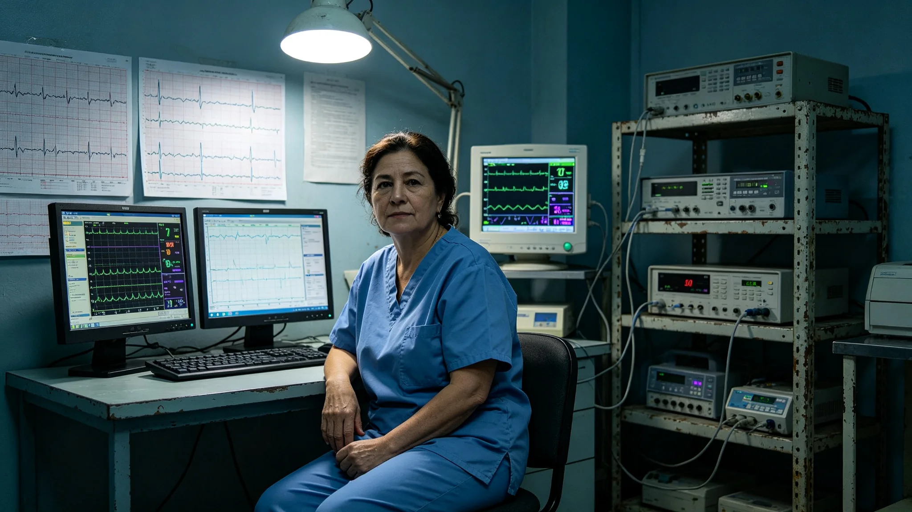

# 跨星系长期居住者健康监测中心首任主任何静初三十年监测网运维与体检档案

**档案类别**：医疗技术公职人员长期履职卷
**建档单位**：联合体长期居住者健康监测中心
**建档日期**：3455年7月8日

## 一、身份与岗位

何静初，女，生于3398年，比邻星b轨道医疗环本籍，三代均为医工。3421年入联合体医疗署任监测技师，3435年起任长期居住者健康监测中心首任主任，至3455年在岗三十四年。其岗位职责为：运维覆盖三恒星系七定居层的长期居住者终身健康传感网，监测骨密度、端粒、前庭、心肺与认知五项指标，签发年度健康监测公报。

## 二、三十年监测网运维数据摘录

| 时段 | 在网监测人数 | 月采样人次 | 告警响应 | 漏报 | 误报 |
|---|---|---|---|---|---|
| 3421—3430 | 1.2亿 | 约1000万 | 98.2% | 0.03% | 0.8% |
| 3431—3440 | 1.8亿 | 约1600万 | 99.1% | 0.01% | 0.5% |
| 3441—3455 | 2.4亿 | 约2200万 | 99.6% | 0.005% | 0.3% |

运维备注：何静初任内推动监测网从"按单位采样"改为"终身贴身采样"，即每个长期居住者自出生起佩戴一枚无源贴片传感器，终身不摘。此改革于3433年试点，3440年全推。其在改革备忘录上签字时附言："健康不是体检那天的事，是每一天的事。贴片贴一辈子，数据才成线。"

## 三、处分与奖励记录

- 3426年，任技师期间，因一段监测网数据断链八小时，记工作差错一次；
- 3434年，推动终身贴片试点，记嘉奖一次；
- 3442年，因一次群体性骨松预警（见GS-3476-01）响应及时，记嘉奖一次；
- 3448年，获跨星系公共服务奖章第二级；
- 3453年，其主管的监测网一次数据异常未及时上报，作书面检讨，未记过。

档案署注明：3453年数据异常事件，何静初在检讨中未推给下属工程师，其原话为"网是我签的，告警是我批的，漏了就是我的漏"。

## 四、体检摘要（本人为终身贴片首代佩戴者）

| 年份 | 骨密度T值 | 端粒评分 | 前庭功能 | 备注 |
|---|---|---|---|---|
| 3421 | 0.0 | 中位 | 正常 | 入职 |
| 3435 | -0.6 | 中位 | 正常 | 任主任 |
| 3445 | -1.1 | 中位偏下 | 正常 | |
| 3455 | -1.4 | 中位偏下 | 轻度迟钝 | 本人在网 |

体检医师签注：何静初是终身贴片制度的首代佩戴者，其本人数据在网已三十四年。其前庭功能在3455年出现轻度迟钝，医师已发前庭监测警示。何静初本人在警示单上签字："我自己就是第一个数据。我的前庭开始钝了，说明贴片也开始钝了——这不是我个人的事，是网的事。"

## 五、签名与告警物证

何静初签发的二十一份年度健康监测公报均附其手写签名。档案抽查显示：其签名在3421年为小楷，3435年后逐渐放大，3445年后在每份公报末页固定加一行小字"本中心不承诺无病，只承诺看见"。档案署注明：这一行小字是其在3442年骨松预警事件后加上的，此后十三年未改。

## 六、家庭与代际

何静初之母何秀，3375—3430年在联合体医疗署任护士，3430年退休。其子沈知行，生于3427年，现任监测网工程师。何静初在其子入职当年的考勤表背面写："他修他的网，我签我的报，是一张网的两头。"

## 七、三十年工作总结（口述笔录摘）

3455年7月，监测中心为其履职三十四年作口述笔录。何静初说：

"长期居住者的健康，不是一天查出来的，是一天一天量出来的。我这三十四年，把监测网从按单位采样改到终身贴身采样，在网人数从一亿二涨到两亿四。我今年五十七岁，按寿命表，我还能再干二十年。我不打算干到死在岗位上，我打算把这套网交给下一代工程师，然后自己也去做那个只贴片子、不签报告的人。我的前庭已经开始钝了，我知道。我把这个数据也留在网上，让后人看看，长期居住在低重力里，人是怎么一点点钝的。"

笔录末注：其口述时长三十三分钟，未提任何个人荣誉。在场记录员备注：其说话时胸口贴著那枚已经戴了三十四年的无源贴片，说到"人是怎么一点点钝的"时，低头看了一眼贴片的指示灯。

## 八、3442年群体性骨松预警处置摘录

3442年，监测网在某星区批量检出长期居住者骨密度骤降（见GS-3476-01）。何静初在预警发出后六小时内，将该星区在网一千二百名长期居住者的骨密度数据全量调出，逐人比对基线，四十六小时内出初判：系该星区一段离心重力调节失准所致，非疾病。其在初判报告上签："网看见得早，人没伤着。"

监测中心注明：此次预警从发出到初判四十六小时，较规程要求的七十二小时提前二十六小时。该流程后写入《长期居住者群体性健康预警响应规程》。

## 九、贴片物证

何静初胸口所戴无源贴片附卷（3455年更换下的旧片）。贴片背面印着一串编号，首字与她的工号相同，3421年启用。贴片表面已磨出细纹，固定带换过六次。监测中心注明：此贴片在网三十四年，数据连续无断，无一次主动离线。更换记录随附本卷，共六次。何静初在交回旧片时写："它陪我钝了三十四年，现在让它去陪下一个人。"

---

**归档编号**：MED-LTH-3455-018
**建档人**：联合体长期居住者健康监测中心 档案员 周南乔
**日期**：3455年7月8日
