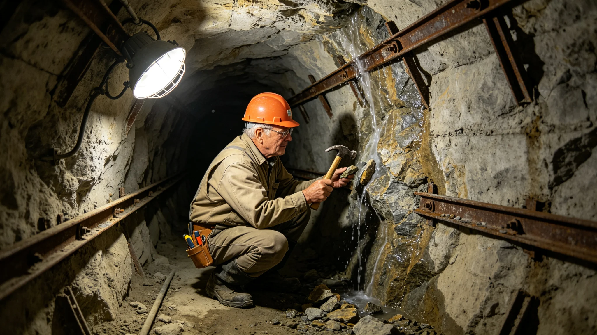

# 鲸鱼座τ星地下城扩容总工程师袁召南三十年岩层勘定与签字涂改档案

**档案类别**：工程技术公职人员长期履职卷
**建档单位**：鲸鱼座τ星地下城建设署
**建档日期**：3457年8月18日

## 一、身份与岗位

袁召南，男，生于3397年，比邻星b轨道本籍，父籍老地球。3420年入地下城建设署任结构工程师，3440年起任地下城扩容总工程师，至3457年在岗三十七年。其岗位职责为：勘定地下城新增居住层的深部岩层，签发扩容掘进许可，对每一段掌子面的支护设计负签字责任。

## 二、三十年勘定与签字数据摘录

| 时段 | 勘定层位 | 签发掘进许可 | 掌子面数 | 遇水处置 | 支护返工 |
|---|---|---|---|---|---|
| 3420—3429 | 第五层 | 14段 | 90面 | 2次 | 3面 |
| 3430—3439 | 第六层 | 18段 | 130面 | 3次 | 5面 |
| 3440—3457 | 第七、八层 | 26段 | 210面 | 4次 | 7面 |

勘定备注：袁召南三十年累计勘定深部岩层芯样约四千根。其签发掘进许可从不只看远程钻探数据，每段掌子面开工前必到现场亲手摸一次岩芯。建设署按规程未反对其下井，仅为其配备了带绳降的密闭耐压作业服。

## 三、处分与签字涂改记录

- 3425年，任工程师期间，因一段掌子面支护设计偏薄，致一次局部掉块，记工作差错一次；
- 3433年，因一段扩容掘进遇地下水（见GS-3478-01）处置及时，记嘉奖一次；
- 3441年，其签发的一段掘进许可中支护参数错引一组岩层数据，被下属指出，主动撤回重签，未记过；
- 3449年，获跨星系公共服务奖章第二级；
- 3455年，因一份扩容年度预算漏列一项深部排水，作书面检讨。

档案署注明：3441年撤回重签事件，袁召南未追究下属，其在撤回备忘录上写："参数是我签的，错在我不在画图的人。"

## 四、签名与涂改物证

袁召南三十年签发的五十八段掘进许可均附其手写签名。档案抽查显示：其签名在3420年为流畅草书，3440年后改为正楷，3442年后在每段许可末页固定加一行小字"本段岩层可挖，支护可守"。档案署另注：其签名页上有四处明显涂改，均为本人笔迹——3433年遇水段，原写"可挖"二字被划去，改写"缓挖，先排水"；3441年错引段，原支护参数被划去重写；3448年一段，原"可挖"划去，改写"不挖，让位给真菌链"；3455年一段，原"可挖"划去，改写"缓挖，先查渗流"。档案署按《工程签字涂改归档规程》将涂改处原样留存。

## 五、体检摘要

| 年份 | 骨密度T值 | 膝关节 | 呼吸功能 | 备注 |
|---|---|---|---|---|
| 3420 | 0.0 | 正常 | 正常 | 入职 |
| 3440 | -0.7 | 轻度磨损 | 正常 | 任总工 |
| 3450 | -1.2 | 中度磨损 | 正常 | |
| 3457 | -1.4 | 中度磨损，配护具 | 正常 | 本批 |

体检医师签注：袁召南长期在深部岩层作业环境工作，骨密度与膝关节下降速率符合长期居住者基线。其呼吸功能三十年保持正常。医师备注："此人三十年下井，肺没坏，是他每次下井都先查通风。"

## 六、家庭与代际

袁召南之父袁定海，3360—3420年在地下城建设署任掘进工，3420年退休。其子袁望北，生于3430年，现任建设署结构工程师。袁召南在其子入职当年的考勤表背面写："他画他的图，我签我的字，错了都是错在签字那一下。"

## 七、三十年工作总结（口述笔录摘）

3457年8月，建设署为其履职三十七年作口述笔录。袁召南说：

"挖地下城这活，最怕的不是挖不动，是挖错了地方。我三十年签了五十八段，划掉了四段'可挖'。划掉不是丢面子，是岩层不让挖。我今年六十岁，按寿命表还能再干二十年。我打算把第八层挖完，把那四段划掉的地方交代给后人——哪段让给真菌链，哪段先排水。然后把签字笔交给我儿子。我不退休，我交班。地下城里住的人越多，越要有人敢在签字那一下，把'可挖'划掉。"

笔录末注：其口述时长二十八分钟，未提任何个人成就。在场记录员备注：其说话时手边放着一段当日从第七层采的岩芯，说到"把'可挖'划掉"时，用指节敲了敲岩芯。

## 八、四段划掉"可挖"的掌子面处置

档案附四段被其划掉"可挖"的掌子面后续处置：

- 3433年遇水段，先排水三个月，再缓挖，后正常贯通；
- 3441年错引段，重取岩芯十六根，支护加厚一档，再签；
- 3448年"让位真菌链"段，整段废弃掘进，改作深地真菌分解链专用廊道；
- 3455年"缓挖查渗流"段，补打渗流监测孔九个，观察一年后再议。

建设署注明：四段之中，两段最终未挖。袁召南在3448年废弃段封壁上写："此段不挖，不是挖不动，是地下城里有比住人更急的东西要地方。"

## 九、岩芯物证

袁召南三十年手摸过的岩芯中，四根附卷：3433年遇水段的湿芯、3441年错引段的夹层芯、3448年让位段的真菌浸染芯、3455年缓挖段的渗流芯。四根芯并排陈列于建设署档案室，标签分别由其手书。建设署注明：其三十年下井千余次，凡遇拿不准的层位，必取一根芯亲手摸过才签字。其四本签字涂改记录已随本卷移交联合档案馆，作为后人掌子面签字规程的物证。

---

**归档编号**：CIV-DG-3457-025
**建档人**：鲸鱼座τ星地下城建设署 档案员 沈知行
**日期**：3457年8月18日
