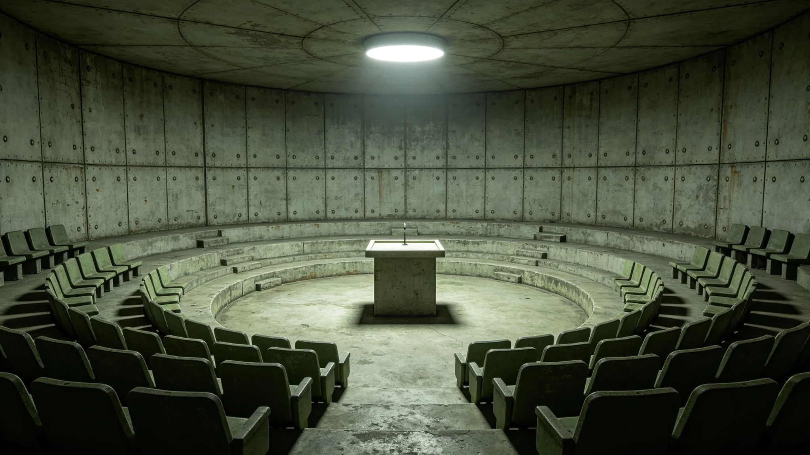

# 三恒星系文明联合体第三代领导人任期轮换与换届制度修订公报

**发布机构**：三恒星系文明联合体公民大会
**发布日期**：3459年1月15日
**文件等级**：跨星系公开

## 一、修订背景

联合体秘书长任期原定为十年一届，自3000年成立以来已换届七次。第七任秘书长骆元洲就职后（见GS-3451-01），公民大会选举事务署于3458年提出：随着寿命延长，在任者任职周期拉长，单一十年任期与"交班节奏"之间出现错配。3451年换届计票系统延迟事件（见GS-3479-01）亦暴露计票流程在长寿命社会下的冗余不足。公民大会经三读，于3459年1月通过本修订。

## 二、修订条款

**（一）任期分段**

秘书长十年任期分为两段：第一段五年，第二段五年。每段结束前十二个月启动下任遴选。第一段结束时，现任须向公民大会作中期履职报告，由跨星系选民作信任投票；信任投票不过半者，第二段自动启动改选。

**（二）连任限制**

因寿命延长，同一人选最多连续担任秘书长两段（十年），不得通过"信任投票续任"方式延长至十五年。卸任后须间隔至少一个十年方可再次参选。

**（三）交班预演**

第二段最后一年，现任须指定一名接班陪练人选，陪练人选列席联合体核心会议一年，但不具表决权。陪练人选的考勤、体检与处分记录同步公开，与候选人同标准。

**（四）计票冗余**

计票系统须双机独立计票，两套结果不一致时，以人工复核为准。延迟期间不得宣布临时结果（承接GS-3479-01监票长姚光霁处置先例，见GS-3458-01）。

## 三、与既有制度的衔接

| 事项 | 原制度 | 本修订 |
|---|---|---|
| 任期 | 十年连续 | 五年分段，中段信任投票 |
| 连任 | 未明确 | 最多十年，卸任间隔一个十年 |
| 接班 | 任满才选 | 最后一年陪练列席 |
| 计票 | 单机计票 | 双机独立，延迟不宣布临时结果 |

## 四、适用范围

本修订适用于联合体秘书长及各星区行政首长。公民代表、议员等选任公职人员是否分段，由各星区自定，不作强制。

## 五、施行日期

本修订自3459年1月15日公布之日起施行。下一次换届为3461年（第七任第二段结束前），按本修订执行。

## 六、三读辩论摘录（节选）

公民大会三读辩论记录附卷，摘录如下：

- 代表某星区某议员："分段信任投票，会不会变成对在任者的不信任？十年还没干完，第五年就要被投一次。"
  法制委员会答："分段不是不信任，是让在任者知道，每五年要交一次账。寿命延长了，十年太长，长到看不见头。五年一交账，位子才坐得住。"
- 代表某星区某议员："陪练列席一年，会不会变成影子秘书长？"
  法制委员会答："陪练无表决权，只列席。他能看见，不能决定。看见是为了接班那天不手生，不是为了提前掌权。"
- 代表某星区某议员："双机计票，成本翻倍，值不值？"
  法制委员会答："3451年延迟那一回，差零点四个百分点就是一个错认的当选人。双机的钱，买的是这个百分点。"

辩论共三日，二百一十七名代表发言，表决一百八十四票赞成、二十三票反对、十票弃权。

## 七、与既有任期制度的衔接表

| 阶段 | 信任投票 | 改选触发 | 陪练 |
|---|---|---|---|
| 第一年至第五年 | 无 | 无 | 无 |
| 第五年末 | 一次 | 不过半即改选 | 无 |
| 第六年至第九年 | 无 | 无 | 末一年陪练列席 |
| 第十年末 | 无 | 届满改选 | 交权 |

## 七、修订成本与影响评估

公民大会法制委员会附成本测算：双机独立计票系统一次换届增支约星汇一千二百万；中期信任投票一次增支约八百万；陪练列席一年增支约三百万。三项合计，十年一届换届较原制度增支约星汇二千三百万，占联合体年度行政支出不足百分之零点二。

法制委员会注明：三千星汇万元级的增支，买的是十年后不出现一个错认的当选人。3451年那回差零点四个百分点，若真错认，重选一次的成本远不止此数。

## 八、典型适用示例

法制委员会附两则适用示例：其一，某秘书长第一段结束信任投票得票过半，进入第二段，末年指定一名陪练列席；其二，某秘书长第一段结束信任投票未过半，第二段自动改选，其本人可在改选中参选，但受十年连任限制。两则示例均假设在任者身体与考勤正常；若在任者健康监测网（见GS-3455-01）报认知量表持续下降，按《公职人员健康退岗规程》另作处置，不属本修订范围。

## 九、附则

公民大会注明：寿命延长后，"任职"不再等于"一生"。制度要做的，是把"一辈子的位子"拆成"一段一段的班"。分段不是不信任在任者，是让在任者知道：位子不是你的，是你坐十年的。双机计票、延迟不宣布临时结果，均承接3451年监票长姚光霁处置先例（见GS-3458-01）。

本修订自3459年1月15日公布之日起施行。下一次换届为3461年，按本修订执行。本公报由公民大会法制委员会解释。

---

**归档编号**：LAW-TERM-3459-004
**编制**：三恒星系文明联合体公民大会法制委员会
**日期**：3459年1月15日
