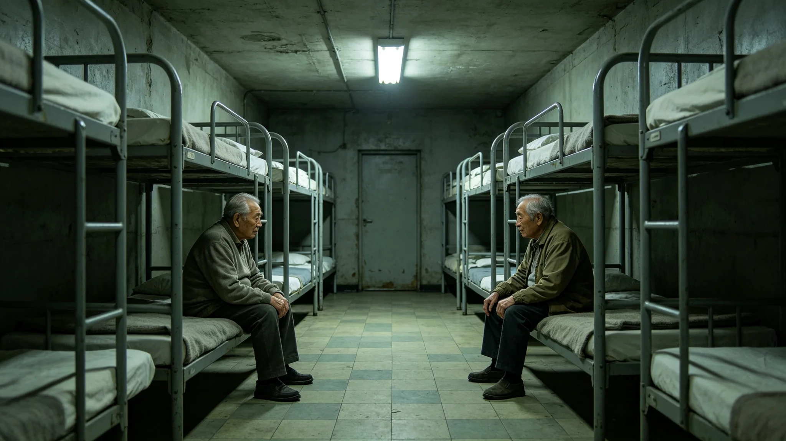

# 三恒星系跨星系养老体系建制与床位互认制度建立公报

**发布机构**：三恒星系文明联合体跨星系养老事务总署
**发布日期**：3460年3月20日
**文件等级**：跨星系公开

## 一、建制背景

随着寿命延长，长期居住者六十岁以上占比已由3415年的28%升至3454年的51%（见GS-3454-01人口首席统计官江暮春台账）。跨星系迁徙常态化下，老人随子女跨星区居住、跨星区养老的需求逐年上升，而各星区养老床位长期"按籍贯分、按星区排"，互不承认对方的床位等级与健康评估。3453年跨星系养老体系首任总管卫慕（见GS-3453-01）提出建制方案，公民大会于3459年三读通过，3460年3月公布本制度。

## 二、制度要点

**（一）床位等级互认**

三恒星系各养老环、养老舱段的床位统一划分为低活力、中活力、高活力三级。各星区互认对方等级，老人跨星区入住时，凭原星区健康评估报告直接对位入住，不再重新评估。

**（二）跨星系养老航线**

养老航线由总署统一调度，每航次配置一名随船医工、两名陪护员与一套第七代生命支持闭环（见GS-3375-01）。航线票价按星汇结算，老人自付比例按其在职累计缴费核定。

**（三）陪护人力互认**

各星区陪护员资质互认。一名陪护员在一个星区取得的资质，跨星区执业无需重新考试，仅须作为期一个月的当地规程见习。

**（四）临终床位**

低活力舱内设临终床位，老人可跨星区选择临终入住星区。临终床位费用由深时间信托基金（见GS-3393-01）兜底，不与个人缴费挂钩。

## 三、床位互认表（摘录）

| 原星区等级 | 对位星区等级 | 重新评估 |
|---|---|---|
| 低活力 | 低活力 | 否，直接入住 |
| 中活力 | 中活力 | 否 |
| 高活力 | 高活力 | 否 |
| 跨级入住 | 按健康状态降一级 | 是 |

## 四、施行与过渡

本制度自3460年3月20日起施行，设三年过渡期（3460—3462）。过渡期内，各星区养老环须完成床位分级标签改造与陪护资质互认登记。总署注明：过渡不是拖延，是让老人搬得动。

## 五、三读辩论摘录（节选）

公民大会三读辩论记录附卷，摘录如下：

- 代表某星区某议员："床位分级互认，低活力老人会不会被'降级'对待？"
  养老总署答："分级不是分等，是按身体状态安排床位。低活力舱靠近护士站，中活力舱有活动空间，高活力舱接近自理。认的是状态，不是人。"
- 代表某星区某议员："跨星区养老，老人路上出事怎么办？"
  养老总署答："养老航线每航次配随船医工与第七代生命支持闭环。3451年那次故障（见GS-3474-01）无一人伤亡，分流规程已写入第三版。路上的事，规程里都有。"
- 代表某星区某议员："临终床位跨星区选，成本谁出？"
  养老总署答："临终床位由深时间信托基金兜底，不与个人缴费挂钩。老人在哪颗星上闭眼，不该由钱决定。"

辩论共两日，一百九十三名代表发言，表决一百六十一票赞成、二十四票反对、八票弃权。

## 六、三年过渡安排

| 年度 | 过渡任务 |
|---|---|
| 3460 | 各星区完成床位分级标签改造；陪护资质互认登记启动 |
| 3461 | 跨星系养老航线扩容至十二条；床位互认试运行 |
| 3462 | 全量互认生效；过渡期结束 |

总署注明：过渡不是拖延，是让老人搬得动、陪护员转得顺、床位调得开。

## 七、床位存量与缺口测算

养老总署附三年床位测算：

| 星区 | 现有床位（万） | 3462年需求（万） | 缺口 |
|---|---|---|---|
| 比邻星b轨道养老环 | 4.2 | 5.8 | 1.6 |
| 鲸鱼座τ地下城 | 2.8 | 4.1 | 1.3 |
| 老地球方向 | 1.6 | 2.2 | 0.6 |
| 其余星区 | 1.0 | 1.5 | 0.5 |
| 合计 | 9.6 | 13.6 | 4.0 |

总署注明：四年净增床位四万张，其中低活力床位占六成。这四万张的投入，由深时间信托基金（见GS-3393-01）与各星区财政按六四分担。

## 八、典型跨星区养老示例

总署附三则适用示例：其一，某老地球方向老人原居高活力舱，随子女迁鲸鱼座τ地下城，凭原星区评估直接对位入住当地高活力舱，不再重新评估；其二，某比邻星b老人健康降至中活力，跨星区迁至轨道养老环，按对位表入中活力舱；其三，某老人临终前要求迁至子女所在星区，临终床位由信托基金兜底，其本人仅付单程养老航线票价。三则示例均按本制度执行，不另收床位费。

总署注明：示例中不出现个人姓名。养老这件事，制度只管床怎么排，不问人叫什么。本制度施行首年，预计跨星区入住老人约一万一千人，较3459年的三千四百人翻三倍以上。

## 九、附则

总署注明：活得久，老就不再是一个星区的事。老人不是哪个星区的财产，老人是整个联合体的人。床位互认，认的不是床，是这个老人在哪个星区都被当人看。本制度承接3353年人口倒挂（见GS-3353-01）、3382年代际抚养共同体（见GS-3382-01）与3453年养老体系首任总管卫慕履职实践（见GS-3453-01）。

本制度自3460年3月20日公布之日起施行，三年过渡期。本公报由联合体跨星系养老事务总署解释。

公报注明：床位互认制度至此运行二十五年，老人跨星迁徙不再重新建档。这就是制度建立的全部意义。

---

**归档编号**：LAW-ELD-3460-011
**编制**：联合体跨星系养老事务总署
**日期**：3460年3月20日
