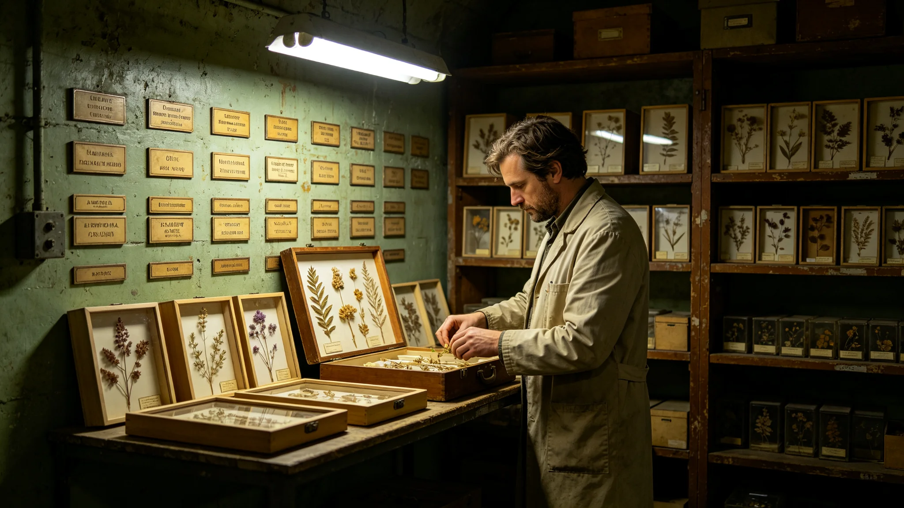

# 三恒星系生态多样性保护名录与原位易地双轨保育制度修订公报

**发布机构**：联合体生态多样性保护署
**发布日期**：3463年4月8日
**文件等级**：跨星系公开

## 一、修订背景

首任首席巡护员顾满仓（见GS-3456-01）履职三十七年，监测物种从120种增至540种，但3441年一个濒危种群在原位意外灭绝（见GS-3477-01），暴露出单一原位保育的脆弱。既有名录制度（见GS-3317-01文明多样性名录）偏重文化语言，未覆盖驯化与伴生物种。保护署经三读，于3463年4月公布本修订。

## 二、修订条款

**（一）双轨保育**

濒危物种一律执行原位、易地双轨：原位保护区继续监测，同时在轨道易地保育基地（见GS-3316-01）保留一份备份种群。原位种群一旦低于警戒线，易地备份立即启动回迁。

**（二）名录分级**

保护名录分四级：存续、脆弱、濒危、极危。极危物种须双轨备份；濒危物种五年内完成备份；脆弱物种列入监测。

**（三）灭绝登记**

任何物种一旦确认灭绝，须在名录上永久刻名，并附灭绝年份、原因与责任人签认，不得抹去。灭绝名录与存续名录并列刻石，不另立"已灭绝"隐名册。

**（四）授粉昆虫联动**

顾满仓3435年被驳回的增设授粉昆虫探头建议（见GS-3456-01），本修订正式写入：凡濒危植物种，其伴生授粉昆虫群落一并列入名录，同轨保育。

## 三、名录分级表（摘录）

| 级别 | 原位监测 | 易地备份 | 五年内要求 |
|---|---|---|---|
| 存续 | 例行 | 否 | 维持 |
| 脆弱 | 加密 | 否 | 准备备份 |
| 濒危 | 加密 | 是 | 完成备份 |
| 极危 | 全时 | 是 | 立即备份并回迁预案 |

## 四、三读辩论摘录

- 代表某星区某议员："灭绝也要刻名，会不会太难看？"
  保护署答："难看得过忘了它。灭绝刻名，是让后人知道我们少过什么。顾满仓那三十七年，少过一种，他没躲。我们也不躲。"
- 代表某星区某议员："双轨备份，成本翻倍，值不值？"
  保护署答："3441年那次灭绝，要是当年有备份，那个种群就不会真没。备份的钱，买的是别再认一次'我们少过'。"

辩论共两日，一百八十二名代表发言，表决一百五十六票赞成、十八票反对、八票弃权。

## 五、为何必须双轨

保护署在报告中陈述单一原位保育的脆弱。3441年那个濒危种群在原位灭绝（见GS-3477-01），复盘发现其伴生授粉昆虫先于其退化，而顾满仓3435年增设探头的建议曾被驳回。若当年有易地备份，这个种群至少在轨道保育基地还留一份，不会真没。

保护署强调：原位保育是主，易地备份是副。备份不是把物种搬进培养罐了事，是在轨道保育基地按原位生态重建一份近似环境，让备份种群保持野性，否则备份出来的只是一群驯化的后代，放生也活不成。双轨的意义在于：原位出事，备份还能回迁；备份退化，原位还能续种。两条腿走路，比一条腿稳。

灭绝刻名一节，保护署在报告中专门说明。过去名录制度只登"现存"，灭绝的物种悄悄从名单上删掉，像没存在过一样。本修订要求灭绝永久刻名，附年份、原因与责任人签认。保护署写明：顾满仓那三十七年，少过一种，他没躲。我们也不躲。灭绝刻名不是揭伤疤，是让后人知道我们在哪一步走错了，下一回别再走。

## 六、五年过渡安排

| 年度 | 过渡任务 |
|---|---|
| 3463 | 名录四级分级重登；极危物种立即备份 |
| 3464 | 濒危物种完成备份；授粉昆虫联动入册 |
| 3467 | 全部现有濒危物种备份完毕；灭绝名录刻石 |

## 七、常见问答摘录

保护署附三则常见问答。问：一个物种灭绝了，名录上会删掉吗？答：不会。永久刻名，附年份、原因、责任签认。问：濒危物种的备份，养在玻璃柜里行吗？答：不行。备份按原位生态重建，保持野性，为的是能回迁。问：极危物种多长时间内必须备份？答：立即。五年内全部现有濒危物种完成备份。

保护署另附一则反面案例说明：3441年那个种群灭绝时，名录上它被悄悄划去，像没存在过。本修订后，它将被补刻回灭绝名录，与顾满仓的检讨（见GS-3456-01）一并留存。

## 八、附则

保护署注明：物种不是货物，不能丢了再补。双轨保育，保的是"少了一种，还能找回来"。

保护署在附则中再作三点说明。其一，名录分级不是给物种贴优劣标签。存续、脆弱、濒危、极危，说的是现在离没多远，不是这个物种值不值钱。极危不等于没救，只是备份要立刻做。其二，易地备份不是动物园。备份种群按原位生态重建，保持野性，不是养在玻璃柜里供人看。备份的目的是回迁，不是展览。其三，灭绝刻名不是追责大会。刻名是把事实留下，不是把哪个总工钉在耻辱柱上；但责任要写清楚，因为下一次谁来管这段，得知道前人在哪一步走过弯路。

本修订自3463年4月8日起施行，五年内完成现有濒危物种备份。本公报由联合体生态多样性保护署解释。

---

---

**归档编号**：LAW-BIO-3463-031
**编制**：联合体生态多样性保护署
**日期**：3463年4月8日
