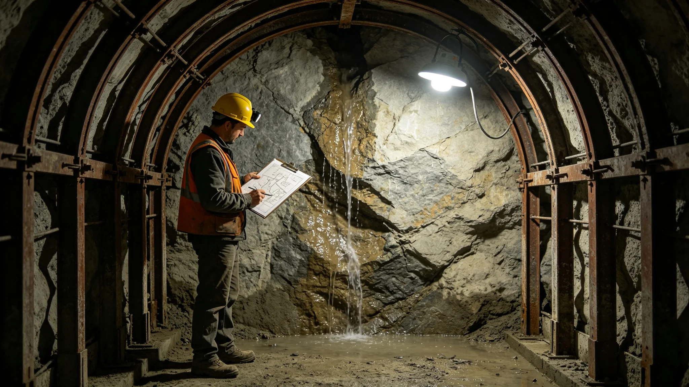

# 鲸鱼座τ星地下城扩容审批与生态让渡一票否决制度修订公报

**发布机构**：鲸鱼座τ星地下城建设署
**发布日期**：3464年2月28日
**文件等级**：跨星系公开

## 一、修订背景

扩容总工程师袁召南（见GS-3457-01）三十年勘定，四度在签字时划掉"可挖"，其中一段整段让位给深地真菌分解链（见GS-3457-01）。这些个案靠其个人判断守住，未上升为制度。3455年一段掘进遇地下水事件（见GS-3478-01）再次暴露：掘进许可若未与生态廊道、渗流监测联动，单点判断再准也挡不住系统性冒进。建设署经三读，于3464年2月公布本修订。

## 二、修订条款

**（一）生态让渡一票否决**

凡扩容掘进段，若该段岩芯含可利用真菌分解链廊道、或位于深地水循环关键渗流带，生态分局有一票否决权，建设署不得强行开工。否决后，该段改作生态廊道或永久封存。

**（二）双签制度**

每段掘进许可，须由建设署总工程师与生态分局首席生态官双签。缺一签，许可不生效。

**（三）遇水缓挖**

掘进遇地下水，一律先排水、补打渗流监测孔，观察不少于一年，再议掘进。不得"边挖边排"。

**（四）掌子面存档**

每段掌子面完工后，其岩芯、支护设计、监测记录整卷存档，作为未来续挖的依据。

## 三、双签流程

| 步骤 | 签署方 | 内容 |
|---|---|---|
| 一 | 建设署 | 岩层勘定与支护设计 |
| 二 | 生态分局 | 生态廊道与渗流评估 |
| 三 | 双方 | 双签，缺一不生效 |
| 四 | 遇水 | 缓挖一年，补孔监测 |
| 五 | 完工 | 整卷存档 |

## 四、三读辩论摘录

- 代表某区议员："生态一票否决，会不会拖慢扩容？"
  建设署答："慢一年，比挖塌了强。袁总工划掉四段，两段没挖，地下城到现在没塌。拖慢的是工期，保住的是住在里面的人。"
- 代表某区议员："双签会不会变成互相推？"
  建设署答："双签不是推，是两边都得负责。签了字，出了事两边都在卷宗里。"

辩论共两日，一百三十四名代表发言，表决一百一十二票赞成、十五票反对、七票弃权。

## 五、为何必须双签一票否决

建设署在报告中陈述旧制的漏洞。过去掘进许可由建设署一家签，生态廊道是否占用，全靠总工程师个人在签字时多问一句。袁召南三十年四度划掉"可挖"，靠的是他每次下井亲手摸岩芯的习惯。但习惯不能制度化——换一个不爱下井的总工，划掉的那四段就可能变成四段硬挖下去的掌子面。

建设署强调：生态让渡一票否决，不是生态分局跟建设署作对，是让管真菌链的人对管掘进的人说一句话：这段下面有比住人更急的东西。3448年那段让位给真菌分解链（见GS-3457-01），事后证明是对的——那段廊道后来成了深地闭环的关键分解节点。若当年硬挖，闭环今天就少一环。

遇水缓挖一节，建设署援引3455年遇地下水事件（见GS-3478-01）。那次靠袁召南个人拍板先排水，才没出更大的事。本制度把"先排水、观察一年"写成硬规程，不许再靠个人拍板。建设署写明：掌子面不等人，岩芯也不等人；但地下水比人更不等。边挖边排，排的是水，赌的是命。

## 六、过渡期安排

| 年度 | 过渡任务 |
|---|---|
| 3464 | 双签制度落地；在建段补生态评估 |
| 3465 | 遇水缓挖规程全推；掌子面存档整卷移交 |
| 3466 | 生态一票否决权正式生效 |

## 七、常见问答摘录

建设署附三则常见问答。问：生态分局否决一段，整个扩容项目下马吗？答：不下马。被否的那段改作生态廊道或封存，下一段照挖。问：遇水了，必须停一年吗？答：先排水，补打渗流监测孔，观察不少于一年，再议。边挖边排不行。问：双签是两边都签个字就行？答：不是。签了字，出了事两边都在卷宗里，谁签谁负责。

建设署另附一则旧案回顾：3455年那段遇地下水（见GS-3478-01），当年靠袁召南个人拍板先排水才没出大事。本制度把那次的个人判断写成硬规程，往后遇水，谁在位置上都得这么办，不必等总工个人拍板。掌子面存档整卷移交联合档案馆，作为未来续挖的依据，不再只锁在建设署柜子里。

## 八、附则

建设署注明：地下城越挖越深，住的人越来越多，越要有人敢在签字那一下把"可挖"划掉。本制度把这个"敢"从一个人的脾气，变成一张表。

建设署在附则中再作三点说明。其一，生态一票否决不是否决扩容，是否决挖错的那段。否决之后，这段改作生态廊道或永久封存，不是整个项目下马；下一段该挖照挖。其二，双签不是互相签字走过场。签了字，出了事，建设署与生态分局都在卷宗里；谁签谁负责，不能互相推。其三，遇水缓挖一年不是教条。一年里补打渗流孔、观察水位，是为了让地下水先说话，再决定人怎么走。水不说话，人不往前走。

本修订自3464年2月28日起施行。本公报由鲸鱼座τ星地下城建设署解释。

---

建设署注明：双签制度自此执行，袁召南的签字不再是孤笔。

---

**归档编号**：LAW-EXP-3464-037
**编制**：鲸鱼座τ星地下城建设署
**日期**：3464年2月28日
