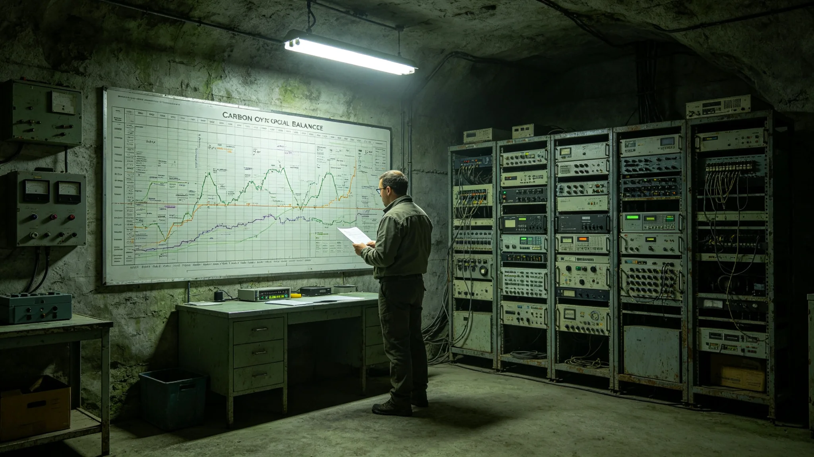

# 三恒星系人工生物圈稳态指标跨星互认与联合监测制度建立公报

**发布机构**：联合体生态闭环总评估办公室
**发布日期**：3465年11月30日
**文件等级**：跨星系公开

## 一、建立背景

三恒星系各人工生物圈——比邻星b全球生物圈（见GS-3389-01）、鲸鱼座τ地下城深地闭环（见GS-3392-01）、各轨道舱段生态区——长期各自监测、各自评估，稳态指标口径不一。一处生物圈出波动，无法立即判断是本地事件还是跨系共性。3452年沈百合（见GS-3452-01）第五代评估立项后，跨系数据比对需求迫切。总评估办公室经三读，于3465年11月公布本公约。

## 二、公约要点

**（一）统一稳态指标**

各生物圈统一采用五项稳态指标：碳氧平衡、真菌分解链效率、伴生昆虫群落、水培循环、生物多样性指数。五项口径三系一致，可直接同屏比对。

**（二）联合监测**

三系各设一个节点，数据实时汇入联合监测中心。任一指标偏离基线超过阈值，三系同时收到预警，不等到本地年报。

**（三）互认评估**

某一生物圈的稳态评估结论，他系互认。跨系迁徙、易地保育（见GS-3463-01）、养老入住（见GS-3460-01），均以互认指标为准。

**（四）百年联评**

每百年一次三系生物圈联合总评估，同时发布，不各自择期。下一次联合总评估定在3489年。

## 三、五项稳态指标阈值（摘录）

| 指标 | 正常区间 | 预警阈值 | 报警阈值 |
|---|---|---|---|
| 碳氧平衡偏差 | ±2% | ±3% | ±5% |
| 真菌分解链效率 | 90%—100% | 85% | 80% |
| 伴生昆虫物种数 | 基线±5% | 基线-10% | 基线-20% |
| 水培循环浊度 | 基准±10% | 基准±20% | 基准±30% |
| 生物多样性指数 | 基线±3% | 基线-6% | 基线-10% |

## 四、三读辩论摘录

- 代表某星区某议员："五指标统一，会不会削平各生物圈差异？"
  总评估办公室答："统一的是口径，不是结果。各生物圈该不一样还是不一样，只是五张表能放在一张桌上比。比得了，才知道谁在出事。"
- 代表某星区某议员："联合监测，数据归谁？"
  总评估办公室答："数据归三系共管，任一家不能单独删。这和深时间遗嘱一个道理——关键数据，得有备份。"

辩论共三日，二百零一名代表发言，表决一百七十三票赞成、十八票反对、十票弃权。

## 五、为何必须三系同表

总评估办公室在报告中陈述各生物圈各自为政的代价。过去比邻星b出一次碳氧波动，鲸鱼座τ要半年后才在年报里读到；鲸鱼座τ一段真菌链效率下行，比邻星b根本不知道。一处生物圈出问题，无法判断是本地故障，还是跨系共性——若是共性，只修本地那一段，等于头痛医头。

总评估办公室强调：五指标统一的是口径，不是结果。比邻星b的生物圈在行星大气调控下运转（见GS-3371-01），鲸鱼座τ的闭环在深地岩层里运转，两处本就不该长得一样。但口径必须一样——碳氧偏差怎么算、分解链效率怎么量、伴生昆虫怎么数，三系用同一把尺子。尺子统一了，五张表才能摆在一张桌上；摆上了桌，才看得见谁在出事。

百年联评定在3489年，是接续3389年比邻星b百年评估、3392年深地百年监测的节奏。总评估办公室写明：生物圈这件事，一年看不出好坏，一百年才看得清。三系一起评，不是同时发布好看，是让一百年后的人拿到一份能横向比的总表，而不是三份各说各话的年报。

数据归三系共管，任一家不能单独删。这条参照深时间遗嘱库（见GS-3396-01）的逻辑：关键数据，得有备份，得有人看着。

## 六、联合监测中心选址与节点

联合监测中心设在三系光际通信网第三中继节点（见GS-3363-01），三系各设一个本地节点，数据实时汇入。中心常驻生态评估师十二名，三班轮值。

## 七、常见问答摘录

总评估办公室附三则常见问答。问：统一五指标，是不是三系生物圈要改成一个样？答：不是。口径统一，结果可以不同。比邻星b在大气调控下转，鲸鱼座τ在深地岩层里闭环，本就不该一样。问：联合监测中心会不会指挥本地怎么修？答：不会。中心只做同屏比对与跨系预警，本地处置仍归三系自己。问：百年联评3489年，中间这二十多年怎么办？答：中间每年联合监测，异常实时预警，3489年只是一次叠曲线的总表。

## 八、附则

总评估办公室注明：生物圈这东西，一千年看下来，一个星区稳不算稳，三系一起稳才算稳。本公约把三表并一桌，下一次百年联评定在3489年。

总评估办公室在附则中再作三点说明。其一，统一口径不抹平差异。比邻星b在行星大气调控下运转，鲸鱼座τ在深地岩层里闭环，两处本就不该长得一样；统一的只是五把尺子，量出来的数可以不同。其二，联合监测不是中央集权。三系本地节点仍管本地，联合中心只做同屏比对与跨系预警，不干预本地处置。其三，百年联评不是一次庆典。3489年那次，要把三系一百年的五指标曲线叠在一起，看出哪条在往下走，哪条稳住了，哪条是新冒出来的。

本公约自3465年11月30日起施行。本公报由联合体生态闭环总评估办公室解释。

---

---

**归档编号**：LAW-BIO-CONV-3465-042
**编制**：联合体生态闭环总评估办公室
**日期**：3465年11月30日
