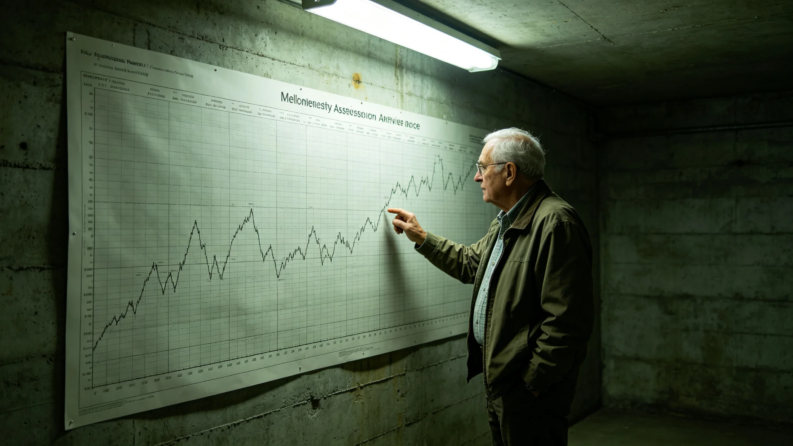

# 鲸鱼座τ星地下城生态闭环千年评估第一轮技术报告

**编制单位**：鲸鱼座τ星地下城生态分局
**报告编号**：ECO-MILL-3466-001
**密级**：跨星系公开

## 一、评估缘起

地下城自落成以来，深地生态闭环已运转近千年。既往百年监测（见GS-3392-01）以十年为一周期，看的是近期波动；首席生态官沈百合3448年首提、3452年获准的第五代评估（见GS-3452-01），第一次把目光从百年拉到千年。本轮评估不是重抄百年监测，而是回答一个百年尺度上才问得出来的问题：这条闭环，按现在的代谢速率，还能稳多久。

## 二、评估方法

本轮评估采用五项千年指标，逐项与跨系互认口径对齐（见GS-3465-01）：

| 指标 | 千年基线 | 本轮实测 | 趋势 |
|---|---|---|---|
| 碳氧平衡偏差 | ±2% | +1.4% | 略偏氧 |
| 真菌分解链效率 | 90%—100% | 94.2% | 稳定 |
| 伴生昆虫物种数 | 基线±5% | 基线-3% | 缓降 |
| 水培循环浊度 | 基准±10% | 基准+6% | 略浊 |
| 生物多样性指数 | 基线±3% | 基线-1.5% | 缓降 |

## 三、关键发现

技术组在报告中陈述三点。其一，真菌分解链效率千年维持在九成以上，是整条闭环最稳的一环；但伴生昆虫物种数与生物多样性指数两项缓降，虽未破预警阈值，千年尺度上却是一条向下的曲线。其二，碳氧略偏氧、水培略浊，两项偏离互相抵消，整体稳态未破，但说明闭环的"自我调节"正在消耗冗余。其三，深地水循环在3455年掘进遇水事件（见GS-3478-01）后被重新评估，本轮确认掘进扰动已停，水循环回到基线。

## 四、千年预测

技术组按五项指标的千年趋势外推：若维持现行代谢速率，伴生昆虫物种数将在约六百年后跌破预警阈值；生物多样性指数将在约八百年后接近报警线。两项均非近期危机，但若不干预，千年尺度上闭环将从"稳态"滑向"单向耗散"。

技术组强调：这不是末日预言。千年外推的误差以百年计，且闭环自身有冗余。报告的意义在于——把六百年后的事，放到今天的桌面上。

## 五、建议

技术组建议三项：一是将伴生昆虫群落列入加密监测，接续顾满仓3435年未被采纳的建议（见GS-3456-01）；二是按《生态多样性双轨保育》（见GS-3463-01）对缓降物种启动备份；三是下一轮千年评估定在3516年，五十年一评，跟踪这条缓降曲线。

## 五之二、为什么千年才问这个问题

技术组在报告中专门解释评估尺度的选择。百年监测看的是"今年比去年坏没坏"，这个尺度上闭环年年稳、岁岁好，看不出趋势。把镜头拉到千年，才能看见那些十年、百年都看不出来的慢变量——伴生昆虫一年少一只，百年少一百只不算事，但一千年就是一个物种没了。

技术组强调：千年外推不是吓唬人。闭环不是活物，它没有自愈意志，它的稳态全靠人盯着、人补冗余。百年监测盯得住眼前的波动，盯不住六百年后的枯竭。本轮评估的价值，是把那条缓降曲线从噪声里拎出来，让它在还很平缓的时候就被看见。看见得早，干预就便宜；等到报警阈值再动，就贵了。

技术组也坦承千年外推的局限。五十年一评的意思，就是承认这次外推只是一个五十年的快照。闭环的代谢速率会随技术、随人口、随扩容变，五十年后要重算。千年评估不是一锤子买卖，是每五十年拍一张照片，把这条曲线一直拍下去。

## 五之三、对扩容决策的影响

这份千年评估交到建设署手里，直接影响未来十年的扩容节奏。建设署在签收时注明：既然伴生昆虫与生物多样性两项缓降，扩容就不能再按"能挖多少挖多少"的老节奏，而要按闭环余量排工期。3464年双签制度（见GS-3464-01）本来只管"哪段不能挖"，这份报告补上了"整个地下城还能撑多久"的上界。

技术组与建设署会商后确定：未来十年，地下城扩容节奏从每年两层压到每年一层，省出的生态容量留给缓降的伴生昆虫群落恢复。建设署注明：少挖一层，换闭环多稳一百年，这笔账算得过来。

技术组与生态分局另签一项纪要：本轮千年评估的五十年后重估，不再只由生态分局一家出，而是联合建设署、人口委员会、健康监测中心四方联席。因为闭环稳不稳，不只看真菌链，还看住多少人、人多老、扩多少层。四方联席，是让这条千年曲线在重估时不被任何一方单独改写。生态分局管真菌，建设署管岩层，人口委员会管人数，健康监测中心管人——四方各守一摊，合起来才是整条闭环。缺了任何一方，千年评估就只剩一家之言。

## 六、附则

生态分局注明：千年评估不是算末日，是算冗余。闭环还稳着，但稳的底子在变薄。这份报告交到建设署手里，是为了让他们在3464年双签制度（见GS-3464-01）下，多知道一件事：往下挖之前，得先知道上面这条闭环还剩多少年的余量。

分局注明：千年评估第一轮至此结束。闭环在基准线内。

---

**归档编号**：ECO-MILL-3466-001
**编制**：鲸鱼座τ星地下城生态分局 技术组
**日期**：3466年3月10日
