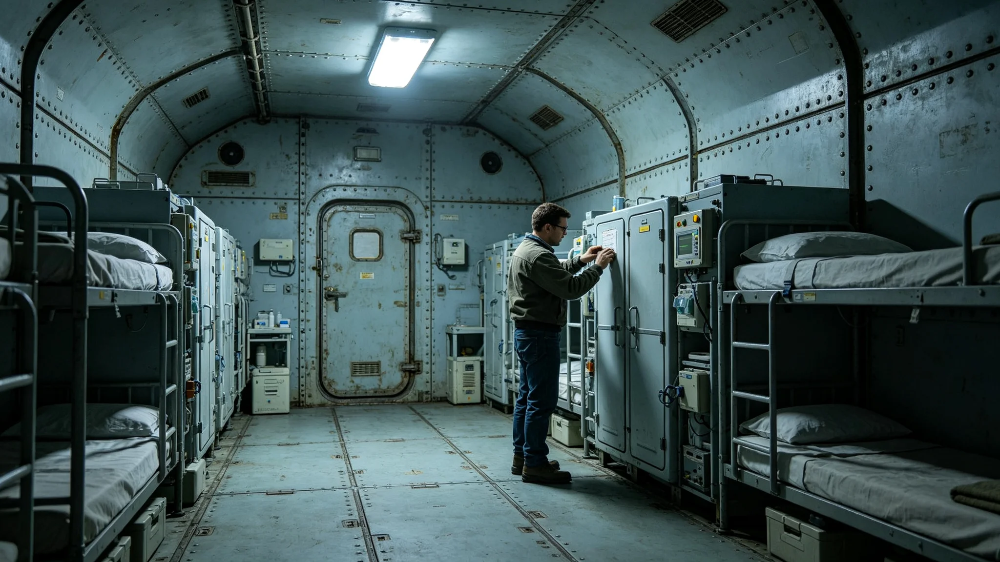

# 跨星系养老航线第七代生命支持闭环系统整舱测试报告

**编制单位**：联合体跨星系养老事务总署
**报告编号**：LSC-ELDER-7TH-3468-006
**密级**：跨星系公开

## 一、测试缘起

第七代生保闭环（见GS-3375-01）原为长航程移民船设计，移植到跨星系养老航线后，须按老人的生理特点重新标定。3451年养老航线一次生命支持故障（见GS-3474-01），无人员伤亡，但暴露通用闭环对老年人生理耐受的余量不足。总署据此立项养老专用第七代闭环整舱测试。

## 二、测试参数

| 项目 | 通用第七代 | 养老专用标定 |
|---|---|---|
| 氧分压波动余量 | ±2% | ±1% |
| 二氧化碳清除延迟 | 三十秒 | 十五秒 |
| 温湿度调节 | 通用 | 偏暖偏湿 |
| 冗余切换 | 单机 | 双机热备 |
| 故障告警到人 | 舱级 | 床位级 |

## 三、测试要点

技术组陈述三点。其一，老人对氧分压与二氧化碳的耐受余量比年轻人窄一半。通用闭环的±2%氧分压波动，对年轻人无感，对低活力老人可能诱发不适。养老专用把余量收窄到±1%，把波动压在老人无感的范围内。其二，二氧化碳清除延迟从三十秒压到十五秒，是因为老人呼出量小但清除慢，残气在舱内堆积更慢却更久，慢堆积更难察觉。其三，冗余双机热备与床位级告警，直接回应3451年故障：那次靠总管卫慕（见GS-3453-01）四十七分钟人工分流，现在系统在床位级六秒内告警，双机热备切换不用人动。

## 四、故障注入测试

技术组在整舱测试中注入五类故障，结果：氧分压漂移、二氧化碳堆积、温湿度失准、冗余切换、单舱断电，五类故障全部在设计指标内被检出并处置，无一次漏检。技术组特别报告：模拟3451年那次故障的复现测试中，床位级告警在六秒内触发，双机热备在八秒内切换，三百一十二名测试用老人（模拟）全程生命体征无波动。

## 五、遗留与成本

技术组如实列出：养老专用闭环整舱采购成本较通用版上浮百分之十八，主要来自双机热备与床位级传感器。总署注明：上浮的百分之十八，买的是三百一十二位老人在六秒内被看见。3451年那次四十七分钟人工分流，是人命赌出来的余量，不该再赌第二次。

## 五之二、为什么不能照搬年轻人的闭环

技术组在报告中解释"老人是设计边界"这句话。通用第七代生保闭环是为长航程移民船设计的，船上是青壮年，耐受余量按青壮年标定。把它搬到养老航线上，等于拿年轻人的肺去量老人的肺——同一个氧分压波动，年轻人无感，老人可能已经在床上去不掉气。

技术组陈述三层差异。其一，肺。老人肺泡弹性下降，同样的二氧化碳堆积，年轻人呼出得掉，老人呼不掉，残气在肺里越积越多。所以清除延迟从三十秒压到十五秒。其二，循环。老人对温湿度波动的调节能力弱，舱里偏冷半度、偏干半成，年轻人无所谓，老人可能受凉。所以养老专用把温湿度调得偏暖偏湿。其三，应急。老人的应急反应慢，系统告警到了，年轻人能自己动，老人动不了，必须双机热备自动切换、床位级直接告警到人。

技术组注明：3451年那次故障（见GS-3474-01）之所以无伤亡，全靠总管卫慕人工分流。但人工分流靠的是一个人四十七分钟的反应，不是系统。这一代把人的四十七分钟，变成系统的六秒。不是不信人，是不能每次都赌一个人那天还在岗位上。

## 五之三、换装节奏与存量航线

总署附换装计划：十二条养老航线分三批换装养老专用闭环，3468年首批四条、3469年五条、3470年三条。换装期间，新旧两套闭环并行一个航次，比对生命体征数据，偏差在允许范围后方可停运旧型。总署注明：换装不搞一刀切，每一条线换完都要跑一个航次看着老人没事，才换下一条。

技术组另报告：换装成本上浮百分之十八，十二条线合计约星汇两亿四。总署把这笔账计入3460年养老床位互认制度的三年过渡投入（见GS-3460-01），与床位扩容四万张一并安排。总署注明：床位是让人有地方去，闭环是让人去的路上活着到。两样一起办，才叫养老体系。

技术组另报告：故障注入测试中，最极端的一次模拟是双机同时失效——这种概率极低，但一旦发生，养老专用闭环仍有第三级手动冗余，由随船医工手动切换。技术组注明：系统再自动，最后仍留一只人手。3451年靠的就是这只手，这一代不打算把它去掉，只是让它平时不用动，关键时刻还动得了。技术组注明：自动化不是把人赶走，是把人从守着机器的位置，挪到看着机器出事的位置。

## 六、附则

总署注明：养老航线的生保，不是把年轻人的闭环照搬过来，是把老人的身体当成设计边界。本报告随养老专用闭环定型交付，3460年起逐步换装十二条养老航线。

---

**归档编号**：LSC-ELDER-7TH-3468-006
**编制**：联合体跨星系养老事务总署 技术组
**日期**：3468年7月19日
