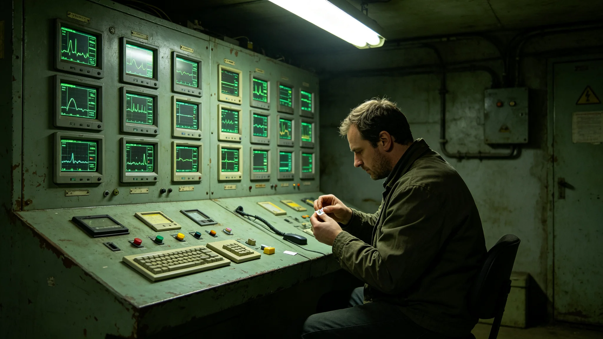

# 长期居住者终身健康监测无源贴片传感网第八代组网技术报告

**编制单位**：联合体长期居住者健康监测中心
**报告编号**：SENSOR-8TH-3470-015
**密级**：跨星系公开

## 一、组网缘起

终身贴身贴片自3440年全推（见GS-3455-01），已运行三十年。第七代贴片靠体表供电，续航三年，更换频繁，数据偶有断链。第八代改为无源贴片，靠体温与运动自供电，终身不换电池，正好对接十年强制换发的制度节点（见GS-3462-01）。

## 二、技术参数

| 项目 | 第七代 | 第八代 |
|---|---|---|
| 供电 | 体表电池 | 体温/运动自供电 |
| 续航 | 三年 | 十年（到换发） |
| 采样通道 | 五项 | 八项（增前庭、认知） |
| 重量 | 11克 | 6克 |
| 断链率 | 0.02% | 0.001% |

## 三、技术要点

技术组陈述三点。其一，无源自供电把电池这个故障点删掉了。过去断链率0.02%，绝大多数断在电池耗尽未及时换；第八代不靠电池，断链率压到千分之一。其二，采样通道从五项增到八项，新增前庭与认知两项——主任何静初本人前庭在3455年开始迟钝（见GS-3455-01），认知量表也出现轻度下降，这两项过去要靠定期人工复测，现在贴片直接连续采。其三，重量从11克降到6克，长期佩戴的不适感减半，配合终身一档（见GS-3462-01），一个人从出生戴到老，贴片越来越轻。

## 四、组网与互认

第八代贴片与跨星互认终身档案（见GS-3462-01）直连。贴片采样的数据实时写入本人终身档案，跨星区迁徙时随迁移包带走。组网覆盖三系七定居层，在网人数2.4亿，第八代首批换装1.2亿。技术组报告：换装期间旧片第七代与新片第八代并行半年，数据比对偏差在百分之一以内，验证了换代不换线。

## 五、遗留与风险

技术组如实列出两项。其一，无源自供电在长期静卧老人身上发电量不足，须外接一枚微型充电片——这意味着低活力舱老人的贴片仍有一个小电池，断链风险在低活力人群中略高。其二，新增的前庭与认知两项采样，数据基线尚短，长期趋势解释需五年以上数据积累。技术组写明：贴片越来越轻、越来越准，但它不是医生；它看见得早，不等于它能治好。

## 五之二、为什么电池是故障点

技术组在报告中解释无源化这个选择。终身贴身贴片戴在人身上，戴的人不会记得换电池。电池三年一耗，耗了忘了换，数据就断一截。过去三十年，何静初那枚片之所以零断链，是因为她自己每三个月看一眼、每六次换电池都记着。但2.4亿人，不可能每个人都像她那样记。

技术组陈述三层考量。其一，把电池这个故障点删掉，等于把断链的最大来源删掉。无源自供电靠体温和运动，只要人还活着、还有体温，片就有电。人静卧到连体温都供不动，再外接微型充电片兜底。其二，十年一换发，正好对接制度。第八代续航十年，到了制度规定的换发节点，整批换新，不必中途换电池。其三，重量从十一克降到六克。这六克不是小事——贴片戴一辈子，每天贴在身上，重五克，三十年就是一个人多扛了一个小东西一辈子。轻五克，是让这层监护轻到几乎忘了它在。

技术组最后注明：新增前庭与认知两项，是因为主任何静初自己开始钝了。她戴了三十四年，她的数据告诉我们，前庭和认知这两项，过去靠定期人工复测，人一过六十就开始出小问题。把这两项塞进贴片，是让"人开始钝"这件事，在钝得还轻的时候就被连续记下来，而不是等到体检那天才发现。

## 五之三、与终身一档的同步

第八代贴片与终身一档互认（见GS-3462-01）是同一张网的两头。技术组说明：贴片在身上采，终身档在星区间走。第八代把数据格式与跨星迁移包对齐，贴片采到的八项数据，到了新星区直接迁入，不用重新建档。

技术组另报告：首批换装一亿二千万片，分三年完成。换装期间，旧片第七代与新片第八代并行半年，比对偏差百分之一以内方停旧片。低活力舱老人的微型充电片单独配发，每半年一次上门更换。监测中心注明：这张网越铺越密，目的不是把人盯死，是让人走到哪、活到哪，那串连续的数据跟到哪。

技术组另报告：第八代贴片的出厂标定，每一片都要在标定台上跑满二十四小时，确认八项采样通道零漂移。监测中心注明：一片片贴一辈子，出厂那二十四小时，是它一辈子数据可信的起点。何静初那枚旧片，当年出厂只标定了两小时；这一代，标定翻了十二倍。

## 六、附则

监测中心注明：第八代贴片是何主任那枚戴了三十四年的片的下一代。她那枚换过六次、断链零次；这一代，我们想让一辈子只换十次、断链几乎为零。本报告随第八代组网交付，与终身一档互认制度同步生效。

---

**归档编号**：SENSOR-8TH-3470-015
**编制**：联合体长期居住者健康监测中心 技术组
**日期**：3470年11月8日
