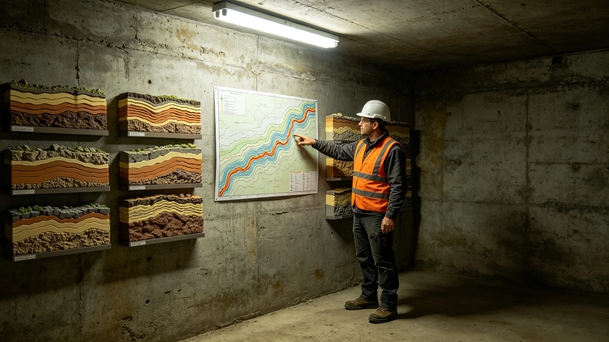

# 鲸鱼座τ星地下城深部岩层结构与渗流带三维探测技术报告

**编制单位**：鲸鱼座τ星地下城建设署
**报告编号**：ROCK-3D-3472-022
**密级**：跨星系公开

## 一、探测缘起

扩容总工程师袁召南三十年靠取芯勘定岩层（见GS-3457-01），但取芯只能"一点一点探"，地下岩层的三维结构与渗流带分布始终是一张不完整的图。3455年掘进遇地下水事件（见GS-3478-01），根因就是掌子面前方一条渗流带未被提前探出。3464年双签制度（见GS-3464-01）要求掘进前必查渗流，建设署据此立项深部岩层三维探测。

## 二、技术方法

| 方法 | 精度 | 覆盖 | 用途 |
|---|---|---|---|
| 三维地震反射 | 十米级 | 全城区 | 宏观岩性结构 |
| 电阻率层析 | 米级 | 重点段 | 渗流带定位 |
| 钻孔取芯 | 厘米级 | 抽检 | 标定三维模型 |
| 微震监测 | 实时 | 活跃段 | 掘进扰动预警 |

## 三、技术要点

技术组陈述三点。其一，三维地震反射把岩层从"一根根岩芯"拼成"一张三维图"。过去袁总工每段掌子面前亲手摸芯，摸到哪算哪；现在三维图先把整段岩层结构摆出来，摸芯只做标定。其二，电阻率层析专找渗流带——地下水在岩层里走的通道，电阻率与干岩不同，米级精度能把渗流带描出来。3455年那条渗流带，按这次探测的回溯，其实早就在三维图的盲区之外，是当时图没覆盖到它。其三，微震监测实时盯掘进扰动，掌子面一有异常声响，立刻报警，配合遇水缓挖规程（见GS-3464-01）。

## 四、探测成果

技术组报告：本轮三维探测覆盖地下城全部在建与规划扩容区，新发现三条此前未绘入图的深部渗流带、两处岩层破碎带。其中一条渗流带正穿过3455年遇水段下方，印证了当年的处置；另两条被标为"禁止掘进区"，写入未来扩容规划。技术组注明：这三条新发现的渗流带，过去靠取芯可能几十年都碰不到，现在一次探出。

## 五、遗留与成本

技术组如实列出：三维探测成本约星汇一亿二，覆盖全城区；米级电阻率层析只在重点段做，全城区米级精度成本过高，留待后续。建设署注明：一亿二，买的是不再靠袁总工一个人下井摸芯。他那三十年，手摸过四千根芯；这张图替他把没摸到的地方补上。

## 五之二、为什么取芯不够

技术组在报告中解释这张三维图要补的是什么。袁召南三十年取芯（见GS-3457-01），手摸过四千根岩芯，他的判断准，但取芯是"点"——一根芯只能告诉你这一个钻孔位置的岩层，钻孔和钻孔之间的岩层是什么，靠人推。推错了，掌子面前方就是未知。3455年那段遇水（见GS-3478-01），不是袁总工没本事，是取芯的点没铺到那条渗流带上。

技术组陈述三层。其一，三维地震反射把"点"连成"面"。整段岩层的结构、岩性、走向，一次探出，不再靠钻孔之间的推算。其二，电阻率层析把看不见的地下水通道描出来。水在岩层里走，眼睛看不见、取芯不一定取到，但电阻率不一样。米级精度把渗流带画成图，哪段下面有水、水往哪走，开工前就知道。其三，微震监测实时盯掘进。掌子面一有异常声响，配合遇水缓挖规程（见GS-3464-01），不必等到水渗出来才反应。

技术组最后注明：这张图不是取代袁总工的手。他那双手的判断，三十年没错过。图替他的，是把他手伸不到的地方、他没来得及摸的层位，先摆出来。他签字划掉"可挖"的时候，手里多了一张图，划得更有底。

## 五之三、与双签制度的衔接

三维探测成果是3464年双签制度（见GS-3464-01）的岩性依据。建设署说明：制度要求每段掘进许可建设署与生态分局双签，签之前建设署要出岩层勘定与支护设计，生态分局要出生态廊道与渗流评估。这张三维图把两边的底都垫实了。

建设署另报告：新发现的三条渗流带、两处破碎带，已标入禁止掘进区，写入未来扩容规划。袁召南在签收这张图时，在图边那三条新渗流带旁各写了一个"缓"字。建设署注明：他三十年前亲手摸芯划掉的那四段，现在一张图替他找出了三条新的。往后双签，手里有图，心里有底。

技术组另报告：三维图每年复测一次，盯岩层随掘进的微变形。建设署注明：地下城往下挖，岩层自己也在慢慢变。这张图不是画一次就锁死，是每年重画一遍，让"哪段能挖"这个判断跟着岩层一起变。袁召南在复测规程旁签了一个字："图也得跟着长。"建设署注明：岩层不变，变的是人对岩层的认识。这张图每年重画，就是让人的认识跟着岩层一起准。

## 六、附则

建设署注明：地下城往下挖，越挖越要先知道下面是什么。这张三维图不是取代袁总工的手，是让他的手和这张图一起决定哪段"可挖"、哪段划掉。本报告随探测成果并入双签档案，作为未来掘进许可的岩性依据。

---

**归档编号**：ROCK-3D-3472-022
**编制**：鲸鱼座τ星地下城建设署 技术组
**日期**：3472年4月25日
