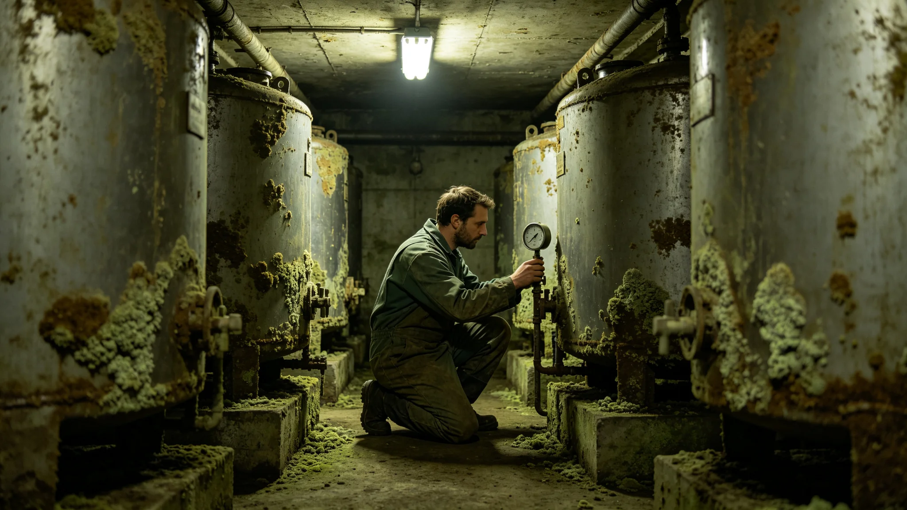

# 鲸鱼座τ星地下城第六居住层真菌分解链三日波动与应急处置事件通报

**发布单位**：鲸鱼座τ星地下城生态分局
**通报编号**：INC-FUNGI-3473-002
**密级**：跨星系公开

## 一、事件经过

3473年8月9日凌晨，第六居住层一段深地真菌分解链效率从常态94%骤降至82%，跌破报警阈值（见GS-3465-01五项指标）。监测系统六小时内报警（见GS-3470-01第八代贴片式监测网），生态分局值班巡检员于报警后两小时抵达现场。现场采样发现：该段分解链所用营养液的一处补给阀异常半开，致稀释过度，真菌群落活性下降。

事发当夜，第六居住层居民并无察觉。深地廊道里的分解链在墙后运转，居民在七米之上的居住层睡觉、吃饭、照看老人。没有人闻到墙下有什么不对。监测屏上那条分解链效率曲线，从94%慢慢往82%滑，滑到82%时，系统报警响了。值班巡检员从第三居住层赶到，背着采样箱，爬了两层升降机。

## 一之二、为什么是六小时

分局在通报中解释报警到处置的时间差。第八代监测网（见GS-3470-01）逐时采样，分解链效率一旦跌破阈值，六小时内告警。但六小时不是"系统六小时后才发现"，而是"系统一直在看，跌到阈值那一刻就报了"。从报警到巡检员到场两小时，是人的路程。从到场到确认原因、关阀、回升，用了三天。

分局注明：这三天里，分解链在82%—85%之间徘徊，没再往80%的报警线以下掉。如果没有那六小时报警，靠的是月度巡检，这个波动可能要一个月后才被发现。一个月后发现，分解链可能已经跌破80%，就不是三日处置，而是闭环断裂了。

## 二、处置过程

值班巡检员到场后，未立即关阀，而是先按规程记录现场状态、采样、拍照，再关阀调节营养液浓度。当日下午，首席生态官沈百合（见GS-3452-01）从第三居住层赶到，亲手嗅探该段气味，确认真菌活性正在回升。三日之内，分解链效率从82%回升至91%，未跌破80%的报警线，未波及其他段。

## 二之三、这三天里墙后发生了什么

分局在通报末尾附一段现场记录。8月9日凌晨报警后，巡检员到场，先采样、拍照，再关阀。营养液浓度调低后，真菌群落先是"懵"了半天——被稀释惯了的菌丝，一时适应不过来正常浓度。第二天，分解链效率爬到86%；第三天，回到91%。沈百合第二天下午赶到，亲手在廊道里走了一遍，嗅探那股熟悉的霉味。她在巡检本上写："味道回来了。"

分局注明：分解链不是机器，是活的。它被稀释了，它要缓三天才缓过来。这三天里，墙后那些真菌在加班似地恢复活性。人在墙上睡觉，不知道；墙后在慢慢往回长。

## 三、原因复盘

复盘认定：补给阀半开系前一日维护工单未完全复位所致。维护工在3473年8月8日换阀后，误将新阀停在半开位置，未做全开确认。这不是工艺事故，是一道确认工序的疏漏。沈百合在复盘会上指出：这道确认工序，过去靠维护工自检，没有第二人复看，漏了就漏了。

## 四、处置与整改

分局据复盘提出两项整改：其一，换阀工序增加第二人复看，复看记录并入巡检本；其二，营养液补给阀加装开度联锁，未全开则报警。两项整改于8月底落地。沈百合在整改单上签："漏了一道确认，三天才追回来。这道确认，从今往后不能再靠一个人自检。"

## 五、无人员伤亡与生物圈影响

本次事件无人员伤亡，未波及其他段，未污染生物圈。三日波动期间，第六居住层居民正常生活，未感知异常。分局注明：这正是监测网六小时报警的价值——人还没察觉，系统已经看见，处置完了人还不知道。

## 六、教训

分局在通报末尾写：分解链稳了一千年，不是因为它不会波动，是因为波动一出来就被按住。这次三天追回来，靠的是监测网、靠的是值班员到场、靠的是沈百合那双手嗅出来。下次还能不能三天追回来，取决于那道确认工序补上没有。

沈百合在整改单末另附一行：这次三日波动，第六居住层居民全程无感。墙后在加班，墙上在睡觉。这就是闭环该有的样子——人不知道墙后在转，墙后也不该让人知道它在转。但分局必须知道。分局知道了，按住了，才算闭环没断。

分局在通报最后附一句：这次事件无人员伤亡、无生物圈污染、无跨系影响。它只是一次三日波动。但三日波动之所以被记下来，是因为它差一点就不是三日，而是闭环断裂。把它记下来，是为了让下一次三日波动，还是三日。

分局注明：三日波动至此平息。闭环没断。巡检员蹲下去闻见味，就是这事件的全部。

分局在通报最后另写：三日波动期间，第六居住层三百一十二户住户无一人撤离。分局注明：波动只在分解链里，没传到住户的舱里。这就是闭环和住户之间的那道墙。墙后波动三日，墙里照常吃饭睡觉。分局注明：这道墙，是这一千年闭环最要紧的东西。

---

**归档编号**：INC-FUNGI-3473-002
**发布**：鲸鱼座τ星地下城生态分局
**日期**：3473年8月14日
