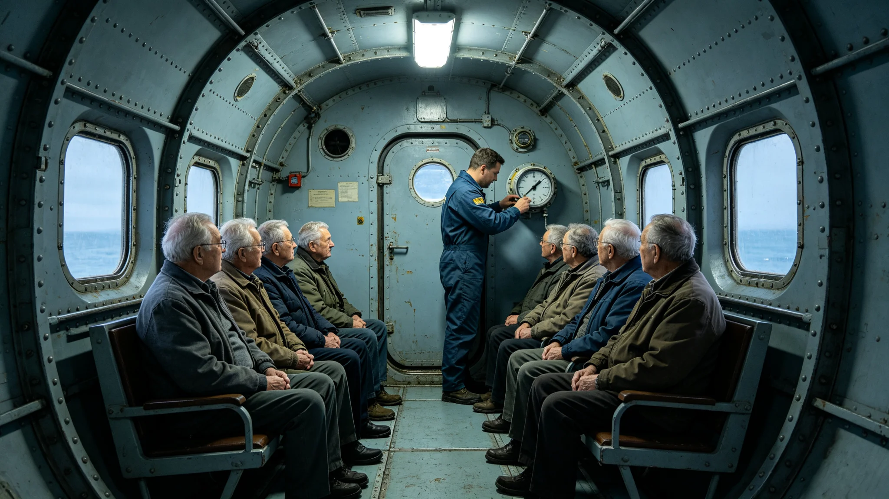

# 跨星系养老航线"归舟三号"生命支持舱段故障与三百一十二名老人分流事件复盘报告

**发布单位**：联合体跨星系养老事务总署
**报告编号**：INC-ELD-3474-005
**密级**：跨星系公开

## 一、事件经过

3474年2月18日，跨星系养老航线"归舟三号"载三百一十二名老人自比邻星b轨道养老环飞往鲸鱼座τ方向。航行至中段，三号舱段生命支持系统二氧化碳清除效率骤降，舱内二氧化碳分压在二十分钟内升至预警值。系统按当时的通用第七代闭环报警，值班随船医工立即启动应急。

事发时，三号舱段里三百一十二名老人大多半卧在床位上。养老航线走得慢，老人们有的在睡，有的在看舷窗外的星。二氧化碳一点点积上来，老人们先是觉得闷，接着有人开始喘气。随船医工闻到舱里气味不对，看表——二氧化碳分压已经顶到预警线。

## 一之二、为什么是三百一十二人

总署在报告中说明这个数字的分量。三百一十二名老人，低活力占六成。这个年龄段、这种身体，在生命支持出问题的舱里，比青壮年多撑不了多久。二氧化碳堆积对青壮年是"闷"，对老人可能就是"喘不上气"。通用第七代闭环的清除延迟三十秒，对青壮年是无感的三十秒，对老人是难熬的三十秒。

总署注明：这次无伤亡，不是因为系统好，是因为随船医工发现得早、卫慕分流得快。三百一十二人，一个都没伤着。但复盘会上没人庆祝——因为所有人都知道，下次不一定有这么快。

## 二、处置过程

养老总管卫慕（见GS-3453-01）在枢纽调度台接到报告后，四十七分钟内将三百一十二名老人分流至邻近两站备用床位，另调两艘封闭加压转运舱接驳。分流过程中，所有老人生命体征平稳，无一人恶化。卫慕在调度单右下角照例画了那个小圆圈。事故复盘会首份检讨由其本人签出。

## 二之二、分流那四十七分钟里发生了什么

总署在报告中还原卫慕调度台上那四十七分钟。接到报告后，她先不慌着分流，而是先问清三号舱段二氧化碳还剩多少、随船医工还能撑多久。问清了，她才给邻近两站发调床请求，调两艘封闭加压转运舱。三百一十二名老人从三号舱段撤出，转移到邻近两站备用床位，再换乘转运舱继续航程。整个过程，老人们被扶着、被背着，没有一个人在舱里慌。

总署注明：卫慕那四十七分钟，不是在搬人，是在排床。她三十七年排的就是这个——三百一十二个人，低活力占六成，哪几个人得先上转运舱，哪几个人能在备用床位多歇一会儿。她在调度单右下角画的那个小圆圈，那天画了三次。

## 三、原因复盘

复盘认定：三号舱段二氧化碳清除单元的一处滤芯提前耗竭。通用第七代闭环的滤芯更换周期按青壮年标定，三号舱段因载老人、呼出模式不同，滤芯耗竭速度快于预期，系统的滤芯寿命预估未按老年人群修正。

复盘另指出：通用第七代闭环的二氧化碳清除延迟为三十秒（见GS-3468-01），对老人偏慢。这次能无伤亡，全靠随船医工及时发现、卫慕人工分流。但人工分流靠的是一个人四十七分钟的反应，不是系统。

## 四、处置与整改

总署据复盘提出两项整改：其一，养老航线生命支持立即换装养老专用第七代闭环（见GS-3468-01），二氧化碳清除延迟压到十五秒，氧分压余量收窄到±1%，双机热备；其二，滤芯更换周期按老年呼出模式重新标定。整改于3468年随养老专用闭环定型落地。

卫慕在复盘检讨原文末句："床是我排的，生命支持是我签的，三百一十二位老人一夜没地方睡，是我的账。"

## 五、无人员伤亡

本次事件无人员伤亡。三百一十二名老人经分流与接驳，全部平安抵达目的地。总署注明：这次无伤亡，是运气加人工。下次不能再靠运气加人工。

## 六、教训

总署在报告末尾写：3451年那次故障（见GS-3453-01附3451故障）靠的也是人工分流。六年过去，问题还是同一个——通用闭环没为老人重新标定。这一次，我们把它写成了养老专用闭环。下一次，应该不用再靠一个人四十七分钟坐在调度台前了。

卫慕在复盘检讨的最后补了一句：三百一十二位老人，那天晚上有一个老人在转运舱里问她，"小姑娘，我们这是去哪？"她说，"去个有床的地方。"那一夜她排的不是床位，是三百一十二个人晚上有地方躺。这才是养老。

总署注明：归舟三号事件后，十二条养老航线在两年内全部换装养老专用闭环。老人们再走这条线，二氧化碳在舱里积不到让人喘气的程度，滤芯按老年呼出标定。卫慕说，这一回，系统该替他们撑着了。

总署注明：归舟三号故障至此复盘完毕。养老专用闭环自此换装。

---

**归档编号**：INC-ELD-3474-005
**发布**：联合体跨星系养老事务总署
**日期**：3474年2月26日
