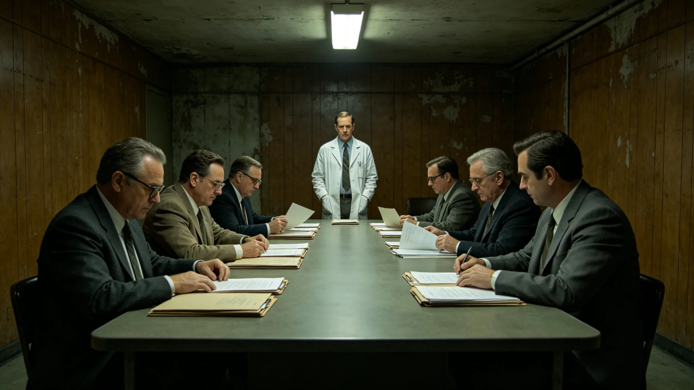

# 端粒修复第八代临床试验一例异常增殖信号暂停入组与伦理复核事件通报

**发布单位**：联合体寿命延长医学伦理委员会
**通报编号**：INC-LON-3475-008
**密级**：跨星系公开

## 一、事件经过

3475年10月，端粒修复第八代临床试验（见GS-3469-01）入组第六个月，一例受试者在常规随访中检出一处轻度异常增殖信号。信号未达确诊标准，但按伦理委员会"修复率每提一个百分点、随访期延长一倍"的严格红线（见GS-3469-01），一旦出现异常增殖信号，无论轻重，立即暂停入组。委员会在信号检出后二十四小时内宣布暂停新受试者入组。

这例受试者是一名六十二岁的长期居住者，入组前签了知情书，知道可能无效、可能有不良反应、可随时退出。信号检出那天，他还以为只是常规复查。医生告诉他有一处轻度异常，需要进一步查，他点头，说"你们查，我等"。

## 一之二、为什么二十四小时就停

委员会在通报中解释暂停的速度。第八代是主动修复端粒，干预的是细胞分裂的倒计时（见GS-3469-01）。这种干预，修复少了白做，修复多了可能诱发异常增殖。伦理委员会从一开始就定了一条红线：只要出现异常增殖信号，无论轻重，立即暂停入组。这条红线不是为了这次设的，是为了将来某一次"是真的"时，能在第一时间停住。

委员会注明：二十四小时就停，看起来太快——一次轻度信号，四周后可能就是良性。但红线就是红线。如果因为"看起来是良性"就不暂停，那下一次真信号来时，人就会想"上次不也没事吗"。这个念头，才是延寿医学最大的风险。

## 二、处置过程

暂停入组后，委员会做三件事：一是对该例受试者作进一步检查，确认信号来源；二是对全部已入组受试者加做一次专项筛查；三是请技术组复算第八代修复剂量与该信号的因果关系。三件事同步进行，不等结果。

## 二之二、那四周复核里做了什么

委员会在通报中还原那四周。暂停入组后，技术组把第八代全部已入组受试者的随访数据调出来，逐人比对；该例受试者被安排进一步影像与活检。每周一次技术组例会，每次例会都在等那个活检结果。第四周，结果出来：良性结节，与端粒修复无关。

委员会注明：那四周里，没有一个新受试者入组。已入组的受试者照常随访，只是随访从季度加密成了月度。委员会在那四周里没有发任何"试验遇挫"的消息，也没有发"一切正常"的消息——因为结果没出来之前，说什么都是抢跑。

## 三、原因复核

四周后，复核结论：该例信号经进一步检查，确认为非试验相关的良性结节，与端粒修复无因果关系。其余已入组受试者专项筛查，未发现类似信号。技术组复算：第八代修复剂量在当前窗口内，未诱发异常增殖。

## 四、处置与恢复

委员会在复核结论基础上，宣布恢复入组，但附加两项条件：其一，专项筛查频次从季度加密为月度；其二，每两月向伦理委员会提交一次全组异常信号汇总。委员会注明：暂停是因为红线，恢复是因为复核。红线不因"虚惊一场"而放松，反而因为这次虚惊证明它管用。

## 五、受试者知情

该例受试者在检出信号当日即被告知实情，复查后也如实告知良性结论。委员会注明：受试者在试验开始时就签了知情书，知道会有不良反应、可随时退出。这次暂停，是知情书里写过的事，不是意外。

## 六、教训

委员会在通报末尾写：延寿医学走到第八代，每一步都要在伦理上停一停。这次暂停入组，四周后无事恢复，看起来是一场虚惊。但如果那次信号是真的呢？暂停入组这道程序，就是为了让"是真的"那一次，能在第一时间停住。我们不希望用上它，但必须让它在。

那例受试者复查完，知道是良性，回家了。委员会注明：他没有因为这次暂停而退出试验——他说，"你们停得对，我才敢接着试。"这句话，比任何疗效数据都让委员会安心。

委员会在通报最后附一句：这次暂停入组与恢复，全过程如实记录，未删改。第八代试验继续，但已不再是那个"修复率15%"的纸面数字——它多了一道真实经历过的暂停。委员会注明：试验的价值，不只在结果，也在它敢为一个信号停一停。委员会注明：这一年的试验数据，连同这次暂停与恢复，全部存档。无论第八代最终能否通过三年随访，这次暂停本身，都会写进延寿医学的伦理档案。

委员会注明：暂停入组四周后恢复。试验继续。伦理停一停，比不停好。

委员会在通报最后另写：暂停入组四周期间，那例受试者每周复查一次。第四次复查，信号消退。委员会注明：他知道是良性，回家了。他没因为这次暂停而退出试验——他说，你们停得对，我才敢接着试。委员会注明：这句话，比任何疗效数据都让委员会安心。

---

**归档编号**：INC-LON-3475-008
**发布**：联合体寿命延长医学伦理委员会
**日期**：3475年10月30日
