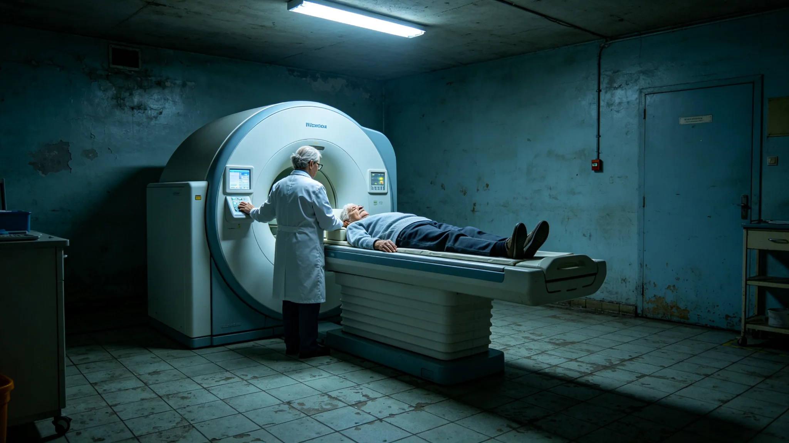

# 某星区长期居住者群体性骨密度骤降预警与离心重力调节失准处置事件通报

**发布单位**：联合体长期居住者健康监测中心
**通报编号**：INC-BONE-3476-011
**密级**：跨星系公开

## 一、事件经过

3476年5月，第八代终身贴片监测网（见GS-3470-01）在某星区批量检出长期居住者骨密度环比骤降，降幅远超长期居住者正常基线。监测中心主任何静初（见GS-3455-01）在预警发出后六小时内，将该星区在网一千二百名长期居住者的骨密度数据全量调出，逐人比对基线。

这不是一个人骨头出问题，是一个环里一千二百个人的骨头，一起比上个月松了。何静初看着屏上那条本该平缓下降的曲线，忽然往下掉了一截——不是掉一两个人，是整个环的曲线一起往下。她当时就知道，这不是病，是环境。

## 一之二、为什么是一千二百人

监测中心在通报中说明这个数字的意义。一千二百人，住在同一个居住环，共用一套离心重力调节器。骨头松，长期居住者本来就会一年比一年松，但那是缓慢的、个体的。这一次是批量的、同步的——一千二百个人的骨密度在同一个月一起往下掉。

何静初在复盘会上指出：如果是疾病，一千二百个人不可能同月得同一种骨病。批量同步下行，只有一个解释：他们共用的那个环境参数变了。贴片贴在人身上，量的是骨头；但骨头的变化，往往是环境的变化在人身上的投影。看见骨头掉，只是第一步；找到哪个环境参数漂了，才是这次预警真正要做的事。

## 二、初判过程

何静初团队四十六小时内出初判：骨密度骤降集中在该星区同一居住环，非疾病。进一步排查发现：该居住环离心重力调节器在上月一次维护后，实际输出重力从设计值0.65g漂移至0.58g，漂移未被维护记录捕获。低离心重力下，骨密度以远超正常速率流失。

## 二之二、四十六小时里怎么找的

监测中心在通报中还原那四十六小时。何静初团队把一千二百人的骨密度数据全量调出，先看是不是集中在某几栋楼——结果是整个环。再看是不是集中在某一段人群——结果是全年龄段同步。那就排除了个体疾病。剩下的只有环境。她把该环的离心重力、氧分压、温湿度、辐射背景，一项项拉出来比。比到第三十六小时，离心重力那一项跳了出来——实际0.58g，设计0.65g。

监测中心注明：0.58和0.65，差0.07个g。人在这个环里，日常感觉不到重力轻了0.07。但骨头感觉得到。骨头在低重力下一年一年地松，松得比正常快。四十六小时找到那0.07g，靠的是把一千二百人的骨头和一个环的环境放在一起对。

## 三、处置过程

监测中心联合该星区工程署，立即校正离心重力调节器至0.65g，并对该环一千二百名长期居住者作骨密度复查与补钙干预。校正后三个月，该环骨密度下降速率回到长期居住者正常基线。无一人发展为骨质疏松症。

## 四、原因复盘

复盘认定：离心重力调节器维护后未做重力输出复测，是一道缺失的工序。维护工换了部件，按规程应测一次输出重力确认，但这次跳过了。何静初在复盘会上指出：骨密度降下来是慢事，重力漂了却没人看，这是监测网只看人、不看环境的盲区。

## 五、整改

监测中心据复盘提出两项整改：其一，离心重力调节器维护后强制输出复测，复测记录并入设备档案；其二，健康监测网增加环境参数联动——一旦某环批量骨密度下行，自动提示排查该环重力、氧分压等环境参数。整改于6月底落地。

## 六、教训

监测中心在通报末尾写：这次预警从发出到初判四十六小时，比规程要求的七十二小时提前二十六小时。网看见得早，人没伤着。但根因是维护工序漏了一道。何静初说："贴片贴了一辈子，数据一连上就看见骨头在掉。可骨头掉是因为重力漂了，重力漂是因为人没测。看见骨头掉容易，找到重力漂在哪，才是本事。"

监测中心在通报末尾另写：三个月后复查，一千二百人的骨密度下降速率回到基线。校正后的离心重力调节器，每季度复测一次输出，复测记录并入设备档案。何静初在整改单上签："贴片是贴在人身上的，但它量到的问题，往往长在机器上。下次再批量下行，先查机器，再查人。"

何静初注明：骨密度骤降至此处置完毕。重力调节器校正后，骨密度回到基线。

何静初在通报最后另写：校正后的离心重力调节器，每季度复测一次输出。三个月后复查，一千二百人的骨密度下降速率回到基线。何静初注明：贴片是贴在人身上的，但它量到的问题，往往长在机器上。下次再批量下行，先查机器，再查人。

---

**归档编号**：INC-BONE-3476-011
**发布**：联合体长期居住者健康监测中心
**日期**：3476年6月21日
