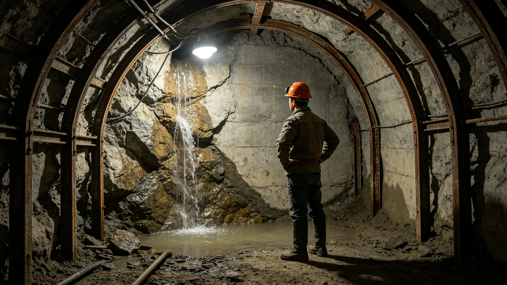

# 鲸鱼座τ星地下城第八层扩容掘进掌子面遇地下水事件缓挖处置复盘报告

**发布单位**：鲸鱼座τ星地下城建设署
**报告编号**：INC-WATER-3478-017
**密级**：跨星系公开

## 一、事件经过

3478年4月，第八层扩容掘进至某掌子面，出渣时发现岩渣含水率异常。总工程师袁召南（见GS-3457-01）到场取样，判明该掌子面前方存在一条深部渗流带。按其三十年经验，未强行掘进，立即停工。

那天掌子面上，掘进机刚停下来，出渣口淌下来的渣子比往常潮。袁召南蹲下去，抓了一把，在手里捻了捻。他没说话，站起来，让掘进机退后，让所有人撤到安全线外。三十年了，他的手比仪器快——这把渣的含水率告诉他，前面有水。

## 一之二、为什么是袁召南先撤

建设署在报告中说明这一下后撤的分量。掘进掌子面上，进度是钱，工期是命。能不停就不停，是掘进队的本能。但袁召南蹲下去捻了那把渣，站起来就让所有人撤了。这个"撤"，在工程上等于把已经挖下去的进度先停下来，把已经上的人先撤出来。

建设署注明：他三十年四度在签字时划掉"可挖"（见GS-3457-01），每一次划掉，都是把进度先放一放。这一次也是。他不是不敢挖，是他的手告诉他，前面那条水，不知道有多深。水不说话，人不往前走。他在掌子面上蹲下去的那一把渣，比任何一台探测仪都先说话。

## 一之三、缓挖那一个月里做了什么

建设署在报告中还原那个月。停工后，先排水——把掌子面前方渗进来的水一点点抽走。同时补打九个渗流监测孔，把这条渗流带的走向描出来。一个月后，三维岩层探测（见GS-3472-01）确认：这条带从掌子面前方斜穿过去，再挖下去，水会越涌越大。于是整段标为禁止掘进区。

建设署注明：那一个月，掘进机停着，工人在打监测孔、在抽水。进度没了，但人活着。袁召南那一个月几乎天天下井，看水位，看孔里的数据。他说："水在下面走，我得知道它往哪走，才知道人能不能往前走。"

## 二、处置过程

袁召南当场在掘进许可上划掉"可挖"，改写"缓挖，先排水"。按3464年双签制度（见GS-3464-01），建设署与生态分局双签停工。随后补打渗流监测孔九个，启动排水，观察水位。一个月后，三维岩层探测（见GS-3472-01）确认该渗流带走向，将其标为禁止掘进区。

## 三、原因复盘

复盘认定：该渗流带在当年取芯勘定中未被探到——袁召南取芯的点没有铺到这条带上。这不是判断失误，是取芯这种"点"探测方式的固有盲区。袁召南在复盘会上指出：我三十年手摸芯，摸到哪算哪；这条带，我的手没伸到。

## 四、整改

建设署据复盘提出：第八层及未来扩容段，掘进前必走三维岩层探测（见GS-3472-01），米级电阻率层析描出全部渗流带后再开工。袁召南在整改单上签："取芯是手，三维图是眼。手不够了，得用眼补上。"

## 五、无人员伤亡

本次事件无人员伤亡。停工缓挖一个月，未造成掌子面坍塌或人员被困。建设署注明：缓挖不是耽误工期，是把人从水里拽出来。袁总工那一下划掉"可挖"，划得对。

## 六、教训

建设署在报告末尾写：3455年那次遇水（见GS-3457-01）靠的也是袁总工个人拍板。这一次，他还是那个人。但制度不能再指望他每次都在。3464年的双签、3472年的三维图，就是把他这一次的判断，变成谁在位置上都得这么办的规程。他在签字那一下敢划掉"可挖"，是因为他下井摸了三十年；后来人手里有图，就不必每次都赌一个老工程师那天还在掌子面上。

袁召南在签收三维图那天，在图边那条新发现的渗流带旁写了一个"缓"字。建设署注明：这个"缓"字，和他三十年前在掌子面岩壁上写的那个，是一个笔法。三十年过去，他还是那个敢在签字那一下停下来的人。只是这一次，停下来之后，手里多了一张图告诉他为什么该停。

建设署在报告最后附一句：那条渗流带此后十年未再掘进。3472年三维图每年复测，水位稳定。建设署注明：缓挖一年，省下的是八层底下的人。袁召南那年六十岁，他没说"我老了该退了"，他说"水还在走，我还得看"。建设署注明：这一年缓挖，没出一个伤亡，没塌一面掌子面。那九个渗流监测孔，至今还在数据中心实时传水位。水没说话的时候，孔替它说。建设署注明：这起事件无人员伤亡、无生物圈污染，是一起被提前按住的隐患。把它记下来，是为了让八层以下的掌子面，都先有九个孔，再有掘进机。

建设署注明：遇水缓挖至此复盘完毕。九个渗流孔打到掌子面旁。

建设署在报告最后另写：那条渗流带此后十年未再掘进。3472年三维图每年复测，水位稳定。建设署注明：缓挖一年，省下的是八层底下的人。袁召南那年六十岁，他没说"我老了该退了"，他说"水还在走，我还得看"。

---

**归档编号**：INC-WATER-3478-017
**发布**：鲸鱼座τ星地下城建设署
**日期**：3478年5月30日
