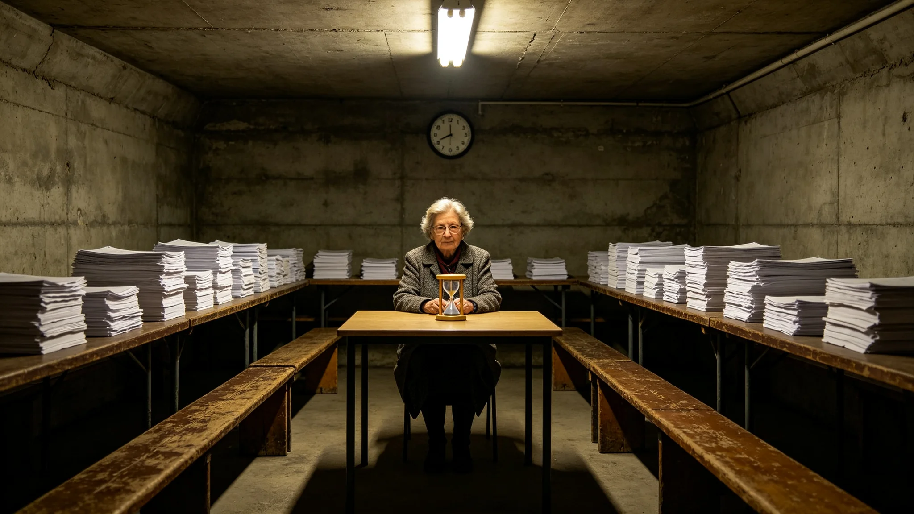

# 第七任秘书长第一段中期信任投票计票系统延迟十一小时与双机重计事件通报

**发布单位**：三恒星系公民大会选举事务署
**通报编号**：INC-VOTE-3479-020
**密级**：跨星系公开

## 一、事件经过

3479年11月，第七任秘书长骆元洲（见GS-3451-01）第一段任期结束，按3459年分段换届制度（见GS-3459-01）举行中期信任投票。计票进行至七成时，主计票系统突发延迟，计票进度停滞。

那天计票厅里，大屏上的计票数字停在了七成，不动了。厅里有人开始看表，有人小声商量。有人凑到监票长姚光霁跟前，说七成都出来了，要不先按这个报个倾向，让外面的人先有个数。姚光霁摇头。他在监票席上坐下来，把那个旧沙漏倒过来。

## 一之二、为什么是十一小时

选举事务署在通报中说明这十一小时。延迟不是机器坏了，是数据同步故障。系统在恢复，双机独立计票在另跑。但七成的数字已经在大屏上了——外面的人会看，会猜，会有人拿七成的数字去发消息。姚光霁要做的，就是在这十一小时里，不让任何一个"临时数字"流出去。

选举事务署注明：十一小时，他倒了十一次沙漏。他不是不知道外面在等，不是不知道媒体在催。他知道。但他更知道，七成不是全部。按七成报，差零点四个百分点，就是一个错的"未过半"，就是一场不该有的改选。十一小时等的就是这零点四个百分点。

## 一之三、双机重计那十一小时

选举事务署在通报中还原那十一小时。主系统恢复前，双机独立计票在另一台机器上同步跑。姚光霁在监票席上坐着，看着两台机器的屏幕——一台停在七成，一台还在慢慢算。他不让任何人去碰停着那台的数字，也不让任何人把七成的消息放出去。

选举事务署注明：那十一小时里，计票厅外的公民不知道里面在等什么。有人开始散场，有人还在等。姚光霁不出来说话。他只是坐着，沙漏倒了十一次。第十一次沙漏漏完，双机重计出结果——过半。这时候他才站起来，宣布最终结果。

## 二、处置过程

监票长姚光霁（见GS-3458-01）拒绝选举事务署内有人提出的"先按已有七成出临时倾向数字"的建议。其原话："七成不是全部，倾向不是结果。延迟不是出事，是制度在走。"姚光霁在监票席位上坐等十一小时未离场，其间启动3459年修订的双机独立计票。

## 三、双机重计

系统恢复后，按全量重新计票。结果与延迟前七成的倾向数字相差零点四个百分点——若按临时倾向数字发布，将导致信任投票"未过半"的误判，进而触发第二段自动改选。双机重计确认：信任投票实际过半，骆元洲进入第二段任期。

## 四、原因复盘

复盘认定：主计票系统一次数据同步故障致延迟，非恶意攻击。但暴露旧流程在长寿命社会下的冗余不足——若没有双机独立计票，延迟十一小时内无第二套结果可对照。

## 五、整改

选举事务署据复盘确认：3459年修订的双机独立计票、延迟不宣布临时结果两条规程（见GS-3459-01）在本次事件中经受住了检验。姚光霁在处置备忘录上签："延迟不是出事，是制度在走。"

## 六、无人员伤亡与无误判

本次事件无人员伤亡，最终计票结果无误。选举事务署注明：零点四个百分点，差一点就是一个错认的"未过半"，差一点就是一场不该有的改选。十一小时的等待，买的就是这零点四个百分点。

## 七、教训

选举事务署在通报末尾写：3451年那次换届延迟（见GS-3458-01）靠的是姚光霁一个人坐住。这次3459年制度刚改完，双机计票就用上了。姚光霁说："计票可以慢，不能错。慢一天没人骂，错一次就全完。"下一次换届，希望不用再有人坐十一小时——但真到那天，制度得能接得住。

姚光霁在那次延迟事件后，把那个旧沙漏擦干净，放回监票席抽屉里。他没换个新的。选举事务署注明：他说，沙漏旧点好，倒着倒着，就知道自己又坐了一小时。他今年六十四，下一次换届他六十六。沙漏还在，他也还在。

选举事务署在通报最后附一句：这次延迟事件后，双机独立计票写入了3459年换届制度（见GS-3459-01）。姚光霁那十一小时，不再是一个人的坚守，而是制度的常态。选举事务署注明：零点四个百分点，差一点就是一场错的改选。这一次，我们坐住了。下一次，让制度坐住。骆元洲在第二段就职时说，他没做什么，只是没让那张七成的数字流出去。公民大会注明：他坐住十一小时，就是这一任最大的政绩。

选举事务署注明：计票延迟十一小时至此复盘完毕。双机计票写入制度。

选举事务署在通报最后另写：这次延迟事件后，双机独立计票写入了3459年换届制度。姚光霁那十一小时，不再是一个人的坚守，而是制度的常态。选举事务署注明：零点四个百分点，差一点就是一场错的改选。这一次，我们坐住了。

---

**归档编号**：INC-VOTE-3479-020
**发布**：三恒星系公民大会选举事务署
**日期**：3479年11月11日
