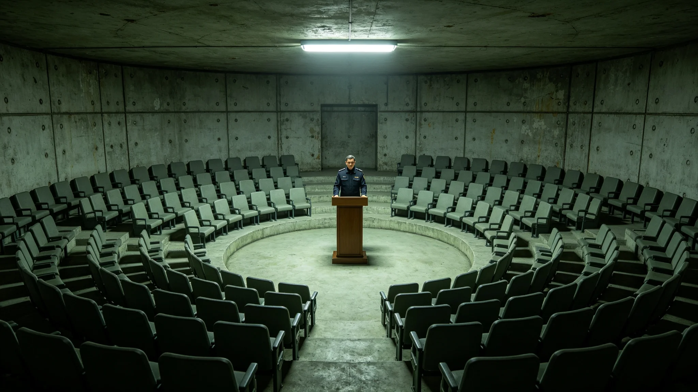

# 三恒星系文明联合体第七任秘书长骆元洲就职典礼规程公报

**发布机构**：三恒星系文明联合体公民大会
**发布日期**：3480年3月1日
**文件等级**：跨星系公开

## 一、典礼背景

第七任秘书长骆元洲于3451年就职（见GS-3451-01），按3459年分段换届制度（见GS-3459-01），3461年通过中期信任投票进入第二段。3480年3月1日，其第二段任期开始，公民大会依规程举行就职典礼。典礼不办庆典，不设口号，按《高级公职人员就职规程》执行。

## 二、典礼规程

**（一）入场**

骆元洲着常服入场，不穿礼服，不设仪仗。公民代表按星区席位就座，无指定贵宾席。入场时，议事厅无音乐，只有通风与照明的底噪。

**（二）宣誓**

骆元洲立于宣誓台前，诵读就职誓词。誓词全文："我将延续而不僭越，看住上一代的闭环，交代好下一代的班，找出今天没出问题、五十年后可能出问题的地方。"其就职文书上原有一个被划去的"开拓"二字（见GS-3451-01），宣誓时不读。

**（三）交班**

第六任秘书长（3299年任满，见GS-3299-01）的交班代表向骆元洲移交一枚联合体中枢铜印。铜印不致辞，不讲话，只移交。

**（四）致辞**

骆元洲致辞不超过十五分钟。其3451年就职时发言十七分钟（见GS-3451-01），本次规程限制在十五分钟内。致辞不设个人愿景口号。

## 三、现场记录

公民大会记录员现场记录：3480年3月1日，议事厅到会公民代表二百一十七名。骆元洲入场用时一分二十秒，无脚步声外的其他声响。宣誓用时四十秒。交班用时十二秒。致辞用时十四分三十七秒，未超规程。致辞末句："灯还亮着，别让它灭。"议事厅无人鼓掌，无人起立。记录员注明：散场时，代表们按席位顺序离场，无人逗留。

## 四、规程说明

公民大会注明：就职典礼不办庆典，是因为这一任不是"新朝"，是"交班"。骆元洲是第三代领导人的首任（见GS-3451-01），他的就职不是开创，是接续。规程把仪仗、音乐、口号都去掉，只留宣誓、交班、致辞三件事。去掉的不是排场，是把"时代"两个字从这个典礼上抹掉。

## 四之二、为什么把仪仗都去掉

公民大会在规程说明中解释这次"去排场"的用意。第七任秘书长骆元洲是第三代领导人的首任（见GS-3451-01）。第三代领导人不是推翻重来的一代，是接上一棒的一代。上一棒交到他手里，他要做的不是开一个新时代，是把上一代建的闭环看住，把下一代的班交代清楚。

公民大会注明：就职典礼上的仪仗、音乐、口号，都是给"开创新时代"的人用的。骆元洲不开创新时代，他接一棒。把排场去掉，是把"时代"两个字从这个典礼上抹掉。一个接棒的人，不需要掌声；他需要的是，他站在宣誓台前的样子，和他考勤表上的笔迹一样，可查、可对、可复查。

公民大会另注明：散场时无人鼓掌，不是冷淡，是规程。这个典礼的全部内容，就是宣誓四十秒、交班十二秒、致辞十四分三十七秒。多一秒不多，少一秒不少。

## 四之三、散场之后

公民大会记录员另记散场后。三百一十七名公民代表按席位顺序离场，无人逗留，无人围着骆元洲握手。骆元洲在宣誓台前站了大约一分钟，然后走下宣誓台，把常服上的一枚别针扶正，从侧门离场。记录员注明：他离场时，没有回头看议事厅。

公民大会注明：散场不逗留，是规程。一个秘书长的就职，结束就结束。他不需要被围在人群里，他需要回到他的办公桌前，继续看那份千年评估。

## 五、附则

本规程自3480年3月1日起执行。下一次就职典礼为3461年中期信任投票后第二段开始，按本规程执行。公民大会注明：就职照不磨皮，誓词不喊口号，交班不讲话。一个秘书长的就职，应该和他的考勤表一样，可查。

## 四之四、典礼与前任的对照

公民大会记录员另对照第六任秘书长3299年就职（见GS-3299-01）。那次就职仍有仪仗、有音乐、有致辞。骆元洲这次，仪仗去了，音乐去了，致辞压到十五分钟以内。公民大会注明：不是这一代的秘书长比上一代朴素，是第三代领导人要的就是"接棒"的样子。上一代把三系缝到一起，这一代把缝好的东西看住。看住，不需要掌声。

公民大会另注明：骆元洲的就职照按其本人要求未作磨皮调色。照片附卷，脸是他当天的脸色。公民大会注明：一个秘书长的就职照，应该和他的体检表一样，不磨皮。

## 四之五、典礼不设来宾席

公民大会在规程最后注明：本次就职典礼不设来宾席。跨星系友邦派来的观礼代表，按普通公民代表就座，无贵宾座。公民大会注明：一个接棒的秘书长，不需要外宾来观礼。他的交班，是联合体自己的事。友邦代表若来，坐在公民席里，和其他人一样看四十秒宣誓、十二秒交班。

## 四之六、典礼之后的第一天

公民大会记录员注明：就职典礼次日，骆元洲按常日到办公室。门禁记录显示他八点十二分到岗，比前一日的就职典礼还早。公民大会注明：典礼是一天的事，看闭环是每一天的事。

---

**归档编号**：RIT-INAG-3480-026
**编制**：三恒星系文明联合体公民大会
**日期**：3480年3月1日
