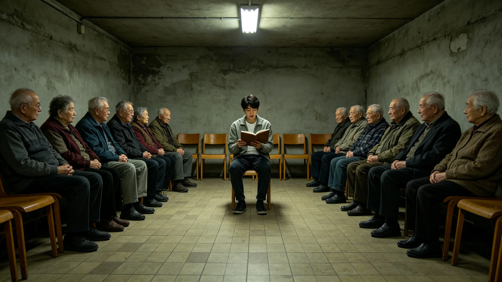

# 三恒星系跨星系敬老节确立与首次跨星共祭仪式规程公报

**发布机构**：联合体跨星系养老事务总署
**发布日期**：3481年10月10日
**文件等级**：跨星系公开

## 一、节期缘起

随寿命延长，六十岁以上占比已过半（见GS-3454-01江暮春台账），跨星系养老体系建制（见GS-3460-01）后，老人跨星区养老常态化。但三系各地敬老习俗不一，无一个跨星区共通的敬老节点。3481年，总署依《跨星系养老体系》提请设立跨星系敬老节，公民大会通过，定每年10月10日为敬老节。

## 二、节期规程

**（一）共祭**

敬老节当日，三系各养老环、养老舱段同时举行共祭。共祭不祭神，不拜偶像，只做一件事：念出当年度辞世老人的姓名。各养老环值班员按名册逐名念出，不念悼词，不做评价，只念名字。

**（二）在位老人受敬**

共祭后，当年度仍在世的老人受一次敬。敬的方式不是磕头、不是献花，是由晚辈为其念一段其本人年轻时的口述史片段（见GS-3376-01文明记忆产业）。念的是老人自己说过的话，不是晚辈编的颂词。

**（三）跨星连线**

敬老节当日，三系各养老环通过光际通信网连线，同屏共祭。跨星迁徙的老人，可在迁入环与迁出环的家人同屏受敬。连线不直播，不公开，只限各养老环内部。

## 三、首次共祭现场记录

3481年10月10日，首次跨星系敬老节。总署记录员现场记录：比邻星b轨道养老环共祭，值班员念出当年度辞世老人姓名一百四十三名，用时十九分钟；鲸鱼座τ地下城养老舱共祭，念出一百零一名，用时十三分钟；老地球方向养老环共祭，念出八十七名，用时十一分钟。三环连线同屏，总用时四十四分钟。

记录员注明：共祭全程无人说话，只有值班员念名字。念完最后一个名字，各环静默一分钟，然后散场。无人鼓掌。

## 四、规程说明

总署注明：敬老节不办庆典，不演节目。念名字、听自己说过的话、同屏共祭，三件事。总署写明：老人不是哪个星区的财产，敬老也不该只在一个星区。把这个节定在10月10日，是因为10月10日——两个"十"，像两个人对面坐着。

## 五、附则

本规程自3481年10月10日首次执行，此后每年同日。总署注明：敬老节这一天，不发宣传稿，不做活动总结。念了多少个名字，就是这个节全部的内容。

## 四之二、为什么是念名字

总署在规程说明中解释这个节的核心动作。三系各地敬老习俗不一，有的磕头，有的献花，有的演戏。总署把这些都去掉，只留念名字。总署注明：老人跨星区养老，到了新环，新环的人不知道他叫什么、年轻时做过什么。念名字，是让这个环里的人知道——这个房间里，住过谁。

总署另注明：不祭神、不拜偶像，是因为老人不是神。他们只是活得久、住得久。把他们当神拜，反而是把他们从"人"里拎出来。念名字，是把他们当人记下来。一个老人辞世，念出他的名字，就是告诉他：你在这个环里住过，我们记得。

## 五、附则

## 三之三、共祭之后

总署记录员另记共祭之后。三环连线同屏念完名字，各环静默一分钟。静默结束，当年度仍在世的老人受一次敬——晚辈为其念一段其本人年轻时的口述史片段。总署注明：念的是老人自己说过的话，不是晚辈编的颂词。一位老人听到晚辈念出他三十年前在迁徙船上说过的一句话，没说话，只是点了点头。

## 四之四、与其他节的区别

总署在规程说明中区分敬老节与归航节（见GS-3395-01）。归航节是祭老地球方向的原乡记忆，敬老节是祭身边活着的人。归航节遥祭远方，敬老节近祭此环。总署注明：敬老节不遥祭，就在这一间养老舱里，念这个环里辞世的名字。老人不需要被全星系记住，他需要被他隔壁床的人记住。

## 四之五、节期不与节庆混

总署在规程最后注明：敬老节不放假、不发福利、不办联欢。它和归航节（见GS-3395-01）、传灯节（见GS-3364-01）区分开。传灯节是代际交接，归航节是遥祭原乡，敬老节是近祭身边人。三个节各管一件事，不混在一起办。总署注明：节越多越要分清，否则老人一年被"敬"三次，一次也没敬到。

## 四之六、首年共祭的数字

总署在规程最后附首年共祭数字：3481年首次敬老节，三系各养老环共念出当年度辞世老人三百三十一名。总署注明：这三百三十一个名字，就是这一年养老体系送走的人。念完他们的名字，节就过完了。没有第二年的庆祝，只有第二年再念。

## 四之七、为什么不直播

总署在规程最后注明：敬老节共祭不直播、不上公众平台。总署注明：念名字是这个环内部的事，不需要全星系围观。老人辞世，是这个环的人共同送走他；直播出去，反而把私事变成了节目。

## 四之八、节期的最后一条

总署在规程最后注明：敬老节当天，养老环不播放音乐，不布置彩灯，不挂横幅。墙上只有名字，桌上只有茶。总署注明：老人要的不是热闹，是安静地被记住。

---

**归档编号**：RIT-ELD-3481-029
**编制**：联合体跨星系养老事务总署
**日期**：3481年10月10日
