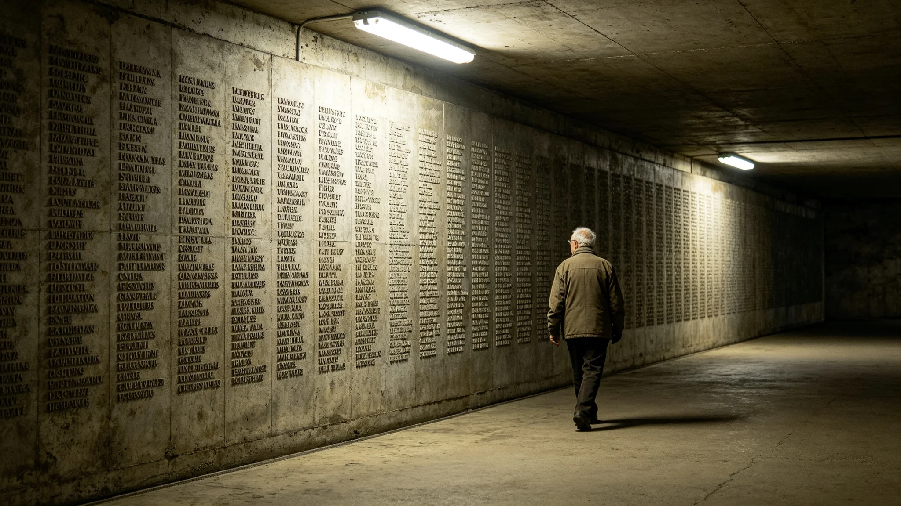

# 鲸鱼座τ星地下城千年居住纪念与"入层人墙"仪式规程公报

**发布机构**：鲸鱼座τ星地下城建设署
**发布日期**：3482年5月18日
**文件等级**：跨星系公开

## 一、纪念缘起

地下城自首批入住以来，已近千年。深地生态闭环运转千年（见GS-3392-01百年监测、GS-3466-01千年评估），入住者一代代在七层深居。3482年，建设署依《地下城市扩容审批制度》（见GS-3464-01）提请举行千年居住纪念，公民大会通过。纪念不办庆典，只做一件事：把千年间入住过地下城的人的名字，刻上一面墙。

## 二、仪式规程

**（一）刻壁**

地下城中央纪念大厅立一面"入层人墙"，刻千年间所有入住者姓名。刻名不按职位、不按名望，只按入住先后。首席生态官沈百合（见GS-3452-01）、总工程师袁召南（见GS-3457-01）的名字，与首批入住的巡检员、掘进工、陪护员刻在同一面墙上，按先后排列，不分高下。

**（二）入层**

纪念当日，当年新入住第八层的居民，由老人领入新层。领入者不致欢迎辞，只把一把新层的钥匙交给新人。钥匙不讲话，只移交。

**（三）巡墙**

纪念仪式后，居民可自由巡墙。墙上刻满名字，无人解说，无人讲解。居民走到某一个名字前，可驻足，可离开。墙上不刻生卒年，不刻事迹，只刻名字与入住层号。

## 三、首次纪念现场记录

3482年5月18日，首次千年居住纪念。建设署记录员现场记录：入层人墙首期刻名三万一千四百二十七个，用时三个月。纪念当日，沈百合到场，在墙上找到其母沈秀兰的名字（3390—3445，见GS-3452-01），驻足约一分钟，未说话。袁召南到场，在墙上找到其父袁定海的名字（3360—3420，见GS-3457-01），同样未说话。

记录员注明：纪念全程无音乐，无致辞。新入住第八层的十二户居民，由十二位老人领入，每人一把钥匙。仪式用时四十七分钟。散场时，无人鼓掌。

## 四、规程说明

建设署注明：千年居住纪念不办庆典，是因为这一千年不是哪个伟人开的，是三万一千四百二十七个人一代一代住出来的。把名字刻上墙，不分职位，就是把这千年还给这三万人。建设署写明：墙上不刻事迹，是因为事迹由活着的人去说，墙只记名字。

## 五、附则

本规程自3482年5月18日首次执行，此后每百年一次。建设署注明：下一次千年纪念是4482年。那时墙上刻的名字，会比现在多。

## 四之二、为什么墙上不刻事迹

建设署在规程说明中解释这面墙的规矩。三万一千四百二十七个名字，若每个都刻生卒年、刻事迹，墙就成了一座功德碑。建设署不要功德碑，要一面墙。墙上不刻事迹，是因为事迹由活着的人去说——沈百合的巡检、袁召南的签字、顾满仓的巡护，这些由活人去讲；墙只记名字，记谁住进来过。

建设署另注明：沈秀兰（3390—3445）与袁定海（3360—3420）的名字，刻在墙的最早一批。她们的女儿与儿子，今天在墙上找到了她们。建设署注明：这面墙不分职位，总工程师的母亲和第一批掘进工的名字，按入住先后刻在同一条线上。这就是千年——不是伟人的千年，是三万人的千年。

## 五、附则

## 四之三、巡墙的人

建设署记录员另记巡墙。纪念仪式后，居民自由巡墙。墙上三万一千四百二十七个名字，无人解说。一位新入住的年轻人在墙上找到自己祖父母的名字，站了一会儿，没说话。建设署注明：墙上不刻生卒年，不刻事迹，只刻名字与入住层号。巡墙的人看多久，是他自己的事。

## 四之四、人墙与万代柱的区别

建设署在规程说明中区分入层人墙与万代柱（见GS-3384-01）。万代柱刻的是文明存续的无名者，入层人墙刻的是具体住过这地下城的人。万代柱刻的是"谁在"，人墙刻的是"谁住过"。建设署注明：人墙只记地下城，不记三系全文明。它窄，因为它只属于这七层深居的人。

## 四之五、人墙不设揭幕式

建设署在规程最后注明：人墙不设揭幕式。墙刻好那天，没有剪彩，没有致辞。居民自己走进去看，自己找名字。建设署注明：这面墙不是揭幕给媒体看的，是刻给住进来的人看的。谁住进来过，谁的名字就在墙上。揭不揭幕，墙都在。

## 四之六、人墙的维护

建设署在规程最后注明：人墙每年补刻新入住者，不擦除旧名。墙若风化，按原样复刻，不重修。建设署注明：这面墙会一直长名字，墙皮会老，名字不擦。下一次千年纪念时，这面墙要比现在厚一倍。

## 四之七、人墙的位置

建设署在规程最后注明：人墙立在地下城中央纪念大厅，不放在入口，不放在广场。建设署注明：它不在路人经过的地方，它在住进来的人愿意绕路去的地方。人墙不是给访客看的，是给住户找的。

## 四之八、入层人墙的最后一条

建设署在规程最后注明：人墙上不刻任何格言、不刻任何标语。墙上只有名字与层号。建设署注明：三万人住进来过，这本身就是话。不需要再写一句口号替他们说。

---

**归档编号**：RIT-MILL-3482-033
**编制**：鲸鱼座τ星地下城建设署
**日期**：3482年5月18日
