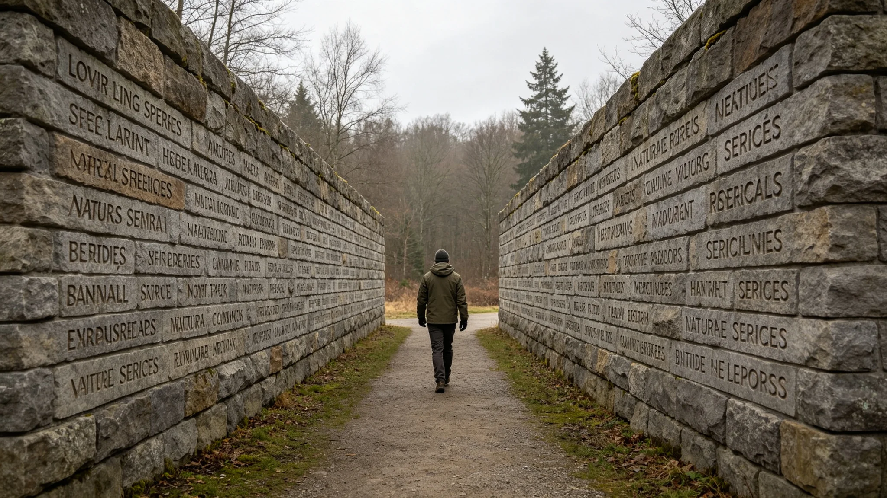

# 三恒星系生态多样性纪念日与濒危物种刻名、灭绝物种补刻仪式规程公报

**发布机构**：联合体生态多样性保护署
**发布日期**：3483年6月5日
**文件等级**：跨星系公开

## 一、节期缘起

3441年一个濒危种群灭绝（见GS-3477-01西岭蓝尾），顾满仓三十年巡护（见GS-3456-01），3463年双轨保育制度（见GS-3463-01）与3471年原位测序网（见GS-3471-01）相继建立。保护署提请设立生态多样性纪念日，每年一次，刻存续、补灭绝。公民大会通过，定每年6月5日。

## 二、节期规程

**（一）刻存续**

纪念日当日，保护署将本年度新增纳入保护名录的物种，刻入存续名录墙。刻名不写赞歌，只写物种名与列入年份。

**（二）补灭绝**

本年度新确认灭绝的物种，补刻入灭绝名录墙，附灭绝年份、原因、责任签认。西岭蓝尾已于3477年补刻（见GS-3477-01），此后每年新增灭绝物种一并补刻。存续名录与灭绝名录并列于同一面墙，谁也不盖住谁。

**（三）巡墙**

仪式后，居民可巡墙。墙上不设解说，不设展板。走到存续名录前，可驻足；走到灭绝名录前，也可驻足。

## 三、首次纪念日现场记录

3483年6月5日，首次生态多样性纪念日。保护署记录员现场记录：本年度新增纳入存续名录物种三十二种，刻名用时一小时二十分钟。本年度新确认灭绝物种一种，补刻入灭绝名录，附原因与责任签认。

记录员注明：顾满仓到场，在灭绝名录墙前站了很久。他今年六十七岁，巡了快四十年。他没说话，只是在西岭蓝尾那个名字旁边，新补刻的那个名字，又添了一行。保护署注明：那天他站了多久，记录员没记——因为不需要记。

## 四、规程说明

保护署注明：这个节不庆祝存续，也不哀悼灭绝。它只是把两件事写在同一面墙上：今年多了几种，今年少了几种。多了，不鼓掌；少了，不遮掩。保护署写明：墙上左边是还在的，右边是没了的。两排并列，一年年添上去。

## 五、附则

本规程自3483年6月5日首次执行，此后每年同日。保护署注明：纪念日不发宣传稿。刻了多少种、补了多少种，就是这个节全部的内容。

## 四之二、为什么存续与灭绝刻在同一面墙

保护署在规程说明中解释这面墙的两面。过去名录只登"存续"，灭绝的物种悄悄划去，像没存在过。3463年制度修订（见GS-3463-01）把灭绝名录补回来，与存续并列。保护署注明：存续名录写"今年多了几种"，灭绝名录写"今年少了几种"。两件事放同一面墙上，才知道这一年生物圈到底是在涨还是在跌。

保护署另注明：顾满仓在西岭蓝尾那个名字旁站了很久。他今年六十七岁，巡了快四十年。他没说话，只是在新补刻的灭绝名字旁又添了一行。保护署注明：那一行，是他自己签的责任。灭绝刻名不是追责大会，但责任要写清楚。墙上左边是还在的，右边是没了的。两排并列，一年年添上去。

## 五、附则

## 四之三、刻石的手

保护署记录员另记刻石。刻存续、补灭绝，都是保护署的老石匠一锤一錾敲上去的。老石匠姓顾，是顾满仓的远房侄子。他不挑字，叫他刻什么就刻什么。保护署注明：存续名录的字刻得浅，灭绝名录的字刻得深一点——不是刻意，是灭绝那行字，老石匠总是多敲了两锤。

## 四之四、刻名与名录的关系

保护署在规程说明中区分刻名与名录登记。名录登记是纸上的、数字的，刻名是石上的、永久的。名录可以修订，刻上石就不再改。保护署注明：一个物种进了灭绝名录，刻上石，就是承认它真没了。这一步不可逆，所以每年只在6月5日这一天，一年一次。平时不补刻，攒到这一天。

## 四之五、刻石不立解说牌

保护署在规程最后注明：刻石墙旁不立解说牌，不设展板，不放电子屏。墙上只有字，没有解释。保护署注明：一个物种为什么没了，墙上刻着年份、原因、责任签认，够了。再立解说牌，就变成科普展览。这面墙不是展览，是记录。

## 四之六、首年刻名的数字

保护署在规程最后附首年刻名数字：3483年首次生态多样性纪念日，新增存续名录三十二种，补刻灭绝名录一种。保护署注明：多了三十二种，少了一种。这一年生物圈的账本，就是这个数。

## 四之七、刻石的位置

保护署在规程最后注明：刻石墙立在保护区入口，不在博物馆，不在展厅。保护署注明：它立在保护区门口，进保护区的人先看见这面墙，再进林子。看见少过什么，再进去看还在的什么。

## 四之八、刻石的最后一条

保护署在规程最后注明：刻石墙上不刻"保护""热爱""敬畏"任何口号。墙上只有物种名、年份、原因、签认。保护署注明：一个物种没了，不需要用"敬畏自然"来补。刻下它没了，就是全部。

## 四之九、刻石的附则

保护署在规程最后注明：刻石墙每十年复测一次风化，按原样复刻。保护署注明：墙上的字不擦，只在风化成看不清时复刻。复刻时，原字深浅不加深，只补到能看清。保护署注明：这面墙要一直立到下个千年。

---

**归档编号**：RIT-BIO-3483-036
**编制**：联合体生态多样性保护署
**日期**：3483年6月5日
