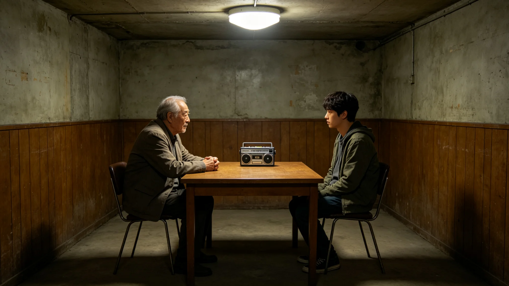

# 三恒星系长寿命公民代际传习"听老一代说话"仪式规程公报

**发布机构**：联合体文明记忆产业委员会
**发布日期**：3484年8月20日
**文件等级**：跨星系公开

## 一、仪式缘起

寿命延长后，长寿命公民在职周期拉长（见GS-3461-01弹性退休），"老一代"与"新一代"的年龄差从十岁变成三十岁、五十岁。过去靠家庭传承的经验，在长寿命社会里出现断层——老人还在岗位上，晚辈还没接上来，中间隔了三十年。3484年，文明记忆产业委员会提请设立代际传习仪式，让老一代把在岗时的判断，亲口说给下一代听。

## 二、仪式规程

**（一）听说话**

仪式不安排老人讲大道理，只做一件事：老人把自己当年在某件事上的判断，亲口说给晚辈听。说的是具体的事——当年为什么在签字时划掉"可挖"，当年为什么在调度台前坐了十一小时，当年为什么在灭绝报告上签了字。

**（二）不评断**

晚辈听，不评断，不提问，不反驳。听完不鼓掌，不总结。传习室里只有老人的声音和录音设备的底噪。

**（三）录音归档**

老人的口述全程录音，归入文明记忆库（见GS-3376-01）。录音不剪辑，不润色。老人说错了，也留着——那是他当时的判断，不是后人的修正。

## 三、首次传习现场记录

3484年8月20日，首次代际传习。委员会记录员现场记录：首场传习由袁召南主讲，听的是其接班陪练（见GS-3459-01陪练列席制度）与两名年轻结构工程师。袁召南讲的是3455年那次遇水（见GS-3478-01），讲了他蹲下去抓那把渣、站起来让人撤的那十分钟。

记录员注明：袁召南讲完，陪练问了一句"如果当时您没蹲下去呢"，袁召南没回答，只是把那段掌子面的岩芯，推到陪练面前。录音在卷。委员会注明：传习不是教标准答案，是让下一代亲手摸一摸当年那把渣。

## 四、规程说明

委员会注明：长寿命社会最大的风险，不是老人不退岗，是老人退岗之前，没把判断交给下一代。经验不写在制度里，写在"为什么"里。为什么划掉"可挖"、为什么坐十一小时、为什么签字认灭绝——这些"为什么"，制度写不出来，只能老一代亲口说。

## 五、附则

本规程自3484年8月20日首次执行，此后每年一次。委员会注明：传习不请明星老人，只请那些手上有判断的人。袁召南、沈百合、顾满仓、卫慕——他们说什么，下一代就听什么。

## 四之二、为什么晚辈不评断

委员会在规程说明中解释"不评断"这条规矩。长寿命社会里，老一代和下一代的年龄差从十岁变成三十岁。晚辈听老人讲当年，第一反应常常是"当年应该怎样怎样"。委员会把这条反应去掉——晚辈不评断、不提问、不反驳。

委员会注明：老人讲的是他当时的判断，不是后人的修正。袁召南讲3455年那次遇水，讲的是他蹲下去抓那把渣、站起来让人撤的那十分钟。晚辈事后复盘可以有一百种更好的做法，但当时那十分钟，是他一个人在掌子面上做的决定。晚辈听，不是去评这个决定对不对，是去摸一摸那个决定当时的分量。

委员会另注明：录音不剪辑、不润色。老人说错了，也留着。那是他当时的判断，不是后人的修正。传习室里只有老人的声音和录音设备的底噪。这就够了。

## 五、附则

## 四之三、传习之后

委员会记录员另记传习之后。袁召南讲完那十分钟，陪录完音，把录音带封存。陪练没有鼓掌，只是把那段掌子面的岩芯，在手里握了一会儿。委员会注明：传习室里没有结束语。老人讲完，起身就走。晚辈坐着，多坐了一会儿才出来。

## 四之四、传习与通识课的区别

委员会在规程说明中区分代际传习与文明存续通识课（见GS-3373-01）。通识课是教科书，教的是定论；传习是口述，教的是判断。委员会注明：教科书写"遇水缓挖"，传习讲的是袁召南蹲下去抓那把渣的那十分钟。定论可学，判断只能听。

## 四之四、传习不录像外传

委员会在规程最后注明：传习录音只存文明记忆库，不对外直播，不上传公众平台。委员会注明：老一代讲的是他们当时的判断，不是供全网围观的表演。传习室里的话，留给来听的晚辈和后来的研究者，不留给流量。

## 四之四、传习的频次

委员会在规程最后注明：传习每年一次，每次一位老人，讲一件事。不请多，不频繁。委员会注明：一年听一件事，听十年，才十件。但这十件，比一百场通识课管用。

## 四之五、传习室的布置

委员会在规程最后注明：传习室不设讲台，不设投影。一张桌，两把椅，一台录音机。委员会注明：老人坐着讲，晚辈坐着听。没有讲台的距离，没有投影的分心。一张桌两把椅，就是传习室的全部。

## 四之六、传习的最后一条

委员会在规程最后注明：传习不发结业证，不评优秀晚辈，不统计听完多少场。委员会注明：听完一场，是你自己的事，不需要证明给别人看。

---

**归档编号**：RIT-TRAN-3484-039
**编制**：联合体文明记忆产业委员会
**日期**：3484年8月20日
