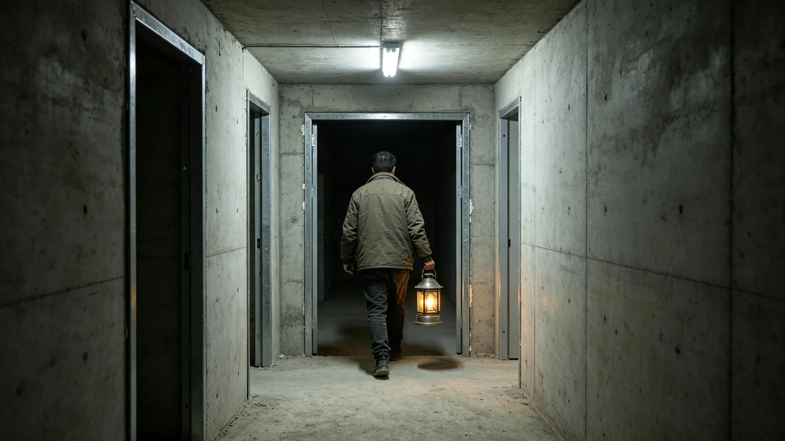

# 鲸鱼座τ星地下城第九居住层首批入住"接灯"仪式规程公报

**发布机构**：鲸鱼座τ星地下城建设署
**发布日期**：3485年12月12日
**文件等级**：跨星系公开

## 一、入住缘起

第八层扩容在3478年遇水缓挖（见GS-3478-01）后，按3464年双签制度（见GS-3464-01）与三维岩层探测（见GS-3472-01）重新规划，第九层于3485年建成。建设署依《地下城市扩容审批制度》提请举行首批入住仪式。仪式不办庆典，只做一件事：让首批入住的人，从老层老人手里接过一盏灯。

## 二、仪式规程

**（一）接灯**

第九层首批入住者，由第八层、第七层各出一位老人领入。老人不致欢迎辞，只把一盏工作灯交到新人手里。灯不讲话，只移交。工作灯是老层巡护用过的旧灯，不是新灯。

**（二）点灯**

新人接过灯后，在新层廊道点亮。点灯不设开关仪式，只是把灯从一只手换到另一只手，灯一直亮着。

**（三）巡新层**

点灯后，新人在老人陪同下巡新层。老人指着廊道里的监测探头、真菌分解链接口、水培循环阀，告诉新人："这些，就是墙后替你们看着家的东西。"不解说原理，只指位置。

## 三、首次入住现场记录

3485年12月12日，第九居住层首批入住。建设署记录员现场记录：首批入住一百二十户。领入的老人中，有袁召南（见GS-3457-01）。他在第八层掌子面上蹲过，现在他领新人走进第九层，指着廊道里的监测探头，说："这些探头，就是当年我蹲下去抓那把渣换来的。"

记录员注明：接灯用时九分钟，点灯用时三分钟，巡层用时四十分钟。仪式全程无音乐，无致辞。散场时，新人在新层门口站了一会儿，没人说话。

## 四、规程说明

建设署注明：新层入住不办庆典，是因为这一层不是谁开的，是老一代在掌子面上一厘米一厘米挖出来的。接灯，接的不是一盏灯，是老一代手里那盏巡了几十年的灯。建设署写明：灯是旧的，因为新层的家，是用旧灯的光换来的。

## 五、附则

本规程自3485年12月12日首次执行，此后每开新层一次。建设署注明：下一次开新层，按双签制度走，还得先有九个渗流孔，再有掘进机。灯不着急点。

## 四之二、为什么用旧灯

建设署在规程说明中解释"接旧灯"这条规矩。新层入住，本来可以配全新的工作灯。建设署偏用老层巡护用过的旧灯。建设署注明：新层的家，不是天上掉下来的，是老一代在掌子面上一厘米一厘米挖出来的。用旧灯，是让新人知道，手里这盏灯，巡过老层的廊道，照过那些划掉"可挖"的掌子面。

建设署另注明：袁召南在第八层掌子面上蹲过，现在他领新人走进第九层，指着廊道里的监测探头，说"这些探头，就是当年我蹲下去抓那把渣换来的"。新人接过旧灯，灯一直亮着。建设署注明：灯不换开关，不搞点灯仪式，只是从一只手换到另一只手。灯一直在亮，只是换了个提灯的人。

## 五、附则

## 四之三、新层的第一晚

建设署记录员另记入住当晚。一百二十户新人在新层安顿下来。廊道里的监测探头亮着微光，真菌分解链在墙后转着。袁召南临走前，把那盏旧灯的电池检查了一遍。建设署注明：新层第一晚，没人庆祝。灯亮着，人住着，墙后替他们看着家。

## 四之四、接灯与入层的区别

建设署在规程说明中区分接灯与千年居住纪念里的入层（见GS-3482-01）。千年纪念的入层是新层居民被领入，交的是钥匙；接灯交的是旧灯。建设署注明：钥匙是开新层门的，灯是照老层路的。交钥匙，是给新人一个家；交灯，是让新人知道这个家的路，老一代走过。

## 四之四、新层不搞乔迁宴

建设署在规程最后注明：新层入住不办乔迁宴，不摆酒，不发贺礼。一百二十户新人接了灯，自己进屋安顿。建设署注明：新家不是宴出来的，是住出来的。灯亮着，人住着，就是庆祝。

## 四之四、旧灯的去向

建设署在规程最后注明：新人接过旧灯，用一年后，灯不收回，不换新。新人自己用着，用坏了再修。建设署注明：灯跟着人走，人住到哪层，灯提到哪层。它照过老层的廊道，现在照新层的。

## 四之五、接灯之后

建设署在规程最后注明：接灯仪式后，新人在新层住满一年，才可参加下一次新层的接灯，把灯传给再下一批。建设署注明：灯传三次，才算真正认了这层。一百年后，这盏灯传过多少手，就是这层住过多少代人。

## 四之六、新层的最后一条

建设署在规程最后注明：新层入住后不设"首任住户"牌匾，不树"第一批居民"纪念像。建设署注明：一百二十户都是第一批，没有谁是首户。墙上不刻牌匾，门上不挂牌子。

## 四之七、新层的附则

建设署在规程最后注明：新层入住后，每年由老人巡层一次，检查廊道里的监测探头与真菌分解链接口。建设署注明：新层不是交了钥匙就不管，老人每年来看一次，看看墙后替你们看着家的东西，还转不转。

---

**归档编号**：RIT-NEWQ-3485-042
**编制**：鲸鱼座τ星地下城建设署
**日期**：3485年12月12日
