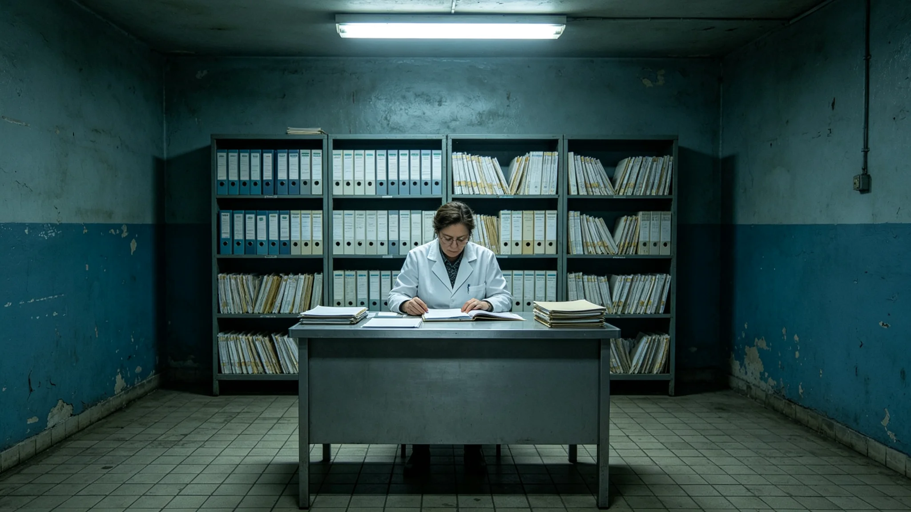

# 三恒星系延寿医疗产业3485年度决算公报

**发布机构**：联合体延寿医疗事务总署
**发布日期**：3487年3月1日
**文件等级**：跨星系公开

## 一、决算总览

3485年度，延寿医疗产业决算如下。总收入按端粒修复疗程、延寿临床试验入组、长寿命公民慢病管理三项计。总支出按临床试验伦理审查、临床试验入组与随访、慢病管理网络运维、不良反应准备金四项计。

总署注明：延寿医疗产业不是营利产业。端粒修复疗程按成本计价，不按疗效溢价。延寿是三系公共事业，不向富者多收、向贫者少收。

## 二、收入项

**（一）端粒修复疗程**

本年度端粒修复疗程（第八代，见GS-3469-01）完成一千四百二十七例，较3484年增加一百一十三例。疗程收入按成本计。

**（二）延寿临床试验入组**

本年度端粒修复第八代临床试验入组四百二十六例。3475年一例异常增殖信号暂停入组（见GS-3475-01）后，入组节奏放缓。总署注明：入组慢，不是产业不好，是伦理复核严了。

**（三）长寿命公民慢病管理**

长寿命公民慢病管理服务覆盖一万一千二百名公民。按3462年终身健康登记制度（见GS-3462-01），慢病管理数据跨星互认。

## 三、支出项

**（一）临床试验伦理审查**

伦理审查支出占总支出百分之十四。3475年暂停入组事件后，伦理委员会扩编，审查员从七名增至十一名。

**（二）临床试验入组与随访**

入组与随访占总支出百分之五十二。每例入组后随访三年，随访成本随入组数上升。

**（三）慢病管理网络运维**

慢病管理网络运维占总支出百分之二十六。含无源贴片传感网（见GS-3470-01）运维、数据跨星互认带宽。

**（四）不良反应准备金**

不良反应准备金占总支出百分之八。3475年异常增殖信号事件后，准备金提额上调。

## 四、决算说明

总署在决算说明中写：3485年度，端粒修复第八代临床试验继续，无新增异常增殖信号。一例3475年暂停的受试者复查良性，已恢复入组（见GS-3475-01）。总署注明：延寿医疗产业这一年最好的数字，不是疗程数，是不良反应准备金没动。

总署另注明：延寿医学走到第八代，每一代都要在伦理上停一停。3475年那次暂停，看起来是一场虚惊，但那次暂停的钱，今年还是照提。总署注明：暂停用不上，比用得上好。

## 五、附则

本决算自3487年3月1日起公开。下一年度决算于3488年3月1日公布。总署注明：延寿医疗产业的账本，不只记收入支出，还记停过几次。停得对，比赚得多重要。

## 四之二、与上年度对比

总署在决算说明中附与3484年度对比：3484年度端粒修复疗程一千三百一十四例，本年度一千四百二十七例，增加一百一十三。3484年度临床试验入组五百零七例，本年度四百二十六例，减少八十一。总署注明：入组数下降不是产业萎缩，是3475年暂停入组（见GS-3475-01）后，伦理复核加严，入组节奏主动放缓。

## 四之三、伦理审查的成本

总署另注明：伦理审查支出从3484年度占总支出百分之九，升至本年度百分之十四。审查员从七名增至十一名。总署注明：伦理审查贵，但比一例异常增殖信号的处置便宜。延寿医学走到第八代，每一代都要在伦理上停一停，这笔钱省不得。

## 四之四、延寿医疗的定价原则

总署在决算说明中另写：端粒修复疗程按成本计价，不按疗效溢价。总署注明：延寿是三系公共事业，不向富者多收、向贫者少收。一个公民能不能延寿，不看他出多少钱，看他符不符合入组条件。

总署另注明：不良反应准备金占总支出百分之八。3475年那例异常增殖信号暂停入组（见GS-3475-01）后，准备金提额上调。总署注明：这笔钱是为"万一"留的。延寿医学走到第八代，"万一"不能不留。

## 四之五、决算不做疗效宣传

总署在决算说明最后注明：本年度决算不做"延寿多少年"的疗效宣传。总署注明：端粒修复第八代还在三年随访中，疗效未定。账上只记入组数、随访数、不良反应数，不记"延寿几年"。总署注明：疗效是随访完了才知道的事，不是决算时吹的事。

## 四之六、决算的审计

总署在决算说明最后注明：本年度决算经联合体审计署独立审计，审计意见为无保留。审计署抽查了端粒修复疗程成本台账、临床试验入组名单、不良反应准备金动用记录。总署注明：账本平不平，不是总署自己说的，是审计署查的。

## 四之七、下一年度计划

总署在决算说明最后注明：下一年度端粒修复第八代临床试验完成三年随访，公布疗效。总署注明：疗效公布前，本产业不扩张、不涨价、不宣传。账上只记事实，不记口号。

## 四之八、决算不公开个例

总署在决算说明最后注明：本年度决算不公开任何一例入组者姓名、病情、疗效。总署注明：延寿医疗是私事，账上记总数，不记个人。一个公民治了没有、治得如何，是他自己的事，不上公报。

---

**归档编号**：FIN-LONG-3487-048
**编制**：联合体延寿医疗事务总署
**日期**：3487年3月1日
