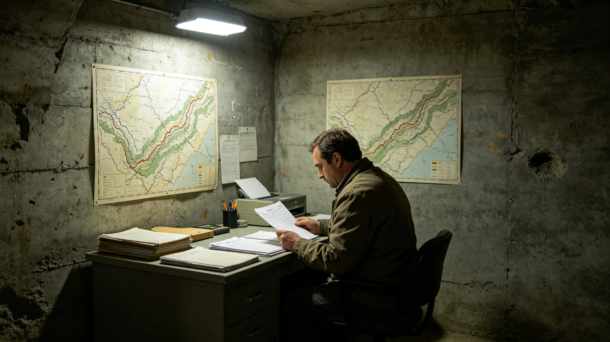

# 鲸鱼座τ星地下城扩容基建产业3485年度决算公报

**发布机构**：鲸鱼座τ星地下城建设署
**发布日期**：3490年3月1日
**文件等级**：跨星系公开

## 一、决算总览

3485年度，地下城扩容基建产业决算如下。总收入按新层建设工程、岩层探测服务、渗流监测运维三项计。总支出按掘进设备折旧、结构工程师薪酬、渗流孔监测运维、遇水应急缓挖准备金四项计。

建设署注明：扩容基建不是营利产业。它的产出是"新层建好了、没塌、没遇水伤人"，不是利润。

## 二、收入项

**（一）新层建设工程**

本年度第九居住层建设工程完工（见GS-3485-01）。工程按3464年双签制度（见GS-3464-01）审批。

**（二）岩层探测服务**

深部岩层结构与渗流带三维探测（见GS-3472-01）服务覆盖第九层规划区。本年度完成探测面积十二平方公里。

**（三）渗流监测运维**

第九层九个渗流监测孔（见GS-3478-01）本年度持续运维。3478年遇水缓挖后，渗流孔每年复测水位。

## 三、支出项

**（一）掘进设备折旧**

掘进设备折旧占总支出百分之三十六。3478年遇水缓挖（见GS-3478-01）后，掘进机按规程停机复测。

**（二）结构工程师薪酬**

结构工程师薪酬占总支出百分之三十四。袁召南为扩容总工程师（见GS-3457-01），今年六十岁。

**（三）渗流孔监测运维**

渗流孔监测运维占总支出百分之十八。

**（四）遇水应急缓挖准备金**

准备金占总支出百分之十二。3478年遇水缓挖后，准备金提额上调。

## 四、决算说明

建设署在决算说明中写：3485年度，第九居住层建成入住一百二十户（见GS-3485-01）。全年掘进无人员伤亡，无掌子面塌方，无新遇水事件。建设署注明：这一年最好的数字，是遇水应急缓挖准备金没动。

建设署另注明：3478年那次遇水（见GS-3478-01），袁召南蹲下去抓了一把渣，站起来让人撤。那一次缓挖，省的是八层底下的人。建设署注明：扩容基建这一年的账本，不只记建了多少层，还记缓挖了几次。缓得对，比建得快重要。

## 五、附则

本决算自3490年3月1日起公开。下一年度决算于3491年3月1日公布。建设署注明：扩容基建的账本，先记安全，再记进度。九个渗流孔没报警，比掘进了多少米重要。

## 四之二、与上年度对比

建设署在决算说明中附与3484年度对比：3484年度掘进按计划推进，本年度因第九层建成，掘进转入下一层前期勘测。建设署注明：这一年没怎么掘进，因为第九层先停了一年缓挖（见GS-3478-01）。缓挖不是停工，是把九个渗流孔先打下去。

## 四之三、缓挖的账本意义

建设署另注明：遇水应急缓挖准备金占总支出百分之十二。建设署注明：这笔钱今年没动，因为九个渗流孔这一年都没报警。建设署注明：袁召南蹲下去抓那把渣（见GS-3478-01），换回来的就是这笔钱没动。慢一年，省的是八层底下的人。

## 四之四、扩容基建的定价原则

建设署在决算说明中另写：新层建设工程按三系公共工程定价，不向新入住居民收"入伙费"。建设署注明：一个家庭搬进新层，不该因为搬到更深一层而多掏搬迁费。扩容是公共工程，不是房地产。

建设署另注明：结构工程师薪酬占总支出百分之三十四。袁召南今年六十岁。建设署注明：扩容这行，最贵的不是掘进机，是敢在签字那一下划掉"可挖"的人。3478年那次缓挖（见GS-3478-01），靠的就是他这一笔。

## 四之五、决算不做掘进排名

建设署在决算说明最后注明：本年度决算不做各掘进标段"进度排名"，不评"最快掘进标段"。建设署注明：扩容这行，快不是好，缓挖才是好。账上记安全，不记速度。

## 四之六、决算的审计

建设署在决算说明最后注明：本年度决算经联合体审计署独立审计，审计意见为无保留。审计署抽查了掘进设备折旧台账、渗流孔监测记录、遇水缓挖准备金动用记录。建设署注明：缓挖对不对，建设署自己说的不算，审计署查的才算。

## 四之七、下一年度计划

建设署在决算说明最后注明：下一年度按3464年双签制度（见GS-3464-01）规划第十层前期勘测，先打渗流孔，再谈掘进。建设署注明：下一年还是先九个孔，再谈掘进机。慢是常态，不是延误。

## 四之八、决算不公开工程师名

建设署在决算说明最后注明：本年度决算不公开结构工程师姓名。建设署注明：袁召南划掉"可挖"，账上记缓挖天数，不记他的名。这一行，没人要当英雄。

## 四之九、决算的最后一条

建设署在决算说明最后注明：本年度决算附件含渗流孔全年水位台账一册、掌子面围岩监测曲线一张。建设署注明：水位和曲线才是账本的正文，数字只是摘要。

## 四之十、决算的最后一条附则

建设署在决算说明最后注明：本年度决算公开后，接受公民质询三十日。建设署注明：账上的数，谁都可以来问。问了，就答。

建设署注明：这就是扩容基建这一年的全部账本。

---

**归档编号**：EXP-CIV-3490-057
**编制**：鲸鱼座τ星地下城建设署
**日期**：3490年3月1日
