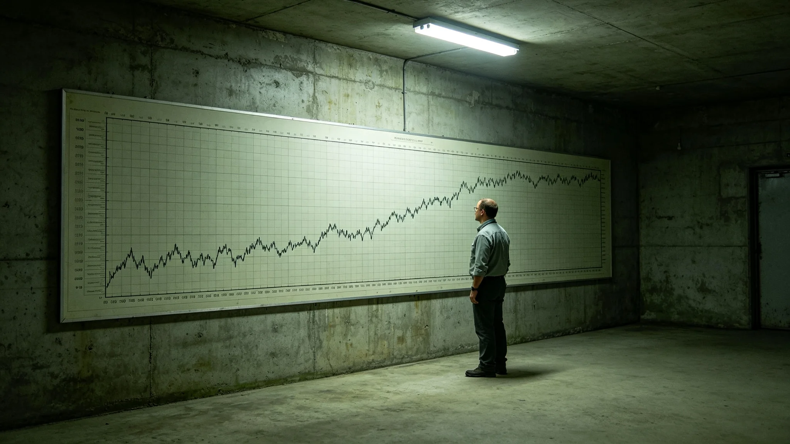

# 鲸鱼座τ星地下城人工生物圈百年稳态评估公报

**发布机构**：鲸鱼座τ星地下城建设署生态维护分局
**发布日期**：3492年6月30日
**文件等级**：跨星系公开

## 一、评估缘起

地下城人工生物圈自第一代闭环建成至今百年。3466年千年评估（见GS-3466-01）把闭环拆成稳态指标，百年评估是其年度序列中的一次节点性回顾。分局依《地下城市生态维护规程》组织本次百年稳态评估，沈百合为首席生态官（见GS-3452-01）。

## 二、稳态指标

**（一）碳氧循环**

百年间，人工生物圈碳氧循环净收支在基准线内波动。百年累计氧气产出与消耗持平，二氧化碳累积量未超千年评估预警阈值。分局注明：碳氧循环是闭环的命脉。一百年没失衡，下一个一百年继续看。

**（二）水培农业产出**

百年间，水培农业产出从第一代闭环的每人每日一千二百克，增至本年度一千四百二十克。产出增加因第九层新增住户（见GS-3485-01），非因单产突破。分局注明：单产这一百年没怎么涨，因为闭环要稳，不要高产。

**（三）真菌分解链**

百年间，真菌分解链经历五代菌种换代。3473年第六层三日波动（见GS-3473-01）后，菌种换代按规程加密。百年累计分解率维持在百分之九十七以上。

**（四）伴生昆虫群落**

百年间，伴生昆虫群落（见GS-3496-01）经历三代自然更替。分局注明：昆虫不是害虫，是闭环的一部分。它们百年没崩溃，是闭环百年没崩溃的旁证。

## 三、评估说明

分局在评估说明中写：百年稳态，不是哪一个人做的。是三万人一代一代在这七层深居里，把这一闭环看住的。分局注明：沈百合的母亲沈秀兰（3390—3445，见GS-3452-01）是第一代巡检员，沈百合自己是第三代。一家三代看了一百年闭环。

分局另注明：百年评估不是庆功。闭环稳了一百年，不代表下一千年稳。分局注明：稳态是日常，不是成就。下一个百年，接着看。

## 四、与千年评估的关系

分局注明：本次百年稳态评估是3466年千年评估（见GS-3466-01）的第四个百年节点回顾。千年评估看千年，百年评估看百年。百年评估的数字，汇入千年评估的长曲线。分局注明：一百年的波动，在千年曲线上只是一小段。但这一小段，住了一代人。

## 五、附则

本公报自3492年6月30日起公开。下一次百年稳态评估于3592年。分局注明：闭环这东西，看一百年不算完，看一千年才算开始。

## 三之二、百年间的三次大波动

分局在评估说明中附百年间生物圈三次大波动：第一次在第一代闭环建成后第三十年，水培藻类大面积衰败，靠更换光源救回；第二次在第六十年，真菌分解链菌种老化，靠第二代菌种换代救回；第三次在3473年（见GS-3473-01），第六层真菌分解链三日波动，靠巡检员蹲下去闻见味救回。分局注明：一百年三次大波动，三次都救回来了。救回来的不是闭环，是三万人的命。

## 三之三、百年间没换过的东西

分局另注明：百年间换了三代光源、五代菌种、八代监测探头，但有一样东西没换——巡检员蹲下去看的动作。分局注明：探头报不出来的，巡检员蹲下去闻见。这个动作，从沈秀兰（3390—3445）那一代，传到沈百合这一代，一百年没换。

## 三之四、百年评估不搞庆典

分局注明：本次百年稳态评估不搞庆典，不挂横幅，不拍宣传片。分局注明：闭环稳了一百年，是日常，不是成就。这一公报写完，接着养闭环。

## 三之五、百年评估与千年评估的关系

分局注明：本次百年稳态评估，是3466年千年评估（见GS-3466-01）的第四个百年节点回顾。千年评估看千年，百年评估看百年。百年评估的数字，汇入千年评估的长曲线。分局注明：一百年的波动，在千年曲线上只是一小段。但这一小段，住了一代人。

分局另注明：百年评估不发勋章。分局注明：闭环稳了一百年，不是哪个人的功劳，是三万人一代一代住出来的。发勋章给谁？发勋章给三万人。

## 三之六、百年评估的最后一条

分局在评估说明最后注明：本次百年稳态评估经联合体审计署独立审计，审计意见为无保留。审计署抽查了碳氧循环曲线、水培产出台账、真菌分解率记录。分局注明：闭环稳没稳，不是分局自己说的，是审计署查的。

## 三之七、百年评估的附件

分局在评估说明最后注明：本次百年稳态评估附件含碳氧循环百年曲线一张、水培农业百年产出表一册、真菌分解链五代比较表一份、伴生昆虫三代更替记录一卷。分局注明：附件才是正文，公报只是摘要。

## 三之八、百年评估的最后一条附则

分局在评估说明最后注明：本次百年稳态评估公开后，接受公民质询三十日。分局注明：闭环稳没稳，谁都可以来问。问了，就答。

分局注明：这就是百年稳态评估的全部。闭环稳着，接着养。

---

**归档编号**：ECO-CEN-3492-063
**编制**：鲸鱼座τ星地下城建设署生态维护分局
**日期**：3492年6月30日
