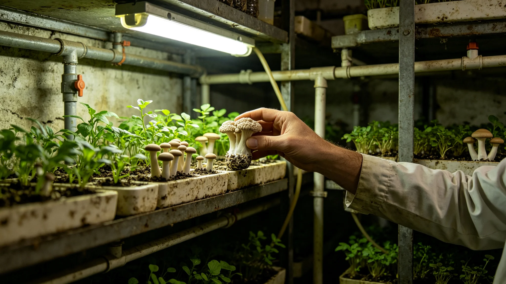

# 三恒星系长期居住者与驯化物种协同演化3492年度监测公报

**发布机构**：联合体生态多样性保护署协同演化监测室
**发布日期**：3494年11月20日
**文件等级**：跨星系公开

## 一、监测缘起

地下城住了一千年，人不只自己活，还带着一批驯化物种一起活。水培藻类、分解真菌、伴生昆虫、巡护犬，这些物种跟着人在深地住了几十代。人在变，它们也在变。3492年，保护署依《生态多样性保护规程》设立协同演化监测室，首次发布年度监测公报。

## 二、监测内容

**（一）驯化藻类谱系**

水培藻类在地下城闭环保育了三十代。监测发现，本年度藻类对地下城照明光谱的适应性较第一代提高百分之十二。保护署注明：藻类不是在进化，是在适应。适应的方向，是人给它的光谱。

**（二）分解真菌谱系**

真菌分解链经历五代菌种换代（见GS-3495-01）。本年度第五代菌种对地下城厨余成分的分解率维持在百分之九十七。保护署注明：真菌在跟着人吃的东西变。人吃什么，真菌分解什么。

**（三）伴生昆虫群落**

伴生昆虫群落（见GS-3496-01）经历三代自然更替。本年度昆虫对地下城离心重力的适应性稳定。保护署注明：昆虫在帮人授粉、帮人分解，它们自己也在跟着这个环住。

**（四）巡护犬谱系**

巡护犬在原位保护区繁育二十代。本年度巡护犬对保护区地形的适应性稳定。保护署注明：狗跟着巡护员走了二十年，巡护员换了两代，狗也换了。

## 三、监测说明

监测室在监测说明中写：协同演化不是浪漫故事，是账本。人住了一千年，驯化物种跟着人住了几十代。它们变了，人也变了。监测室注明：人因为寿命延长而骨密度降（见GS-3476-01），驯化物种因为人住得久而适应了深地的光、深地的重力、深地的厨余。

监测室另注明：沈百合（见GS-3452-01）在监测说明后写：我们以为是我们在养它们，其实是它们在陪着我们活。一千年下来，谁也离不开谁了。

## 四、附则

本公报自3494年11月20日起公开。下一年度监测于3495年11月。监测室注明：协同演化这东西，不监测不知道，一监测才发现，人住久了，身边的活物都跟着变。

## 三之二、协同演化不是浪漫故事

监测室在监测说明中另写：协同演化常被讲成浪漫故事——人驯化了物种，物种陪伴了人。监测室不要这个调子。监测室注明：协同演化是账本。人住了一千年，驯化物种跟着人住了几十代，谁变了多少，得有数。

## 三之三、人与驯化种的依赖

监测室另注明：人已经离不开驯化物种。没有藻，人没氧；没有真菌，人没菜；没有昆虫，人没粉；没有狗，巡护员在林子里没眼睛。监测室注明：这不是浪漫，是依赖。一千年下来，谁也离不开谁了。

## 三之四、监测不搞展览

监测室注明：本次监测不做"人与驯化种"主题展览，不拍宣传片。监测室注明：协同演化是账本，不是展览。账上有数就行，不挂照片。

## 三之五、监测的范围

监测室在监测说明中另写：本年度协同演化监测覆盖水培藻类、分解真菌、伴生昆虫、巡护犬四类驯化种。监测室注明：这四类是闭环里与人最亲的。其他驯化种（如观赏植物、实验动物）另行监测，不在本公报。

## 三之六、监测不浪漫化

监测室注明：本次监测不做"人与动物和谐共生"主题宣传。监测室注明：协同演化是账本，不是散文。账上有数，不抒情。

## 三之七、监测的最后一条

监测室在监测说明最后注明：本次监测经联合体审计署独立审计，审计意见为无保留。监测室注明：协同演化这东西，数字不浪漫。账上有数，审计署查了，才算数。

## 三之八、监测的附件

监测室在监测说明最后注明：本次监测附件含驯化藻类谱系图一张、真菌谱系图一张、昆虫更替记录一卷、巡护犬谱系表一份。监测室注明：附件才是正文，公报只是摘要。

## 三之九、监测的最后一条附则

监测室在监测说明最后注明：本次监测公开后，接受公民质询三十日。监测室注明：协同演化这东西，谁都可以来问。问了，就答。

## 三之十、监测的最后一条

监测室在监测说明最后注明：本年度监测不公开任何驯化种"功劳"排名。监测室注明：藻、真菌、昆虫、狗，谁也不排谁。监测室注明：协同演化是依赖，不是功劳簿。账上有数就行。

## 三之十一、监测的最后一条附则

监测室在监测说明最后注明：本年度监测不公开任何驯化种的具体基因数据。监测室注明：基因数据不上公报，怕被拿去乱改。账上记变化，不记序列。

监测室注明：这就是3492年度协同演化监测的全部。人变了，驯化种也变了。账平了。

监测室注明：下一年度监测于3495年11月。接着看。

监测室注明：沈百合在监测说明后写了一行。

---

**归档编号**：ECO-COEVO-3494-069
**编制**：联合体生态多样性保护署协同演化监测室
**日期**：3494年11月20日
