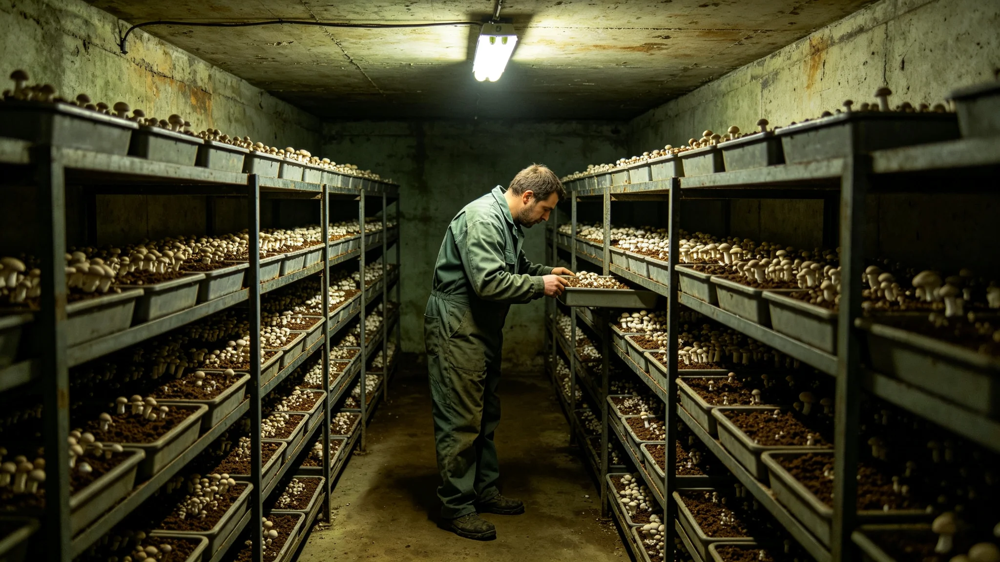

# 鲸鱼座τ星地下城真菌分解链第五代菌种评估公报

**发布机构**：鲸鱼座τ星地下城建设署生态维护分局
**发布日期**：3495年4月15日
**文件等级**：跨星系公开

## 一、评估缘起

真菌分解链是地下城闭环的下消化道。厨余、排泄物、不可回收有机物，全靠这根链分解成水培营养液。第一代菌种建于百年前，此后每二十年左右换代一次。3473年第六层三日波动（见GS-3473-01）后，分局按规程对菌种换代节奏加密。本批为第五代菌种评估公报。

## 二、评估内容

**（一）分解率**

第五代菌种本年度分解率百分之九十七点三，较第四代提升零点一个百分点。分局注明：分解率这一百年从九十五涨到九十七，涨得很慢。因为闭环要稳，不要突破。

**（二）波动频次**

第五代菌种本年度无三日以上波动。3473年那次三日波动（见GS-3473-01）后，菌种换代按规程加密，波动频次从四代时期的每年一至两次，降至本代的每年零次。

**（三）菌种来源**

第五代菌种从第四代最优培养株中选育，未引入外源新种。分局注明：不引新种，是怕新种打乱闭环。闭环转了一百年，新种进来可能是惊喜，也可能是灾难。稳着用老种，比冒险引新种好。

## 三、评估说明

分局在评估说明中写：真菌分解链第五代，是目前五代里最稳的一代。稳，不是因为菌种变强了，是因为人把它伺候得更勤了。分局注明：3473年那次三日波动，逼得巡检员蹲下去闻见味（见GS-3488-01）。闻了三十年味，才把菌种养稳。

分局另注明：沈百合在评估说明后写：真菌不说话，它只分解。分解多了，就是它饿了；分解少了，就是它病了。这根链上没有英雄，只有一茬一茬养菌种的人。

## 四、与百年稳态的关系

分局注明：本次第五代菌种评估，是3492年百年稳态评估（见GS-3492-01）的一项子指标。百年稳态看碳氧、看水培、看真菌、看昆虫，真菌是其中一根。分局注明：这根链稳了，闭环就稳了一大半。

## 五、附则

本公报自3495年4月15日起公开。下一次菌种评估于第四代替换周期满时。分局注明：菌种不换代不行，换太快也不行。稳着来，一茬一茬养。

## 三之二、五代菌种的比较

分局在评估说明中附五代菌种比较：第一代分解率百分之九十五，第三代百分之九十六点五，第五代百分之九十七点三。百年涨了二点三个百分点。分局注明：涨得慢，因为每一代换代都要谨慎。菌种换坏了，厨余堵在链里，第三天就臭。

## 三之三、菌种不引外源

分局另注明：第五代菌种未引入外源新种。分局注明：不引新种，是怕新种打乱闭环。闭环转了一百年，新种进来可能是惊喜，也可能是灾难。稳着用老种，比冒险引新种好。

## 三之四、菌种评估不搞发布

分局注明：本次菌种评估不搞"新菌种发布"，不办发布会。分局注明：菌种不是新产品，是闭环的一部分。换了，接着养。

## 三之五、菌种的培养

分局在评估说明中附菌种培养规程：第五代菌种从第四代最优培养株中选育，在地下菌种培养室养三年，再上线试运行半年，无波动才全链替换。分局注明：菌种换得慢，是怕换坏了。三年养半年试，才敢上链。

## 三之六、菌种不保密

分局注明：第五代菌种谱系不保密，向三系各闭环开放。分局注明：菌种不是哪家的秘方，是三系共同的家底。别的闭环要换菌种，来拿。

## 三之七、菌种评估的最后一条

分局在评估说明最后注明：本次菌种评估经联合体审计署独立审计，审计意见为无保留。审计署抽查了菌种培养记录、分解率台账、试运行波动数据。分局注明：菌种稳没稳，不是分局自己说的，是审计署查的。

## 三之八、菌种评估的附件

分局在评估说明最后注明：本次菌种评估附件含五代菌种分解率比较表一张、第五代培养记录一册、试运行波动曲线一张。分局注明：附件才是正文，公报只是摘要。

## 三之九、菌种评估的最后一条附则

分局在评估说明最后注明：本次菌种评估公开后，接受公民质询三十日。分局注明：菌种稳没稳，谁都可以来问。问了，就答。

## 三之十、菌种评估的最后一条

分局在评估说明最后注明：本年度菌种评估不公开任何菌种"功劳"。分局注明：菌种不说话，它只分解。账上记分解率，不记它的功。分局另注明：菌种不发勋章，不评先进。

## 三之十一、菌种评估的最后一条附则

分局在评估说明最后注明：本次菌种评估不公开培养室位置。分局注明：菌种培养室不公开，怕有人去污染。账上记分解率，不记位置。

分局注明：这就是第五代菌种评估的全部。分解率九十七点三，无三日波动。账平了。

分局注明：下一次菌种评估于第四代替换周期满。接着养。

---

**归档编号**：ECO-FUNGI-3495-072
**编制**：鲸鱼座τ星地下城建设署生态维护分局
**日期**：3495年4月15日
