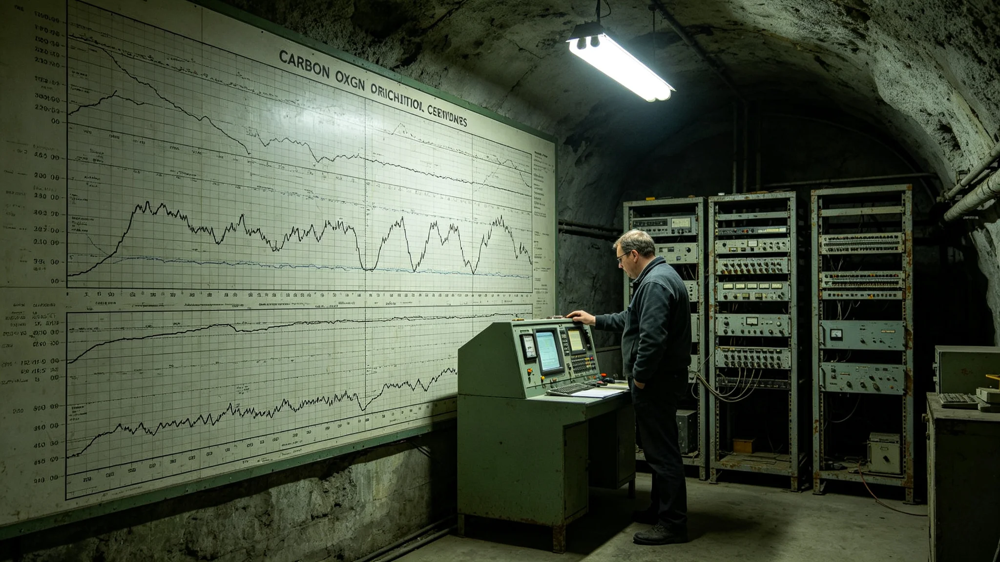

# 鲸鱼座τ星地下城人工生物圈碳氧循环千年平衡公报

**发布机构**：鲸鱼座τ星地下城建设署生态维护分局
**发布日期**：3497年9月1日
**文件等级**：跨星系公开

## 一、公报缘起

碳氧循环是地下城人工生物圈的命脉。人呼吸耗氧、产二氧化碳，藻类光合作用产氧、耗二氧化碳。这一进一出，一千年没失衡，三万人才能在七层深居里活下来。3466年千年评估（见GS-3466-01）把碳氧循环列为第一稳态指标。本批为碳氧循环千年平衡公报。

## 二、千年平衡数据

**（一）氧气收支**

千年累计，人工生物圈氧气产出与消耗持平。氧气净收支在千年间波动幅度未超过百分之三。分局注明：氧气这东西，多了会醉，少了会闷。一千年波动不超过百分之三，就是说三万人这一千年没闷过、没醉过。

**（二）二氧化碳累积**

千年累计，二氧化碳累积量未超千年评估预警阈值。分局注明：二氧化碳积多了，人会困、会懒、会骨质疏松。3476年那次骨密度骤降（见GS-3476-01），查下来不是二氧化碳的事，是重力调节器的事。分局注明：但二氧化碳这根弦，一千年没松。

**（三）藻类产氧效率**

千年间，水培藻类产氧效率维持在每人每日六百升氧上下。分局注明：藻类不高产，只求稳。高产的藻产氧猛，死得也猛。稳着产，比猛着产好。

## 三、公报说明

分局在公报说明中写：碳氧循环千年平衡，不是哪一个人调出来的。是三万人一千年呼吸、藻类一千年光合、真菌一千年分解，三者刚好对上。分局注明：这一对上，就是闭环。对不上，就是三万人在七层深居里窒息。

分局另注明：沈百合（见GS-3452-01）在公报说明后写：我们以为是我们在调碳氧，其实是碳氧在调我们。住久了，人的呼吸都跟着这个环的碳氧节奏走。分局注明：一千年下来，人藻真菌，谁也不欠谁。

## 四、与百年稳态的关系

分局注明：本公报是3492年百年稳态评估（见GS-3492-01）中碳氧子项的千年回顾。百年看一百年，千年看一千年。这一千年碳氧没失衡，下一个千年接着看。分局注明：碳氧这东西，看不出英雄，只看得出三万人有没有喘上气。

## 五、附则

本公报自3497年9月1日起公开。下一次碳氧千年回顾于4497年。分局注明：碳氧平衡这东西，记一千年不算完，记到没人住的那一天才算完。

## 三之二、千年间的一次近失衡

分局在公报说明中附千年间一次近失衡：第一代闭环建成后第五十年，藻类光照不足，氧气净收支一度下探到基准线的百分之九十七。分局注明：差三个百分点就失衡。那次靠紧急加光救回。分局注明：这一千年，差一点就栽在第五十年。

## 三之三、碳氧不靠英雄

分局另注明：碳氧平衡不靠哪个工程师调出来。靠的是三万人一千年呼吸、藻类一千年光合、真菌一千年分解。分局注明：这一对上，就是闭环。对不上，三万人在七层深居里窒息。

## 三之四、公报不搞庆功

分局注明：本公报不搞"千年碳氧平衡"庆功，不挂横幅。分局注明：碳氧稳了一千年，是日常，不是成就。下一个千年，接着看。

## 三之五、碳氧的监测

分局在公报说明中附碳氧监测网：千年间，碳氧监测从第一代的人工采样，到第三代的探头联网，到第八代的实时跨层传输。分局注明：监测手段换了八代，但量的还是那口气。

## 三之六、碳氧不宣传

分局注明：本公报不做"千年碳氧平衡"宣传稿，不上公众平台。分局注明：碳氧稳了一千年，是日常，不是成就。账上有数，自己知道就行。

## 三之七、碳氧公报的最后一条

分局在公报说明最后注明：本公报经联合体审计署独立审计，审计意见为无保留。审计署抽查了千年碳氧收支曲线、藻类产氧台账、监测网数据。分局注明：碳氧平没平，不是分局自己说的，是审计署查的。

## 三之八、碳氧公报的附件

分局在公报说明最后注明：本公报附件含千年碳氧收支曲线一张、藻类产效率表一册、监测网八代更替记录一卷。分局注明：附件才是正文，公报只是摘要。

## 三之九、碳氧公报的最后一条附则

分局在公报说明最后注明：本公报公开后，接受公民质询三十日。分局注明：碳氧平没平，谁都可以来问。问了，就答。

## 三之十、碳氧公报的最后一条

分局在公报说明最后注明：本公报不公开任何工程师"功劳"。分局注明：碳氧平不平，不靠哪个人调。分局另注明：碳氧不发勋章，不评先进。账上有数就行。

## 三之十一、碳氧公报的最后一条附则

分局在公报说明最后注明：本公报不公开监测站具体位置。分局注明：监测站位置不公开，怕有人去破坏。账上记曲线，不记站。

分局注明：这就是碳氧千年平衡公报的全部。氧收支持平，二氧化碳未超限。账平了。

---

**归档编号**：ECO-CO2-3497-078
**编制**：鲸鱼座τ星地下城建设署生态维护分局
**日期**：3497年9月1日
