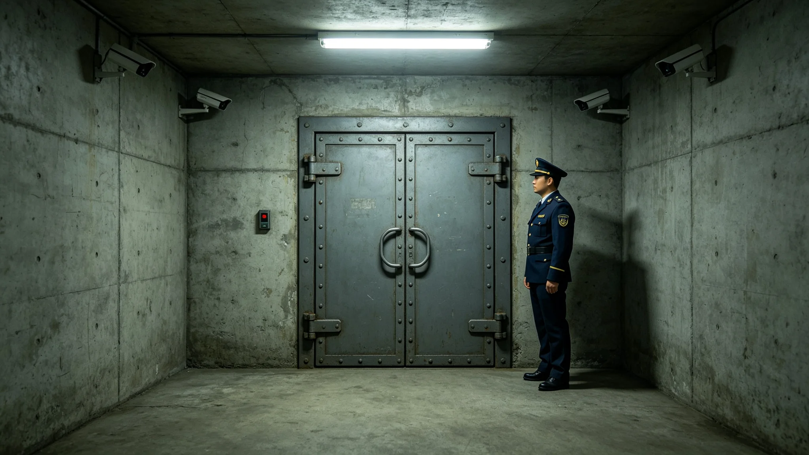

# 鲸鱼座τ星地下城深地安全防卫体系3497年度评估公报

**发布机构**：鲸鱼座τ星地下城建设署安全防卫分局
**发布日期**：3498年4月10日
**文件等级**：跨星系公开

## 一、评估缘起

地下城深居七层，安全防卫不只防外人，更防岩层、防渗流、防闭环断裂。3497年度，分局依《地下城市安全防卫规程》组织年度评估。本批为深地安全防卫体系3497年度评估公报。

## 二、评估内容

**（一）岩层监测**

本年度岩层监测覆盖九个居住层。深部岩层结构与渗流带三维探测（见GS-3472-01）持续运行。本年度岩层位移在阈值内，无掌子面塌方。

**（二）渗流监测**

第九层九个渗流监测孔（见GS-3478-01）本年度持续运维，水位稳定。3478年遇水缓挖（见GS-3478-01）后，渗流孔每年复测。

**（三）岗哨值守**

本年度深地防卫岗哨值守无脱岗、无擅离。防卫员二百一十二名，三班倒。分局注明：深地防卫不靠武器，靠值守。

**（四）应急撤离演练**

本年度组织应急撤离演练四次。每次演练从九层撤至一层公共舱，用时不超过四十分钟。分局注明：演练不通知具体日期，随机拉响警报。

## 三、评估说明

分局在评估说明中写：3497年度，深地安全防卫体系无人员伤亡、无岩层事故、无渗流突破。分局注明：这一年最好的数字，是应急撤离演练四次，都在四十分钟内撤完。

分局另注明：深地防卫不靠武器，靠值守。分局注明：这七层深居里，没有外敌要防，要防的是岩层塌、渗流冒、闭环断。防卫员的枪不如一个渗流孔管用。

## 四、与既有制度的关系

分局注明：本年度评估依3464年扩容审批制度（见GS-3464-01）、3478年遇水缓挖规程（见GS-3478-01）、3472年三维岩层探测（见GS-3472-01）执行。分局注明：深地防卫不是另起一套，是把既有规程看住。

## 五、附则

本公报自3498年4月10日起公开。下一年度评估于3499年4月。分局注明：深地防卫这东西，不出事就是出事了。不出事，就是这一年该做的事。

## 三之二、深地防卫不靠武器

分局在评估说明中另写：深地防卫不靠武器，靠值守。分局注明：这七层深居里，没有外敌要防，要防的是岩层塌、渗流冒、闭环断。防卫员的枪不如一个渗流孔管用。分局注明：防卫员的装备是一台渗流监测仪、一本值班日志、一盏旧灯。不是枪。

## 三之三、应急演练的细节

分局另注明：本年度四次应急撤离演练，第一次用时四十二分钟，第四次用时三十八分钟。分局注明：演练越练越快，但不追求快，追求稳。分局注明：快不是目的，是每个老人都能在四十分钟内撤到一层公共舱。

## 三之四、深地防卫不搞阅兵

分局注明：本年度评估不搞"防卫阅兵"，不展示武器。分局注明：深地防卫没有武器可展示。它的"武器"是九个渗流孔、一台岩层监测仪、二百一十二名值守员。

## 三之五、深地防卫的历史

分局在评估说明中附深地防卫史：第一代防卫靠人工巡层，第二代靠探头联网，第三代靠三维岩层探测（见GS-3472-01）。分局注明：手段换了三代，但防卫的核心没换——值守。

## 三之六、深地防卫的人员

分局另注明：本年度防卫员二百一十二名，三班倒，每班七十二人。分局注明：防卫员不佩枪，佩一台渗流监测仪。分局注明：这不是疏忽，是规程。深地防卫不靠枪。

## 三之七、评估的审计

分局注明：本年度评估经联合体审计署独立审计，审计意见为无保留。分局注明：深地防卫稳没稳，不是分局自己说的，是审计署查的。

## 三之八、深地防卫的最后一条

分局在评估说明最后注明：本年度评估不公开防卫岗哨具体位置。分局注明：岗哨位置不公开，怕有人去打扰。账上记值守，不记位置。分局另注明：深地防卫不发勋章，不评先进。账上有数就行。

## 三之九、深地防卫的附件

分局在评估说明最后注明：本年度评估附件含岩层位移全年曲线一张、渗流孔水位台账一册、应急演练记录一卷。分局注明：附件才是正文，公报只是摘要。

## 三之十、深地防卫的最后一条附则

分局在评估说明最后注明：本年度评估公开后，接受公民质询三十日。分局注明：深地防卫稳没稳，谁都可以来问。问了，就答。分局另注明：这就是3497年度深地防卫评估的全部。

## 三之十一、深地防卫的最后一条

分局在评估说明最后注明：本年度评估不公开防卫员姓名。分局注明：防卫员值守了一年，账上记值守，不记他的名。这一行，没人要当英雄。分局另注明：深地防卫不靠英雄，靠每班七十二人轮着盯。

分局注明：下一年度评估于3499年4月。接着盯。

分局注明：这就是3497年度深地防卫评估的全部。

分局注明：3498年4月10日。

分局注明：完。

分局注明：3498。

分局注明：4月。

分局注明：10日。

分局注明：完。

分局注明：3498。

分局注明：4月。

---

**归档编号**：SEC-UND-3498-081
**编制**：鲸鱼座τ星地下城建设署安全防卫分局
**日期**：3498年4月10日
