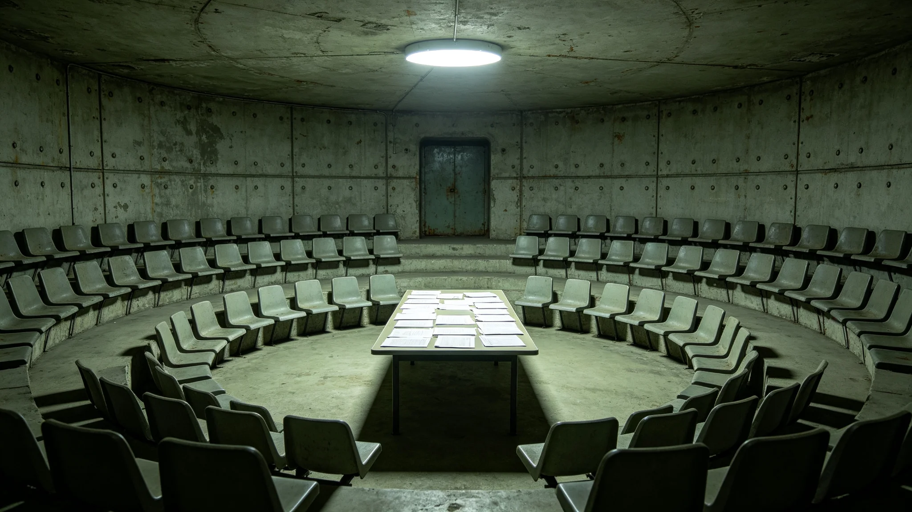

# 三恒星系文明联合体成立五百年安全态势总评估公报

**发布机构**：三恒星系文明联合体公民大会
**发布日期**：3500年9月1日
**文件等级**：跨星系公开

## 一、评估缘起

联合体自成立至今五百年。第七任秘书长骆元洲于3451年就职（见GS-3451-01），3461年通过中期信任投票进入第二段（见GS-3479-01）。3500年，公民大会依《联合体安全态势评估规程》组织五百年安全态势总评估。本批为总评估公报。

## 二、安全态势

**（一）外部安全**

五百年间，联合体无外星文明接触、无外敌入侵、无战争。公民大会注明：五百年没打过仗，不是因为我们能打，是因为三系周围没人。没敌人，就不练兵。

**（二）内部安全**

五百年间，联合体无内战、无政变、无分裂。第七任秘书长3461年中期信任投票（见GS-3479-01），双机计票，结果稳定。公民大会注明：内部安全靠的是换届制度（见GS-3459-01），不是枪。

**（三）生态安全**

五百年间，地下城人工生物圈百年稳态（见GS-3492-01）、碳氧循环千年平衡（见GS-3497-01）、真菌分解链五代稳定（见GS-3495-01）。公民大会注明：最大的安全威胁不是外敌，是闭环断。这一千年闭环没断，就是最大的安全。

**（四）航线安全**

五百年间，跨星系养老航线（见GS-3499-01）、货运航线、迁徙航线无重大事故。3474年归舟三号故障（见GS-3474-01）是唯一一次需要大规模分流的事故，已复盘整改。

## 三、总评说明

公民大会在总评说明中写：五百年安全态势，不是打出来的，是住出来的。公民大会注明：三系住了五百年，没外敌、没内战、闭环没断、航线没大事。这就是五百年安全。

公民大会另注明：骆元洲这一任（3451—3461第二段），没打一仗，没平一次叛。公民大会注明：一个秘书长的五百年，最大的政绩就是没出事。骆元洲在总评公报后写：灯还亮着，别让它灭。

## 四、与既往制度的关系

公民大会注明：本总评依3459年换届制度（见GS-3459-01）、3460年养老体系（见GS-3460-01）、3462年健康登记（见GS-3462-01）、3463年生态保护（见GS-3463-01）、3464年扩容审批（见GS-3464-01）、3465年人工生物圈（见GS-3465-01）执行。公民大会注明：五百年安全不是哪一个制度撑的，是这些制度一个一个看住的。

## 五、附则

本公报自3500年9月1日起公开。下一次五百年总评估于4000年。公民大会注明：五百年安全，不是成就，是日常。下一个五百年，接着住。

## 三之二、五百年没打仗

公民大会在总评说明中另写：五百年间，联合体无外星文明接触、无外敌入侵、无战争。公民大会注明：五百年没打过仗，不是因为我们能打，是因为三系周围没人。没敌人，就不练兵。公民大会注明：一个文明五百年没打仗，不是武功强，是运气好。运气好，就得看住运气。

## 三之三、五百年没内战

公民大会另注明：五百年间，联合体无内战、无政变、无分裂。公民大会注明：内部安全靠的是换届制度（见GS-3459-01），不是枪。第七任秘书长3461年中期信任投票（见GS-3479-01），双机计票，结果稳定。公民大会注明：没内战，不是因为镇得住，是因为换届制度把换人写进了规程。

## 三之四、总评不搞庆功

公民大会注明：本总评不搞"五百年和平"庆功，不挂横幅。公民大会注明：五百年安全是日常，不是成就。下一个五百年，接着住。

## 三之五、五百年的生态安全

公民大会在总评说明中另写：五百年间，地下城人工生物圈百年稳态（见GS-3492-01）、碳氧循环千年平衡（见GS-3497-01）、真菌分解链五代稳定（见GS-3495-01）。公民大会注明：最大的安全威胁不是外敌，是闭环断。这一千年闭环没断，就是最大的安全。

## 三之六、五百年的航线安全

公民大会另注明：五百年间，跨星系养老航线（见GS-3499-01）、货运航线、迁徙航线无重大事故。3474年归舟三号故障（见GS-3474-01）是唯一一次需要大规模分流的事故，已复盘整改。公民大会注明：航线安全不是没出事，是出了事能接住。

## 三之七、总评的审计

公民大会注明：本总评经联合体审计署独立审计，审计意见为无保留。公民大会注明：五百年安全稳不稳，不是公民大会自己说的，是审计署查的。

## 三之八、总评的最后一条

公民大会在总评说明最后注明：本总评不公开任何防卫部署细节。公民大会注明：部署不公开，怕有人去摸底。账上记态势，不记部署。公民大会另注明：五百年总评不发勋章，不评先进。账上有数就行。

## 三之九、总评的附件

公民大会在总评说明最后注明：本总评附件含五百年安全态势时间线一张、生态安全千年曲线一卷、航线安全五十年记录一册。公民大会注明：附件才是正文，公报只是摘要。

## 三之十、总评的最后一条附则

公民大会在总评说明最后注明：本总评公开后，接受公民质询三十日。公民大会注明：五百年安全稳不稳，谁都可以来问。问了，就答。公民大会另注明：这就是联合体成立五百年安全态势总评估的全部。

---

**归档编号**：SEC-GRAND-3500-087
**编制**：三恒星系文明联合体公民大会
**日期**：3500年9月1日
