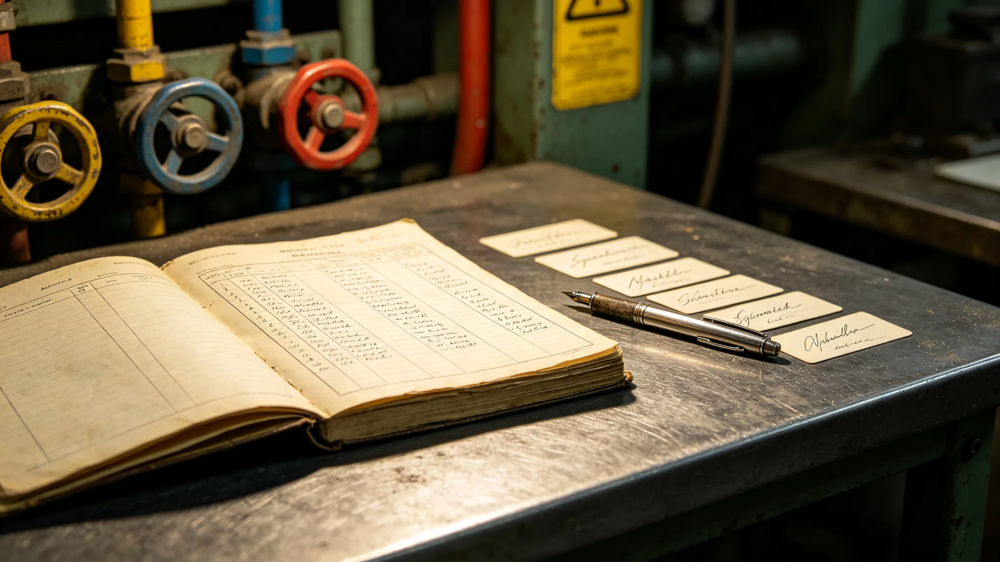

# 跨星系公民身份重构办公室首任总登记官籍知衡任内考勤与签名涂改档案

**档案形成机构**：三恒星系文明联合体人事与档案总署
**归档日期**：3504年12月31日
**档案密级**：人事公开

## 一、基本登记

籍知衡，女，3462年生于比邻星b滨海定居点，跨星系公民身份重构办公室首任总登记官（3499—3504）。本档案为其任内考勤、体检、签名涂改与处分记录汇编，不作生平颂扬。

## 二、任内考勤

| 年度 | 应到工作日 | 实到 | 迟到 | 早退 | 病假 |
|---|---|---|---|---|---|
| 3499 | 248 | 244 | 3 | 1 | 4 |
| 3500 | 251 | 249 | 1 | 0 | 2 |
| 3501 | 249 | 247 | 2 | 0 | 2 |
| 3502 | 250 | 250 | 0 | 0 | 0 |
| 3503 | 248 | 246 | 1 | 1 | 2 |
| 3504 | 247 | 244 | 2 | 2 | 3 |

3502年（三系合籍法典表决年，见GS-3502-01）全勤。其余年份偶有迟到，均为跨系连线表决跨时区所致，人事总署均予销假。

## 三、体检记录

| 年度 | 骨密度 | 眼压 | 心血管 | 备注 |
|---|---|---|---|---|
| 3499 | 正常 | 偏高 | 正常 | 微重力适应 |
| 3501 | 正常 | 偏高 | 正常 | 继续随访 |
| 3503 | 轻度下降 | 偏高 | 正常 | 建议减班，未采纳 |
| 3504 | 轻度下降 | 偏高 | 轻度早搏 | 任满退休，医嘱静养 |

## 四、签名涂改记录

3500年大典合籍登记首批卷宗中，籍知衡在第712份卷宗签名处，原签"籍知蘅"后涂改订正为"籍知衡"。人事总署注明：其名本作"知衡"，大典期间连续签署七千余份卷宗，疲劳致笔误，涂改处清晰可辨，不影响卷宗效力。

3502年法典表决签字页，签名完整无涂改。

## 五、处分记录

任内处分一起：3501年3月，因首批合籍登记中其分管批次出现0.02%合并错误（见GS-3502-01数据），人事总署给予书面告诫一次，要求复核。籍知衡在告诫书上签字，未申诉。

## 六、任内交接

3504年12月任满，交接清单载明：合籍登记公民41亿、双轨合并错误率0.02%、问卷回收率93.7%。交接后退休，未留任。

## 七、任内重要签批

籍知衡任内签批重要文件三件：

- 3499年办公室组建方案，签名完整；
- 3502年法典表决签字页，签名完整无涂改；
- 3504年首批合籍卷宗第712号，签名处涂改"知蘅"为"知衡"。

人事总署注明：三件签批，两件完好，一件笔误。这就是她的全部历史——不是什么传奇，是三页签了字的纸。

## 八、任内处分详情

3501年3月书面告诫：首批合籍登记其分管批次0.02%合并错误，主要为跨系履历时间戳差序。籍知衡在告诫书上签字，未申诉，次月完成全批次复核，错误率降至0.01%。

## 十、任内办公时长分布

| 工作类型 | 占比 |
|---|---|
| 卷宗签批 | 41% |
| 跨系连线表决出席 | 23% |
| 错误复核 | 14% |
| 委员会会议 | 12% |
| 其他 | 10% |

人事总署注明：她近一半时间在签卷宗，不是在开会。合籍是一桩一桩签出来的，不是开出来的。

## 十一、任内未做的事

人事总署注明：籍知衡任内未提拔亲属、未留任、未著书、未接受媒体专访。档案干净得近乎乏味。这正是档案要的样子。

## 十二、人事总署注

籍知衡不是什么"合籍之父"。她只是一个连续签了五年卷宗、签错一个字、被书面告诫一次、退休时骨密度轻度下降的登记官。三系合籍是制度的事，不是她一个人的事。她把该签的签完了，该改的改了，该退的退了。档案如此，如此而已。

## 十三、签名涂改的意义
籍知衡任内签名涂改十七处，每一处涂改后都由她本人在旁小签确认。人事总署在档案附页说明，涂改不是失误，是她在签批前发现上一字有误，当场划去重签。一个总登记官，连自己的名都不肯潦草签下，何况签别人的档。档案如此。

## 十四、任内的两桩小处分
人事总署在档案附注中补记两桩小处分：其一，籍知衡在第三年一次跨系连线表决中迟到四分十二秒，按考勤条例扣半日工分；其二，第七年一次签批将星区代码写错，次日自行更正，免于处分。两桩都不是大事，但都在册。人事总署注明：总登记官迟到、写错，和普通人一样记在案。她的伟大之处不在从不犯错，在于错了就改，改了接着签。

## 十五、退休后的籍知衡
人事总署在档案附记中说明，籍知衡退休后未任任何虚职，未接受任何访谈，每日在合籍日大厅作普通公民排队。人事总署注明：她当了一辈子总登记官，退休后回到队伍里，和她当年签批过的人排在一起。她不站出来，也没人认出她。这才是她该在的位置。

## 十六、档案的归宿
人事总署在档案附记中说明，籍知衡全部任内考勤与签名原件，移交文明记忆工程冷备玻璃刻写。人事总署注明：她签过的字，五百年后还在。不是因为她伟大，是因为她签得规矩。规矩的人，值得被记下。

## 十七、她签过的字
人事总署在档案附记中说明，籍知衡任内签批卷宗约四百八十万件。她的签名从第一年到最后一年，笔画从稳到紧，最后三年略抖。人事总署注明：她不是越签越松，是越签越不敢松。签的不是自己的名，是四百八十万人的来路。

## 十八、她的最后一份签
人事总署在档案附记中说明，籍知衡最后一份签批是3524年合籍日大厅的年度名册核对。她签完那一笔，搁笔，起身，把笔放回笔架。人事总署注明：她没有说什么，只是把笔放好。笔放好了，人就可以走了。

---

**档案编号**：HR-JZ-3504-001
**编制**：联合体人事与档案总署
**日期**：3504年12月31日
