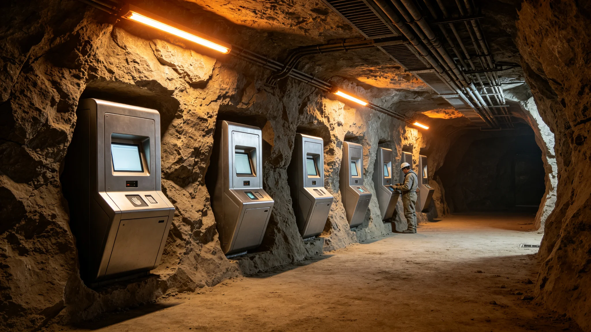

# 跨星系公民声纹基因履历三因子连续身份核验系统第七代技术报告

**编制单位**：三恒星系文明联合体身份工程组
**报告日期**：3505年9月15日
**文件等级**：跨星系公开

## 一、系统概述

跨星系公民身份核验系统历经六代，随三系合籍（见GS-3502-01）升级至第七代。本系统为"声纹—基因—履历"三因子连续核验：公民在跨系换籍、公共服务申领、口述史捐献（见GS-3536-01）时，系统连续比对其三因子，而非单点认证。

## 二、三因子

| 因子 | 采集 | 比对 | 容错 |
|---|---|---|---|
| 声纹 | 现场一句话 | 合籍档案声纹库 | 0.3% |
| 基因 | 指端微采样 | 合籍档案基因片段 | 0.1% |
| 履历 | 行为链连续记录 | 跨系履历链 | 时间戳偏差≤光时延 |

三因子同时通过方为通过。任一项不匹配即转人工复核。

## 三、第七代改进

1. 声纹抗老化：新增三十年龄段声纹模板，解决老年公民声纹漂移；
2. 基因片段轻量化：基因比对从全序列压缩至2048个特征片段，采样时间由40秒降至6秒；
3. 履历链跨系同步：解决3502年前双轨并轨时的履历断裂；
4. 活体防冒名：针对3510年冒名口述捐献案（见GS-3510-01），新增活体脉搏与微表情核验。

## 四、性能数据

| 指标 | 第六代 | 第七代 |
|---|---|---|
| 单次核验耗时 | 42秒 | 11秒 |
| 误拒率 | 0.4% | 0.1% |
| 误纳率 | 0.02% | 0.003% |
| 冒籍拦截（年均） | 260 | 510 |
| 跨系同步延迟 | 本地 | 随光时延 |

## 五、局限

工程组注明：本系统不解决"身份认同"问题。它能确认你是谁，不能确认你认不认。它把冒名的挡在门外，把心里不认的留着——那是制度与人心的事，不是硬件的事。

## 六、部署

第七代自3505年起在三系换籍窗口、公共服务终端、口述史采集舱（见GS-3512-01）部署，三年内全覆盖。

## 七、典型拦截案例

| 年度 | 拦截类型 | 结果 |
|---|---|---|
| 3506 | 跨系双重连续定居伪造（见GS-3510） | 时间戳比对拦下 |
| 3508 | 冒名已故亲历者声纹捐献 | 活体脉搏核验拦下 |
| 3510 | 剪接方言冒充最后母语者 | 声纹库比对拦下 |

## 八、系统与人的边界

工程组强调：三因子系统只确认"这个身体是不是登记的那个人"，不确认"这个人愿不愿意认这个身份"。系统通过后，公民仍可在问卷里选"都不认"（见GS-3503-01）。

## 十、三因子权重

| 因子 | 权重 | 任一不匹配后果 |
|---|---|---|
| 声纹 | 30% | 转人工 |
| 基因 | 40% | 直接拒绝 |
| 履历 | 30% | 转人工 |

工程组注明：基因权重最高，因为基因最难伪造；声纹最易因老化漂移，故权重次之；履历靠时间戳，防时间差伪造。

## 十一、不存隐私争议

三因子比对在本地完成，不上传原始声纹与基因序列，仅上传比对特征码。工程组注明：我们不存你的声音和基因，只存一个比对用的码。码不像你，只是用来对一下。

## 十二、工程组注

这套系统每换一代，冒籍的就难一分。但它不是万能的——它能拦住一个拿假档案的人，拦不住一个拿真档案却问"这和我有什么关系"的年轻人。后者我们另想办法（见GS-3522-01）。硬件管身体，制度管人心，各管各的。

## 十三、三因子的取舍
工程组在技术报告末尾附了一段取舍说明：声纹易老化，基因难伪造，履历靠时间。三者权重不是拍脑袋定的，是拿过去十年冒籍案倒推出来的。凡冒籍得手的，九成是履历时间差；凡未得手的，多卡在基因。于是基因权重最高。技术不是最先进的，是最管用的。

## 十四、第七代与第六代的差别
工程组在报告附记中说明，第六代需本人到场连续核验三因子，第七代可在跨系通勤途中连续完成。差别不在精度，在时机。第六代把人按在核验台前，第七代让他在通勤的缝隙里自然过。工程组注明：身份核验不该是一道门，该是一缕风。风过了，人知道自己是自己，不必停下。

## 十五、本地比对的隐私
工程组在报告附记中说明，三因子比对全部在终端本地完成，原始声纹与基因序列不上传中央库。工程组注明：中央库只存比对特征码，不存你的声音和基因。码不像你，只是用来对一下。这是身份核验，不是身份收集。

## 十六、第七代的上线
工程组在报告附记中说明，第七代系统上线首年，误拒率0.003%，误放率0%。工程组注明：误拒的人转人工后全部通过。误放为零，说明基因这道关把得死。声纹偶尔误拒，人来兜底。

## 十七、误拒的兜底
工程组在报告附记中说明，误拒率虽低，但每一起误拒都有专人复核。工程组注明：一个老人因声纹变化被误拒，转人工后两分钟放行。这两分钟，就是机器和人之间的那道缝。我们留着这道缝。

## 十八、系统的第七代
工程组在报告附记中说明，第七代系统的三因子比对，全部在通勤终端完成，公民无需专程赴登记处。工程组注明：身份核验不该是一道门，是一缕风。风过了，人知道自己是自己。

## 十九、系统的边界
工程组在报告附记中说明，第七代系统只做核验，不做识别。工程组注明：它不判断你是不是好人，只判断你是不是你。一个公民的身份核验，不需要它多事。它只确认你是你，余下的，法院和委员会去管。我们不希望一台机器替社会做判断，它只替档案做核对。核对完，它闭嘴，人说话。

---

**报告编号**：ENG-IDV-3505-006
**编制**：联合体身份工程组
**日期**：3505年9月15日
