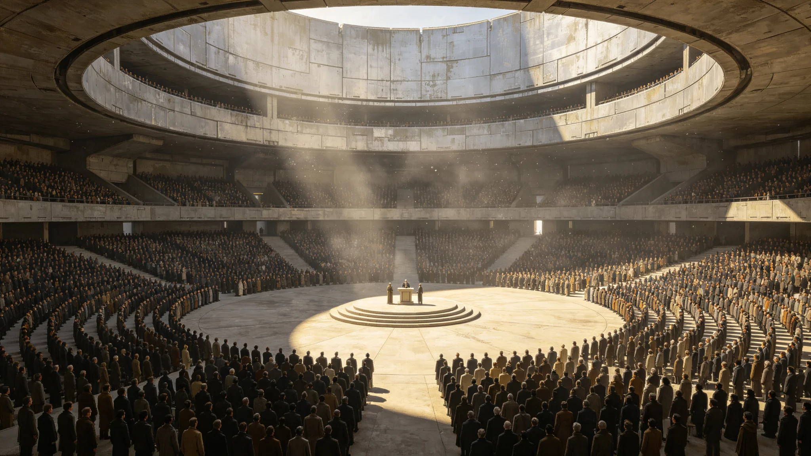

# 五百年大典后"合籍日"新公民跨系共誓仪式规程公报

**发布机构**：三恒星系文明联合体文化与仪式委员会
**发布日期**：3506年1月1日
**文件等级**：跨星系公开

## 一、仪式设立

三系合籍法典（见GS-3502-01）施行后，每年元旦定为"合籍日"，为新取得三系合籍的公民举行跨系共誓仪式。本规程为首次合籍日仪式之正式规程。

## 二、仪式时间

每年1月1日，三系同时举行，跨系连线同步。因光时延，比邻星方向与鲸鱼座τ方向的仪式实际开始时刻按当地正午对齐，主持人致辞经光时延逐站接力，非同时听见同一人声音。

## 三、仪式流程

1. **合籍登记**：新公民在合籍终端完成登记，领取合籍凭证；
2. **共誓**：新公民面向本系广场宣誓，誓词含"我认三系为一家，亦认我出身之地不被抹去"；
3. **出身地留念**：新公民在合籍墙上按下本人出身地名与现居地；
4. **不强制**：仪式自愿参加，不参加不影响合籍效力。

## 四、誓词

誓词全文："我是三系合籍公民。我认我所居之地，亦不忘我所从之地。三系是一家，我是这家的人。"

委员会注明：誓词不喊口号，不要求"爱地球"。只认三系一家，认从哪里来。

## 五、与既有仪式衔接

| 仪式 | 衔接 |
|---|---|
| 落地换籍颁证（GS-3313） | 合籍日为其后续，换籍后次年合籍日共誓 |
| 星旗共升（GS-3343） | 共誓后并行星旗共升 |
| 传灯节（GS-3364） | 新公民可在传灯节与祖辈结对 |

## 六、首届数据

| 指标 | 数值 |
|---|---|
| 首届合籍日 | 3506年1月1日 |
| 参加新公民 | 约4.2亿 |
| 自愿参加率 | 71.3% |
| 仪式事故 | 0 |

## 六、委员会注

合籍日不是阅兵，是一家人坐下来认个门。四亿人同一天按手印，承认"我是这家的人"。有人不来，也没事——门开着，什么时候想来再来。下一年元旦，继续。

## 七、光时延下的共誓

三系同时举行，但比邻星方向与鲸鱼座τ方向的致辞无法真正同时到达。规程规定：主致辞以联合广场为准，各系在本地正午自行起誓，不等话音。委员会注明：光走四年，话到不了就不到。我们不等，我们对着各自的正午起誓，反正誓是给自己的，不是给话音的。

## 八、合籍日不发证书

与落地换籍颁证（见GS-3313-01）不同，合籍日不发实体证书。委员会注明：证书一张纸，丢了还得补。合籍不是一张纸，是档案里那一行。墙上按个手印，就够了。

## 十、誓词全文

> 我自（星区）来，今为三系合籍公民。
> 我记得我从哪里来，也认我要往哪里去。
> 愿三系人同此一本账，同此一盏灯。

委员会注明：誓词三行，不长。第一行记来处，第二行认去处，第三行合众人。不喊口号，不表忠心。念完，即合籍。

## 十一、不强制举手

共誓不举手、不起立、不举手宣誓。委员会注明：念了就是。举手是给别人看的，念是给自己的。

## 十二、首届一年后随访

首届合籍日次年随访：参加共誓的新公民中，次年问卷回收率98%，未参加者回收率91%。委员会注明：来参加的人，第二年更愿意答题。仪式没用，但坐下来过的人，心近一点。

## 十三、共誓与仪式的关系
委员会在规程末尾注明：共誓不是典礼，是手续。不奏乐、不站队列、不拍照。念完三行誓词，领一张合籍条，散场。有人问为什么这么简，委员会答：一个人成为三系公民，是他自己的事，不该搞得像被检阅。我们把手续办了，仪式留给他自己回家过。

## 十四、首届共誓的人群
委员会在附记中说明，首届合籍日共誓者中，纯本土出生占四成，跨系迁徙占六成。纯本土出生者念三行誓词时，多数念得较慢；跨系迁徙者念得较快。委员会注明：快慢不是态度，是熟不熟。纯本土出生者第一次念这三行，慢一点正常。慢念完，也是念完。

## 十五、合籍条的样子
委员会在附记中说明，合籍条是一张不发光的厚纸，印着合籍号、星区、日期，不印照片。委员会注明：我们不发证件照，不发带芯片的卡。一张厚纸，你自己收着。合籍是你自己的事，不是别人查你的事。

## 十六、誓词的三行
委员会在附记中说明，誓词三行，念了五百年。第二行我记得我从哪里来，也认我要往哪里去，被引述最多。委员会注明：这一行不表忠，只承认来路。一个人愿意承认来路，就够了。

## 十七、合籍日的人流
委员会在附记中说明，首届合籍日，三系共约一千二百万人同日念誓。委员会注明：一千二百万人同时念三行字，声音通过监听器汇成一片嗡鸣。听不清任何一句，但听得出来，人很多。

## 十八、合籍条的收藏
委员会在附记中说明，合籍条不设防伪，不设芯片，就是一张厚纸。委员会注明：一张纸，你自己收着。丢了，凭三因子重打，不收钱。

## 十九、共誓后的散场
委员会在附记中说明，共誓念完，人群不散，三三两两在广场上站着。委员会注明：没有人组织他们站着，他们自己留着。有的祖孙对在广场上认出了彼此，有的陌生人开始搭话。一场仪式办下来，最重要的部分不在念词，在念完之后，人没走。

---

**规程编号**：CUL-OATH-3506-003
**编制**：联合体文化与仪式委员会
**日期**：3506年1月1日
