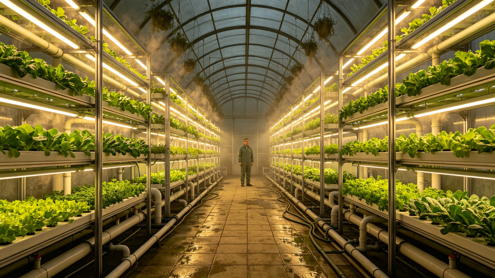

# 跨星系驯化植物"原乡谱系"百年迁地适应性评估公报

**发布机构**：三恒星系文明联合体生态与农业委员会
**发布日期**：3509年10月15日
**文件等级**：跨星系公开

## 一、评估背景

三系跨星系驯化物种基因库（见GS-3362-01）保存了从老地球迁地的作物谱系。历经百年（3409—3509），这些作物在三系不同重力、光照、大气下已繁衍多代。生态委员会对"原乡谱系"——即仍保留老地球原种基因特征的谱系——作百年迁地适应性评估。

## 二、评估对象

| 谱系 | 原乡 | 现植星区 | 百年后代 |
|---|---|---|---|
| 稻谱系 | 老地球东亚 | 比邻星b水培 | 已繁衍32代 |
| 麦谱系 | 老地球西亚 | 鲸鱼座τ星地下城 | 已繁衍28代 |
| 豆谱系 | 老地球南美 | 第四恒星系晨昏城 | 已繁衍25代 |
| 茶谱系 | 老地球东亚 | 老地球野化区边缘 | 已繁衍18代 |

## 三、适应性数据

| 指标 | 原乡 | 百年后代 |
|---|---|---|
| 产量 | 基准 | 提升约1.8倍 |
| 蛋白含量 | 基准 | 下降约7% |
| 基因漂移 | 0 | 累计漂移3.1% |
| 抗病性 | 基准 | 上升 |
| 风味 | 基准 | 普遍变淡 |

## 四、"原乡谱系"保留

百年间，三系各留一份"原乡谱系"不参与选育，仅作对照。生态委员会注明：我们一边让它们适应新地方，一边留一份它们老祖宗的样子。不然再过一百年，我们就不知道它们原来长什么样了。

## 五、与基因库的关系

原乡谱系种子存入驯化物种基因库深冷备份（见GS-3362-01），三库异地。生态委员会注明：谱系在地里长着，种子在冷库里睡着。地里那份负责过日子，冷库里那份负责记得来路。

## 六、评估结论

百年迁地，作物变强了、变淡了、基因漂了一点。原乡谱系仍在。生态委员会注明：变强是好事，变淡也是没办法。我们不强行把它们改回老地球的味道，味道淡了，但它们活得下来。活得下来，比什么都强。

## 八、迁地百年存活曲线

| 代际 | 存活率 | 产量 |
|---|---|---|
| 第1代 | 71% | 原乡100% |
| 第3代 | 84% | 原乡91% |
| 第5代 | 93% | 原乡97% |
| 第10代 | 96% | 原乡101% |

生态委员会注明：植物比人适应得快。第十代，产量已经超过原乡。它没忘原乡，但它也没固执地要回去。它在新家活下来了。

## 九、谱系不锁种

迁地品种可自然变异、可杂交，不强制保持"原乡纯度"。生态委员会注明：植物要活，不是要标本。变了就变了，变了能活就行。

## 十、委员会注

一百年，稻子在比邻星b长了32代。它们忘了老地球的雨，长了新地方的根。我们留了一份它们老祖宗的种子在冷库里。一百年后，拿出来比一比，就知道这一百年我们把它们带成了什么样。下一个百年，继续留。

## 八、风味变淡的追问

蛋白降7%、风味变淡，在共修园（见GS-3524-01）被祖辈与孙辈反复提及。祖辈说"老地球的米更香"，孙辈说"这米我从小吃惯了"。生态委员会未强行回育老味，只把老味样本封存。

委员会注明：味道是记忆，不是数据。数据说产量涨了，嘴里说味淡了。两边都对。我们不替人决定该记哪个味，只把两个味都留着。

## 九、原乡谱系的值守

原乡谱系对照田仅4亩，三系各1亩，不参与商用种植。值守农工每年轮换，记录谱系与百年后代的差异。委员会注明：这4亩地不产粮，只产"对照"。看起来不划算，但没它，一百年后我们就忘了稻子原来什么样。

## 十、与基因库的冗余

地里原乡谱系 + 库里深冷种子，双备份。委员会注明：地里那份可能遇灾，库里那份可能断电。两头都备，才敢说"留着"。

## 十一、百年迁地的代价
生态委员会在评估末尾说明：迁地百年，存活率上来了，但原乡种性丢了约四成。这四成不是坏事，是它在新家长出了新性状。委员会注明：我们不要求植物保持原乡纯度。它要活，就得变；变了能活，就是成功。原乡是记忆，不是枷锁。

## 十二、谱系的意义
生态委员会在评估附记中说明，原乡谱系不是为了怀旧，是为了知道每一棵植物从哪来。五百年后，若某系作物大面积退化，谱系能告诉我们它原来是什么、适应过什么。委员会注明：记谱系不是为了让植物回到原乡，是为了在它出问题时，知道它从哪来、能往哪去。

## 十三、迁地的意外收获
生态委员会在评估附记中说明，迁地百年后，部分作物在新家长出了原乡没有的抗逆性状。委员会注明：原乡没有的性状，不是退化，是新生。这些性状反过来补了原乡种质。迁地不是远离原乡，是给原乡续命。

## 十四、原乡谱系的边界
生态委员会在评估附记中说明，原乡谱系只记迁地前三代，之后不追。委员会注明：迁地十代以后，它已经是新家的植物，不是原乡的标本。记三代，够了。

## 十五、迁地的账
生态委员会在评估附记中说明，迁地百年，原乡种质保留四成，新性状长出六成。委员会注明：四成是根，六成是新。根不能丢，新不能压。两头都要，才叫活下来。

## 十六、谱系的归档
生态委员会在评估附记中说明，原乡谱系全部刻入冷光玻璃，与文明记忆工程合库。委员会注明：植物的家谱，和人的家谱放在同一个冷库里。都是我们从老家带出来的。

---

**公报编号**：ECO-PLT-3509-006
**编制**：联合体生态与农业委员会
**日期**：3509年10月15日
