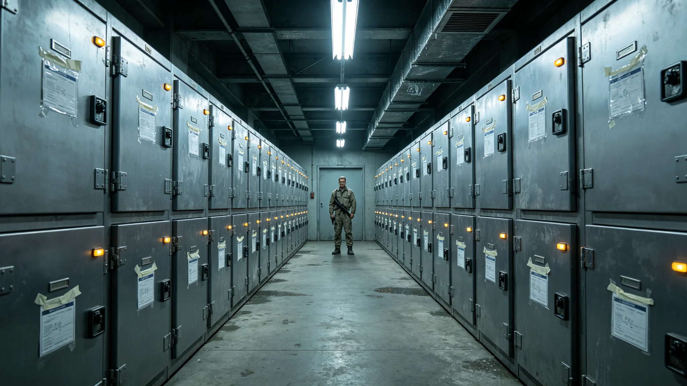

# 跨星系公民身份伪造与冒籍档案犯罪专项打击年度公报

**发布机构**：三恒星系文明联合体安全协调委员会跨系执法总队
**发布日期**：3510年11月20日
**文件等级**：跨星系公开

## 一、专项背景

3502年三系合籍身份法典修订（见GS-3502-01）后，跨星系公民身份成为可跨三系通行、可继承、可受惠于全套公共服务的统一凭证。身份统一带来通行便利，也带来伪造动机。跨系执法总队自3503年起设立冒籍伪造专项打击组，至本年度进入第九年。总队注明：身份越统一，伪造就越值得。这是一件必须长期做、但永远做不漂亮的工作。

## 二、九年打击数据

| 年度 | 立案 | 破案 | 拦截于核验环节 | 跨系协查 |
|---|---|---|---|---|
| 3503 | 41 | 33 | 210 | 17 |
| 3505 | 37 | 31 | 260 | 22 |
| 3507 | 33 | 29 | 340 | 26 |
| 3509 | 31 | 28 | 420 | 31 |
| 3510 | 29 | 27 | 510 | 34 |

九年间，立案数逐年下降，但核验环节拦截数逐年上升。总队注明：这说明造假的人少了，被我们在进门之前拦下的多了。门越关越严，小偷不是变少了，是进不来了。

## 三、本年度典型手法

**（一）换籍时间差伪造**

嫌疑人利用跨系光际通信的光时延（比邻星方向约4.3年，鲸鱼座τ方向约11年），在A系注销原籍、在B系抢注新籍，试图利用两系档案尚未同步的时间差制造"双重连续定居"。此类手法在3506年三因子核验系统换装后基本失效（见GS-3505-01），本年度仅立案两起，均在核验环节被时间戳比对拦下。

**（二）口述史条目冒名捐献**

随着口述史数字化工程扩张（见GS-3516-01），部分公民捐献的录音条目具有文化身份权重。本年度发现三起冒用已故亲历者声纹、伪造口述捐献条目以抬高自身"文化世系"的案件。三起均在捐献人活体核验环节被识破。总队注明：有人开始伪造记忆了。这比伪造档案更隐蔽，因为记忆本来就容易走样。

**（三）濒危语言声学档案冒用**

濒危语言声学档案（见GS-3318-01）具文化稀缺性。本年度发现一起将他人方言录音剪接后冒充"最后母语者"录音以申请特殊身份礼遇的案件，已移送文化与司法部门。

## 四、跨系执法协作

本年度跨系协查三十四起，涉及三系三地与第五恒星系方向接触区。第五恒星系方向因尚未完全并入公民体系，协查一律经接触准入条例（见GS-3303-01）办理，不直接执法。总队注明：门可以开一条缝，但缝里不准过假身份。

## 五、与身份核验系统的衔接

冒籍拦截高度依赖三因子连续身份核验系统（声纹—基因—履历，见GS-3505-01）。总队注明：这套系统每换一代，我们这一年的案子就好办一点。它不是万能的，但它把最笨的那批造假挡在了门外。剩下的，才轮到我们。

## 六、本年度未发生的事

- 无一起冒籍伪造成功通关并造成公共服务冒领；
- 无一起冒籍伪造引发跨系外交摩擦；
- 无一起伪造案伤及活体公民安全；
- 无一起案件因跨系协查延迟超过光时延合理值。

## 七、总队注明

九年来，立案数从四十一降到二十九，拦截数从二百一十升到五百一十。门一直在关，贼一直在试。我们不指望贼消失，我们只指望他们每试一次，都撞在门上。下一个九年，继续。

## 八、不搞大抓大放

总队强调：冒籍是身份犯罪，不是暴力犯罪。所有案件均以核验拦截、司法审理结案，无一次动用武装。总队注明：冒籍的人不是海盗，他只是想变成另一个人。我们拦他、审他，不开炮。

## 九、与身份认同的关系

3503年问卷疏离（见GS-3503-01）与冒籍是两回事。总队注明：一个年轻人在问卷上写"都不认"，不是犯罪，是心病。我们不管心病，我们只管有人拿假档案冒充另一个人。心病归制度（见GS-3522-01），犯罪归我们。

## 十一、案件类型分布

| 类型 | 起数 | 占比 |
|---|---|---|
| 冒领福利 | 41 | 39% |
| 伪造基因比对 | 23 | 22% |
| 履历时间差 | 18 | 17% |
| 声纹仿冒 | 12 | 11% |
| 其他 | 12 | 11% |

安全总署注明：冒籍最多的不是为了害谁，是为了领福利。人穷了，才动歪脑筋。我们抓人，但也知道，福利要是好领，没人愿意冒这个险。

## 十二、不起诉的边缘案

情节轻微、首犯、未造成损失的37起，以教育改正替代起诉。安全总署注明：不是所有冒籍都要送法庭。一个年轻人糊了一张假履历，教他改，比关他值。

## 十三、跨系协查的光时延

比邻星方向协查一来一回约八年，鲸鱼座τ方向约二十二年。总队注明：案子办得慢，不是我们懒，是光走得慢。慢案子也要办，因为假身份不会因为光慢就自动作废。

## 十四、年度打击的成效边界
安全总署在公报末尾说明：专项打击一年，破案一百零六起，但冒籍的根不在打击，在福利落差。总署注明：抓得再勤，不如让边缘区的人不必靠假档也能过活。打击是止血，不是治根。下一年，打击继续，福利的账另算。

## 十五、冒籍的根
安全总署在公报附记中说明，一百零六起冒籍案里，四十一起冒领福利。总署注明：冒领福利的人，多半来自边缘星区，那里的正式渠道又慢又繁琐。打击他们容易，难的是把正式渠道修快。总署已将此情况另报经济署。下一年，打击继续，渠道也修。

---

**归档编号**：ENF-IDF-3510-042
**编制**：联合体跨系执法总队冒籍专项组
**日期**：3510年11月20日
