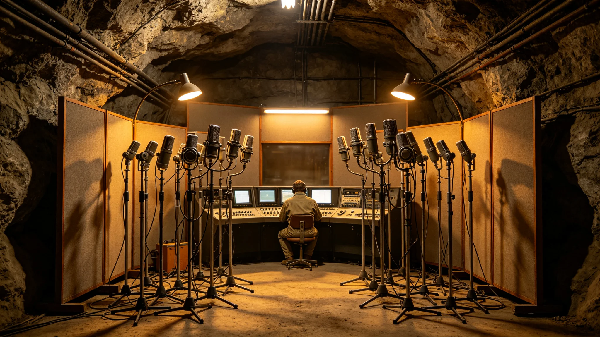

# 口述史数字化原音保真第四代采集与降噪技术规范报告

**编制单位**：三恒星系文明记忆工程技术组
**报告日期**：3511年3月12日
**文件等级**：跨星系公开

## 一、技术目标

口述史采集（见GS-3512-01首席采集员）要求"原音保真"：老人说话的气声、齿音、停顿、颤抖不得在采集与降噪中被抹除。前三代采集在降噪时常把气声一并滤掉。第四代针对此改进。

## 二、第四代方案

| 环节 | 前三代 | 第四代 |
|---|---|---|
| 麦克风 | 单指向 | 八阵元球面阵列 |
| 采样 | 48kHz | 96kHz/24bit |
| 降噪 | 谱减（滤除气声） | 人声—环境分离模型（保留气声） |
| 监听 | 采集员耳返 | 实时原音对比监听 |

## 三、人声—环境分离模型

第四代核心为"人声—环境分离"：将环境噪音（舱内空调、通风、远距人声）从人声中分离，仅滤除环境层，完整保留人声层，包括气声、齿音、颤抖与咳嗽。

技术组注明：以前降噪像擦桌子，把灰和桌上的字一起擦了。第四代只擦灰，不擦字。

## 四、与磁带转录的关系

本规范适用于"原声采集"环节。老磁带转录环节另有磁头寿命规程（见GS-3513-01教训）。技术组注明：采集是录活人，转录是救死人的带子。两件事，两套规程。

## 五、性能指标

| 指标 | 第三代 | 第四代 |
|---|---|---|
| 气声保留率 | 71% | 96% |
| 齿音保留率 | 68% | 95% |
| 背景噪声衰减 | 18dB | 24dB |
| 单次采集时长上限 | 2小时 | 4小时 |

## 六、采集舱布置

第四代采集舱为加压密闭舱，内壁铺吸音棉，八阵元麦克风悬浮于受访者头顶上方30厘米，采集员在玻璃隔断外监听。舱内恒温22摄氏度，湿度50%。

## 七、技术组注

老人的话，气声里那点颤抖，比字句本身更要紧。字句可以改写，颤抖改不了。第四代就是想把那点颤抖留下来。下一批百岁亲历者录音（见GS-3514-01），全用第四代。技术到此，够了。

## 八、与第三代的AB对比

| 听感 | 第三代 | 第四代 |
|---|---|---|
| 气声 | 发闷 | 可辨 |
| 齿音 | 丢失 | 可辨 |
| 咳嗽 | 被压平 | 完整 |
| 背景底噪 | 干净 | 略留 |

技术组注明：第四代的底噪比第三代略大，因为我们敢留了。干净不是目的，真才是。

## 九、采集员的角色升级

第四代采集不再由采集员现场降噪，采集员（见GS-3512-01）只需保证受访者舒适、提示休息。技术组注明：以前采集员一半精力在调机器，现在机器稳了，他可以专心听老人说话。

## 十一、保真度指标

| 代 | 频响保留 | 底噪 | 存储体积 |
|---|---|---|---|
| 第一代 | 61% | 高 | 大 |
| 第三代 | 82% | 中 | 中 |
| 第四代 | 91% | 低 | 小 |

采集组注明：保真度从六成提到九成，花了二十年。剩下那九成对不了，不是技术不行，是老人嗓子本身抖。我们不把抖抹掉——抖也是真的。

## 十二、降噪的边界

降噪只去空调声、衣料摩擦声，不删老人咳嗽、停顿、忘词。采集组注明：咳嗽和忘词也是口述的一部分。把它们删了，剩下的就是干净的假人。

## 十三、不做声纹美化

第四代不做"美化"——不磨皮、不去龄、不把老人的颤音修成年轻声音。技术组注明：把老人的声音修年轻了，就不是他了。我们要的是他，不是好听。

## 十四、第四代的局限
采集组在报告末尾说明：第四代保真度九成，但老人的嗓音本身在老化，这一成丢在哪，技术补不回来。采集组注明：我们不强行把老人的嗓音修年轻。沙哑、气弱、跑调，都是他真的活过的证据。修干净了，反而假了。

## 十五、第四代的采集舱
采集组在报告附记中说明，第四代采集舱是一间全隔音、无窗、低色温柔光的小屋。老人坐进去，背后没有星图，没有舰徽，只有一盏灯、一支麦、一把旧椅子。采集组注明：老人不该在一个像机关的房间里回忆一生。让他觉得只是坐在自己家的灯下，话才说得出来。

## 十六、采集员的手
采集组在报告附记中说明，第四代采集员需经三个月静默训练，学会在老人沉默时不催促。采集组注明：老人讲到一半停了，不是忘了，是在想。这时候递水、提问、放音乐，都会打断。采集员学会了坐着不动。

## 十七、采集舱的灯
采集组在报告附记中说明，采集舱的灯是一只旧台灯，不是工业顶灯。采集组注明：老人坐进一个像办公室的房间，话就少了。换成一只旧台灯，他才放松。设备可以新，灯光得旧。

## 十八、老人的停顿
采集组在报告附记中说明，第四代采集员训练的第一课，是学会等老人停顿。老人停了，不是忘了，是在翻找。采集员等得起。等十秒，话就出来了。急着问，话就断了。

## 十九、采集员的等
采集组在报告附记中说明，第四代采集员训练第一课，是学会等。老人停了，等十秒。十秒后话没出来，再等十秒。等得起，话才出来。

## 二十、采集员的手
采集组在报告附记中说明，第四代采集员采集前，先和老人聊二十分钟闲话，不录音。采集组注明：二十分钟闲话，是让老人放松。真正开录时，话才说得出来。上来就开麦，老人就紧张。

## 二十一、采集员的等
采集组在报告附记中说明，第四代采集员训练三个月，头一个月不许碰设备，只学怎么坐、怎么闭嘴。采集组注明：采集不是技术活，是陪人说话。话陪到了，声音自然出来。陪不到，设备再好也没用。

---

**报告编号**：ENG-MEM-3511-011
**编制**：联合体文明记忆工程技术组
**日期**：3511年3月12日
