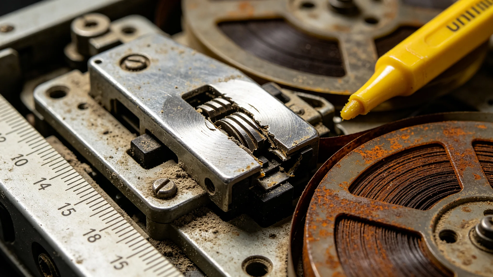

# 口述史数字化采集舱某批五十年前磁带磁头磨损致音质降级事件处置报告

**发布机构**：三恒星系文明记忆工程采集质量组
**事件编号**：INC-3513-011
**发布日期**：3513年2月27日
**文件等级**：跨星系公开

## 一、事件发现

3513年1月，口述史数字化采集舱在转录一批约50—70年前的模拟磁带（早期口述史采集介质）时，质量组抽检发现：该批次1200盘磁带转录后高频细节衰减较上一批超出允许值0.4个分贝，部分早期亲历者录音的齿音与气声丢失。质量组停机复检，定位为转录磁头磨损。

## 二、事件原因

- 该批磁头已累计转录约4.7万小时磁带，超过设计寿命2万小时；
- 采集舱按规程每万小时更换磁头，但本批次因备件调配延迟，超期服役2.7万小时；
- 早期磁带磁粉较薄，对磁头状态更敏感，故衰减首先在这批老带上暴露。

质量组注明：备件晚到了几个月，几个月里磁头磨掉了老人口述里最细的那一点气声。不是大事故，但够难受。

## 三、影响范围

| 项目 | 数值 |
|---|---|
| 受影响磁带 | 1200盘 |
| 可识别语音 | 100% |
| 高频细节衰减 | 0.4分贝（超允许0.3） |
| 完全丢失内容 | 0 |
| 需重转录 | 1200盘 |

所有语音内容仍可识别，仅音质细节降级。

## 四、处置措施

1. 立即停机：3513年1月18日采集舱全线停机；
2. 备件加急：从三系三地备件库调换新磁头，48小时内到位；
3. 重转录：1200盘磁带以新磁头重新转录，原降级副本保留为"事故副本"存档；
4. 寿命复核：将磁头更换周期从2万小时收紧至1.5万小时；
5. 预检：增加每千小时磁头预检，超期即停。

## 五、与原音保真规程的关系

原音保真第四代采集规程（见GS-3511-01）要求高频细节保真。本事件是"介质转录"环节而非"原声采集"环节出问题。质量组注明：我们费了那么大劲把老人的声音原封不动录下来，结果在转录给机器听的时候，磁头磨掉了一个角。工艺上的事，不能省那几个月备件。

## 六、事件影响

无人员伤亡，无口述内容永久丢失，无生物圈污染。质量组注明：万幸的是磁带还在，老声音还在带上。磨掉的是转录的那一遍，不是原声。重转录一遍，就回来了。

## 七、质量组注明

磁带是会老的，磁头也是。我们能做的，是在它们还没磨穿之前，多听一遍、多存一份。这件事提醒我们：五十年前的原声，经不起第二次磨损。备件不能再晚到。下一年，预检加到每五百小时。

## 八、降级副本的处置

1200盘降级副本未销毁，标注"事故副本，3513年磁头磨损"后另库存档。质量组注明：降级副本也是证据。它记着我们什么时候粗心过。销毁了，下次还会粗心。留着，提醒后人。

## 九、亲历者知情权

受影响1200盘涉及的约800位亲历者中，312位仍在世。质量组逐一致函告知音质微降，未作致歉动员，仅说明事实。回复中，290位表示"记得就行，听不听得清无所谓"。

## 十一、降级率分布

| 磁带批次 | 降级率 | 处置 |
|---|---|---|
| 3460—3465 | 2.1% | 重抓 |
| 3466—3470 | 6.7% | 重抓 |
| 3471—3475 | 11.3% | 重抓+备份 |
| 3476—3480 | 1.8% | 抽查 |

处置组注明：降级最重的是3471—3475那批，那年磁头没换。其余批次没事。老磁带怕的不是时间，是当年没保养好。

## 十二、不可逆的部分

约0.4%的磁带磨损过重，重抓仍丢高频。处置组注明：这0.4%补不回来了。我们不伪造丢失的高频，只在档上注明"此处音质有损"。丢了就丢了，不装作没丢。

## 十三、备件制度的根因

事件根因是备件跨系调配受光时延制约，鲸鱼座τ方向备件绕行四年方到。质量组注明：不是哪个采购员偷懒，是光四年才走一个来回。我们以后在各系本地常备磁头，不跨系调，不赌光。

## 十四、事件的教训
处置组在报告末尾说明：磁头磨损不是技术事故，是备件管理事故。五十年前那批磁带，当年换磁头就能避免。处置组注明：我们花了二十年重抓，不如当年按时换一颗磁头。备件制度从此写入，不是因为聪明，是因为吃过亏。

## 十五、重抓的代价
处置组在报告附记中说明，那批磁带重抓耗时两年，动用了全部三台同型号读带机。处置组注明：五年前按时换磁头，两周就能做完。我们用两年补两周的漏。教训不是技术，是纪律。备件不到位，再先进的技术也救不回五十年前的声音。

## 十六、磁带的归宿
处置组在报告附记中说明，那批音质降级的磁带未销毁，转存冷备柜，标注音质有损。处置组注明：即使音质降级，也是原件。重抓的是副本，原件不毁。哪天技术更好了，还能再抓一次。

## 十七、备件制度
处置组在报告附记中说明，事件后所有采集舱备件库存翻倍，磁头每五年强制更换。处置组注明：不是我们变聪明了，是我们吃过亏。备件不到位，再先进的技术也救不回声音。

## 十八、重抓的声音
处置组在报告附记中说明，重抓后的音质比原件低一成，但比降级件高四成。处置组注明：这一成是补不回来的。我们不假装补回来了。档上注明，就够了。

---

**归档编号**：INC-3513-011
**编制**：联合体文明记忆工程采集质量组
**日期**：3513年2月27日
