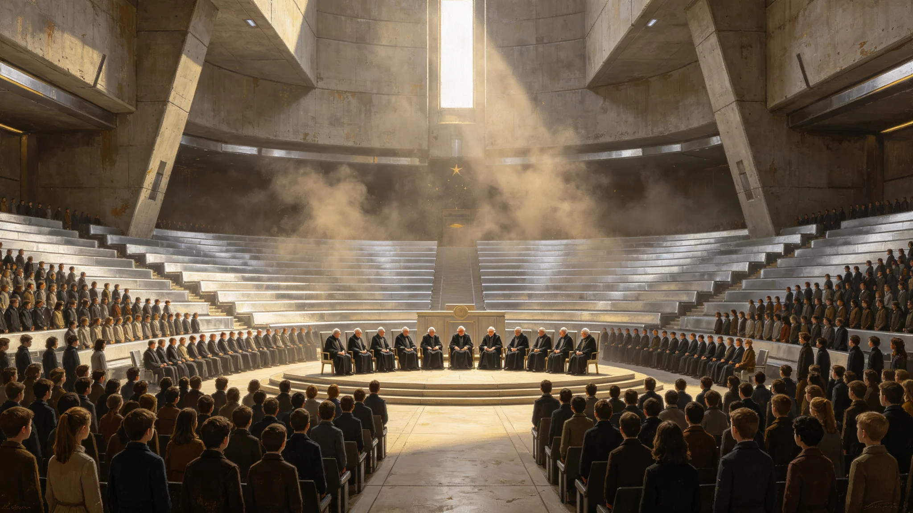

# 口述史开录日——首批百岁亲历者集体口述封档仪式规程公报

**发布机构**：三恒星系文明记忆工程委员会
**发布日期**：3514年9月9日
**文件等级**：跨星系公开

## 一、仪式设立

口述史数字化工程（见GS-3511-01）进入第十年，首批百岁亲历者（亲历五百年大典前后者）口述采集完毕。委员会将每年9月9日定为"口述史开录日"，当日为年满百岁、完成口述捐献的亲历者举行集体封档仪式。

## 二、仪式对象

年满百岁、自愿完成口述捐献（见GS-3536-01）的亲历者。仪式不强制，不评定，不比较"谁讲得好"。

## 三、仪式流程

1. **入舱**：亲历者在第四代采集舱（见GS-3511-01）作最后一次补录，由本人决定有无补充；
2. **封档**：补录完毕后，亲历者亲手按下封档键，其口述条目正式入文明记忆库；
3. **点灯**：封档后在封档墙上点亮一盏灯，灯旁刻其姓名与口述起止年；
4. **不颁奖**：无奖、无杯、无名次。

## 四、与去伪存真的关系

亲历者口述经去伪存真组（见GS-3534-01）标注传闻后封档。仪式上不讨论真伪，委员会注明：老人说完了，就是说完了，真假以后的人自己看。

## 五、首届数据

| 指标 | 数值 |
|---|---|
| 首届封档亲历者 | 112人 |
| 人均口述时长 | 6.2小时 |
| 补录率 | 78% |
| 仪式出席率 | 94% |

## 六、委员会注

## 七、补录的意义

补录不是"定稿"。委员会注明：老人最后一次补录，常改前几处说法。我们不纠结哪版"正确"，几版都留。人老了，记忆变了，变也是真的。

## 八、不直播不转播

封档仪式不直播、不剪辑、不上公共频道。委员会注明：这是私人的话，不是表演。在场的只有老人、采集员、一盏灯。播出去，就成了节目。我们不要节目，要封档。

## 十、开录日不办典礼

首批封档当日，不设会场、不邀媒体、不安排致辞。委员会注明：老人讲了一辈子话，封个档不用再让他们上台。录完，封舱，散。

## 十一、封存件的取用

封存件两百年内不公开，仅目录可查。委员会注明：老人讲的话，先让他们自己安静。两百年后，后人再听。那时他们的后人也死了，话才真正归公共。

## 十二、与点灯封档的关系

9月9日开录日封首批百岁亲历者，12月21日点灯封年度条目（见GS-3543-01）。委员会注明：一年两头，一头收话，一头点灯。

## 十三、灯不熄

点灯墙的灯常年不灭。委员会注明：灯要是灭了，说明我们忘了这一年封过谁。灯亮着，就是提醒。

一百一十二位老人，每人说了六个钟头的话。我们把这些话封进玻璃（见GS-3539-01），点一盏灯。没有奖，没有杯，只有一盏灯亮着。灯亮着，话就没散。下一年九月九，继续封。

## 十四、首批的意义
委员会在规程末尾说明：首批封档的百岁亲历者，是最后一批还记得启程的人。他们走后，启程就只剩文字和声音，不再有活人能说。委员会注明：这一批录完，我们就只能听，不能问了。所以录得慢，录得细，录得不急。

## 十五、首批亲历者的平均年龄
委员会在规程附记中说明，首批封档的百岁亲历者平均年龄一百零二岁。他们中有人记得启程时的舷窗，有人记得老地球的海，有人只记得在船上出生。委员会注明：不管记得什么，他们都是最后一批能说的活人。录完这批，启程就只剩声音，不再有活人。

## 十六、开录日的天气
委员会在规程附记中说明，首批开录日选在9月9日，三系同历。委员会注明：这一天不挑晴朗，不挑吉时，只是日程排到了。录完了就封舱，不管外面什么天气。天气是天的事，录话是人的事。

## 十七、封档的钥匙
委员会在规程附记中说明，首批封档舱钥匙分七地保管，单地无法开启。委员会注明：一个人不能独自打开这一舱声音。七地同时同意，才开。这是对老人的尊重。

## 十八、第一批的人数
委员会在规程附记中说明，首批封档的百岁亲历者共三百一十二人。委员会注明：三百一十二人，是最后一批还记得启程的活人。录完这三百一十二人，启程就只剩声音了。

## 十九、封档的静
委员会在规程附记中说明，封档当日舱内无音乐、无致辞。委员会注明：三百一十二人说完，舱门关上，灯灭，走人。安静是对他们的尊重。

## 二十、封档的钥匙
委员会在规程附记中说明，首批封档舱钥匙分七地保管，单地不能开。委员会注明：一个人不能独自打开这一舱声音。七地同时同意，才开。这是对三百一十二位老人的尊重。

## 二十一、封档的静
委员会在规程附记中说明，封舱后舱内温度恒定十八度，钥匙分七地。委员会注明：三百一十二人的声音，在这个温度下躺两百年。两百年内不开。两百年后，后人自己开。

## 二十二、封档的两百年
委员会在规程附记中说明，首批封档的三百一十二人，两百年内不开。委员会注明：这不是保守，是尊重。老人讲了一辈子话，封了就让他们安静两百年。两百年后，他们的后人也死了，话才真正归公共。在此之前，只目录可查，声音不播。

---

**规程编号**：CUL-SEAL-3514-008
**编制**：联合体文明记忆工程委员会
**日期**：3514年9月9日
