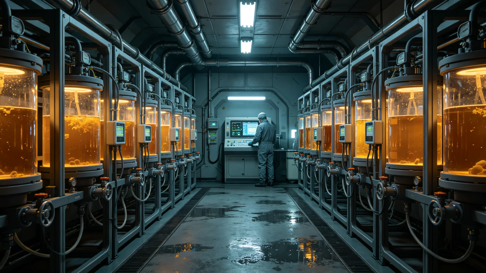

# 多星系地下城共生微生物群落代谢节律跨系对照监测公报

**发布机构**：三恒星系文明联合体生态委员会
**发布日期**：3517年11月11日
**文件等级**：跨星系公开

## 一、监测背景

各系地下城（鲸鱼座τ星地下城、第四恒星系晨昏城竖井、比邻星b地下城市）的闭环生态依赖共生微生物群落分解废弃物、固碳、供藻。这些微生物在不同重力、光照周期、温度下，其代谢节律已分化。生态委员会作跨系对照监测。

## 二、监测对象

| 地下城 | 主群落 | 重力 | 光照周期 |
|---|---|---|---|
| 鲸鱼座τ星地下城 | 真菌分解链 | 0.8g | 人工12h |
| 第四恒星系晨昏城竖井 | 垂直森林根际菌 | 0.6g | 晨昏交替 |
| 比邻星b地下城市 | 固碳微藻伴生菌 | 1.0g | 人工16h |

## 三、节律数据

| 指标 | 鲸鱼座τ | 第四恒星系 | 比邻星b |
|---|---|---|---|
| 代谢周期 | 26小时 | 31小时 | 22小时 |
| 固碳峰值相位 | 暗期中段 | 晨昏交界 | 光期初 |
| 群落稳定性 | 高 | 中 | 高 |
| 跨系移植成活率 | 61% | 44% | 72% |

## 四、分化原因

生态委员会研判：三系地下城微生物在百年间各自适应了本系重力、光照与温度，代谢节律已分化。鲸鱼座τ星地下城真菌链百年监测（见GS-3392-01）最久，节律最稳。

## 五、跨系移植风险

委员会注明：把A系地下城的微生物搬到B系，成活率不算高。它们已经习惯了A系的昼夜。这不是它们"不听话"，是它们在新地方长了新的生物钟。

## 六、与生态闭环的关系

各系地下城生态闭环（见GS-3392-01、GS-3371-01）已与本地微生物群落适配。委员会不强行统一三系微生物节律，只监测、不干预。

## 七、委员会注

## 八、微生物的"方言"

跨系移植成活率低，委员会类比：微生物也有"方言"。鲸鱼座τ星的菌听不懂比邻星b的氧分时序。委员会注明：人学新话要十年，菌学新环境要一百年。它们不笨，它们慢。

## 九、监测不干预

委员会明确：监测只记录，不调节律。不把A系菌的钟强行拨到B系。委员会注明：它们活得好好的，我们凭什么调它们的钟。调坏了，闭环就塌了。

## 十一、跨系代谢对照

| 星区 | 周期 | 与原乡差 |
|---|---|---|
| 比邻星b地表带 | 23.8时 | -1.7% |
| 鲸鱼座τ星地下城 | 24.1时 | +0.4% |
| 第四恒星系晨昏城 | 24.6时 | +2.5% |

生态委员会注明：微生物跟着恒星走。恒星转得快，它代谢也快；恒星转得慢，它也慢。它不懂什么是城邦，它只跟着光走。

## 十二、不调周期

监测到节律漂移后，不强行把微生物调回原乡24时。生态委员会注明：它已经适应了新家。硬调回去，它反而死。

## 十三、与人的对照

委员会议：人在三系间迁徙，要重新适应当地生物钟；菌在三系间移植，成活率也不高。委员会注明：人算移民，菌算引种。两头都不容易。下一年，继续对照。

微生物没有文化，但它们有自己的钟。三系地下城的钟，走得不一样。我们不打算把它们调成一个点。各走各的，各自闭环，各自活着。下一年，继续看钟。

## 十三、微生物与人的对照
生态委员会在公报末尾说明：微生物跟着恒星走，人却不跟着。人有灯，有钟，有作息表；微生物没有，它只跟光。委员会注明：人定的24小时，对微生物只是借口。它活它的节律，我们活我们的。两不相扰。

## 十四、微生物的账本
生态委员会在公报附记中说明，微生物代谢节律漂移后，地下城空气循环系统的换气周期也跟着微调。委员会注明：人定的换气周期，最后得跟着微生物的节律走。人不是地下城的主人，微生物才是。人只是暂住，跟着它的节奏换气。

## 十五、微生物的名字
生态委员会在公报附记中说明，地下城共生微生物未给商业命名，只按编号记录。委员会注明：不给它起商品名，不把它做成卖点。它在地下城待了五百年，比任何公司都久。名字由着它自己。

## 十六、微生物的用处
生态委员会在公报附记中说明，地下城微生物代谢节律，是空气循环系统的活指标。委员会注明：它代谢正常，说明空气正常；它节律乱了，说明空气出了问题。它比仪器先知道。

## 十七、人的周期
生态委员会在公报附记中说明，地下城人仍按24小时作息，微生物按23.8到24.6不等。委员会注明：人有人的钟，微生物有微生物的钟。两套钟并行，互不要求对方对齐。

## 十八、两套钟
生态委员会在公报附记中说明，人按24小时，微生物按恒星周期。委员会注明：两套钟并行，互不要求对齐。人有人的作息，菌有菌的节律。

## 十九、两套钟的并行
生态委员会在公报附记中说明，人按24小时作息，微生物按恒星周期，两套钟并行。委员会注明：人有人的钟，菌有菌的钟。不要求对方对齐。

## 二十、两套钟的并行
生态委员会在公报附记中说明，人按24小时，微生物按恒星周期。委员会注明：两套钟并行，互不要求对齐。人有人的作息，菌有菌的节律。两不相扰。

## 二十一、人的周期
生态委员会在公报附记中说明，人按24小时，微生物按恒星周期。委员会注明：两套钟并行，互不要求对齐。人有人的钟，菌有菌的钟。

---

**公报编号**：ECO-MIC-3517-011
**编制**：联合体生态委员会
**日期**：3517年11月11日
