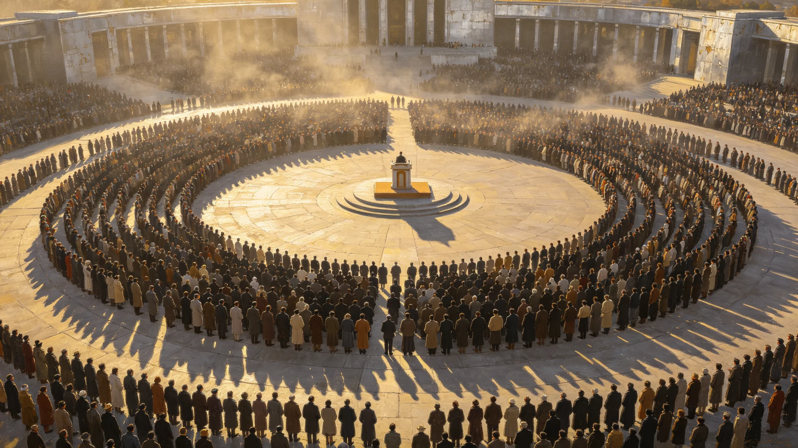

# 跨星系"母语日"——多星系语言并行诵念仪式规程公报

**发布机构**：三恒星系语言与文化委员会
**发布日期**：3521年3月21日
**文件等级**：跨星系公开

## 一、仪式设立

语言演变监测制度（见GS-3515-01）施行后，各系方言与濒危语言并行存续。委员会将每年春分日定为"母语日"，当日三系并行诵念各自母语与方言，不翻译、不统一。

## 二、仪式原则

1. **不翻译**：各系诵念各自母语，现场不设同声传译；
2. **不评比**：不评"最美母语"，不排座次；
3. **不强制**：自愿诵念，自愿聆听；
4. **濒危优先**：濒危语言（见GS-3317-01）与最后母语者（见GS-3319-01）代表优先诵念。

## 三、仪式流程

1. **并行诵念**：三系广场同时开始，各诵各的，互不干扰；
2. **濒危专区**：濒危语言母语者专区，由志愿者陪诵；
3. **录音归档**：当日诵念全部录音，入濒危语言声学归档（见GS-3318-01）；
4. **不结束词**：仪式无统一结束语，诵完即散。

## 四、委员会注

我们把三系的话在同一天念出来，不翻译。有人问听不懂怎么办。听不懂就对了——这就是母语的意义：它是说给自己人听的。听不懂的，听个声响也好。声响留着，以后的人也许听得懂。

## 五、首届数据

| 指标 | 数值 |
|---|---|
| 参加诵念语言与方言 | 137种 |
| 诵念者 | 约8.6万 |
| 录音归档 | 8.6万条 |
| 濒危语言参与 | 23种 |

## 六、与既有仪式衔接

| 仪式 | 衔接 |
|---|---|
| 名录刻石（GS-3320） | 母语日诵念者名录补刻 |
| 标准语养护（GS-3515） | 母语日不影响标准语公务地位 |

## 七、委员会注

春分这天，三系同时说话，各说各的。没有人听不懂所有人，但每个人都听见了别人也在说话。这就够了。语言活着，不是因为统一，是因为有人愿意念。下一年春分，继续念。

## 八、诵念文本

诵念文本不统一，可念诗、念家训、念童谣、念一段自己的话。委员会注明：不安排统一稿。统一稿就成了口号，不是母语。念什么，自己定。

## 九、濒危专区的陪伴

濒危语言诵念者若口齿不清，志愿者陪诵，但不替诵。委员会注明：陪是陪着，不是替。最后一个会说的人念，旁边人只是张嘴陪个声。

## 十一、参与分布

| 星区 | 诵念者 | 其中濒危区 |
|---|---|---|
| 比邻星b | 2.1万 | 300 |
| 鲸鱼座τ星地下城 | 3.4万 | 180 |
| 第四恒星系晨昏城 | 1.2万 | 60 |

委员会注明：三系同时念，声音各不一样。没人能听懂所有人，但每个人都听见了别人也在说话。这就够了。

## 十二、不评奖

诵念不评奖、不选"最美语言"。委员会注明：语言不是选美。念了就行，不比谁念得好。

## 十三、委员会注

当日录音全部入声学归档（见GS-3318-01），不剪辑、不精修。委员会注明：念错了、念岔了，都留着。那才是真的在念。

## 十四、诵念的留白
委员会在公报末尾说明：诵念不设统一文本，不要求整齐。有人念得大声，有人念得含糊，有人中途停下。委员会注明：这才是母语日。整齐了，就成了合唱；含糊了，才是真有人在用母语。

## 十五、并行诵念的声音
委员会在公报附记中说明，三系同时诵念时，监听器录下的是一片混响，听不清任何一句。委员会注明：这正是目的。我们不要一个统一的声音，要一片各自的声音混在一起。听清哪一句不重要，重要的是三系都在说。

## 十六、诵念后的安静
委员会在公报附记中说明，诵念结束后，三系监听器里的混响慢慢退去，恢复安静。委员会注明：诵念只有一刻，安静是常态。我们只要每年一刻，三系人同时说一次话，够了。

## 十七、诵念的文本
委员会在公报附记中说明，诵念文本不统一，可念诗、念家训、念童谣、念一段自己的话。委员会注明：不安排统一稿。统一稿就成了口号。

## 十八、并行的声音
委员会在公报附记中说明，三系诵念时间错开0.3光时，监听器收到的不是同时，是错峰。委员会注明：即便错峰，监听器里也听不出哪句是哪系。

## 十九、诵念的错峰
委员会在公报附记中说明，三系诵念时间错开0.3光时，监听器收到的是错峰嗡鸣。委员会注明：即便错峰，也听不出哪句是哪系。

## 二十、诵念的文本
委员会在公报附记中说明，诵念不设统一文本。委员会注明：不安排统一稿。统一稿就成了口号。

## 二十一、诵念的错峰
委员会在公报附记中说明，三系诵念时间错开0.3光时。委员会注明：即便错峰，监听器里也听不出哪句是哪系。一片混响，就是目的。

## 二十二、诵念的文本
委员会在公报附记中说明，诵念不设统一文本。委员会注明：不安排统一稿。统一稿就成了口号。

## 二十三、诵念的错峰
委员会在公报附记中说明，三系诵念时间错开0.3光时。委员会注明：即便错峰，监听器里也听不出哪句是哪系。一片混响，就是目的。

## 二十四、诵念的错峰
委员会在公报附记中说明，三系诵念时间错开0.3光时。委员会注明：即便错峰，监听器里也听不出哪句是哪系。一片混响，就是目的。

## 二十五、诵念的文本
委员会在公报附记中说明，诵念不设统一文本。委员会注明：不安排统一稿。统一稿就成了口号。

---

**规程编号**：CUL-MOT-3521-012
**编制**：联合体语言与文化委员会
**日期**：3521年3月21日
