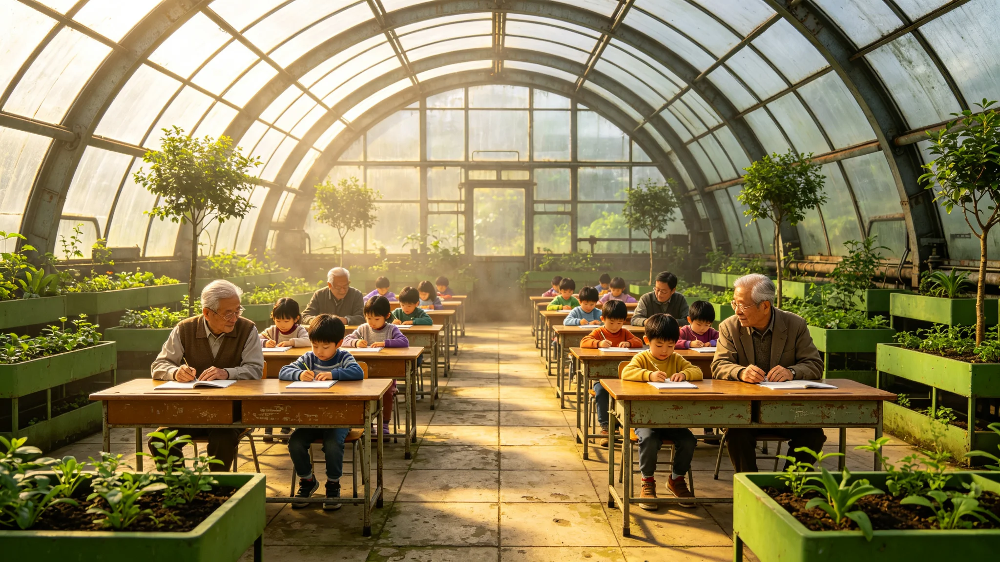

# 代际文化断层弥合与祖孙共修制度修订公报

**发布机构**：三恒星系文明联合体社会与家庭委员会
**发布日期**：3522年5月18日
**文件等级**：跨星系公开

## 一、修订背景

传灯节代际交接仪式（见GS-3364-01）与归航节老地球遥祭（见GS-3395-01）施行多年，主要面向有老人在世的家庭。但三系合籍后（见GS-3502-01），一批纯本土出生、从未踏足老地球方向的青少年与祖辈之间出现文化断层：祖辈记得地球，孙辈只在档案里见过地球。社会与家庭委员会修订代际断层弥合制度，将"祖孙共修"由倡议改为制度。

## 二、修订要点

**（一）祖孙对结对**

每一名十四至十六岁青少年，由社区匹配一名六十岁以上、文化背景不同的祖辈公民，结为"祖孙对"。结对按文化背景差异配对：地球出身的祖辈配纯本土出生的孙辈，比邻星出身的祖辈配鲸鱼座τ星出身的孙辈。

**（二）共修内容**

祖孙对每季度共修一次，内容包括：共阅一件初代档案、共听一段口述史、共做一道祖辈家乡菜、共访一处文化遗址。共修不考试、不打分、不评比。

**（三）不强制**

祖孙对为自愿参加，社区只撮合、不强制。委员会注明：断层不能靠法令弥合，只能靠人坐下来聊。法令能做的，是把椅子摆好。

## 三、与既有制度衔接

| 制度 | 衔接 |
|---|---|
| 传灯节（GS-3364） | 祖孙对在传灯节举行结对与结业仪式（见GS-3528-01） |
| 抚养共同体（GS-3382） | 祖孙对不替代法定抚养，仅文化共修 |
| 归航节（GS-3395） | 祖辈可在共修中向孙辈讲述归航节由来 |
| 口述史捐献（GS-3536） | 祖辈共修讲述可志愿捐献为口述条目 |

## 四、首年数据

| 指标 | 数值 |
|---|---|
| 结对数 | 41.2万 |
| 完成首年共修率 | 88.3% |
| 孙辈问卷"愿意再修" | 81.6% |
| 祖辈问卷"被听懂了" | 76.4% |
| 共修中发生代际争论 | 1.1万次（均为正常讨论，见GS-3527-01） |

## 五、典型争议

3527年曾发生一起青少年在共修中拒认"老地球叙事"的公开讨论事件（见GS-3527-01）。委员会认为这不是共修失败，而是共修起效——孙辈开始提问了。

## 六、委员会注明

## 七、共修内容不考核

共修不考试、不打分、不评优。委员会注明：一旦考核，祖孙就成了师生，共修就成了上课。上课没人爱听。不考，他们才愿意坐。

## 八、传译人的角色

卡壳时由传译人（见GS-3526-01）居中传话，不传结论。委员会注明：传译人是翻译，不是裁判。两边都急了，他把两边的话各重复一遍，火就小了。

## 十一、共修结对数

| 年度 | 结对数 | 完成率 |
|---|---|---|
| 3518 | 1.2万 | 78% |
| 3520 | 1.8万 | 83% |
| 3522 | 2.3万 | 86% |

委员会注明：结对越来越多，完成率也在涨。不是祖孙变亲近了，是越来越多的人愿意坐下来试一次。试一次，就有一次的收获。

## 十二、不考核不评优

共修不打分、不排名。委员会注明：一旦考核，祖孙就成了师生。师生没人爱当。不考，他们才愿意来。

## 十三、委员会注明

自愿参加，不强制，不与公民待遇挂钩。委员会注明：来共修的人，是想来的；不来的，也不扣他什么。强迫来的共修，修不出东西。

五百年了，祖辈记着海，孙辈没见过海。我们不逼孙辈爱海，我们只是把祖辈和孙辈按在一张桌子上，让海被讲一遍。讲不讲得通，随他们。但至少桌子摆过。下一年，继续摆桌子。

## 十四、制度的边界
委员会在公报末尾说明：共修是制度，但制度只管摆桌子，不管聊什么。委员会注明：我们不规定祖孙俩必须聊什么、必须达成什么共识。聊崩了也是共修。制度把门打开，进不进、聊不聊，随他们。

## 十五、共修的桌子
委员会在公报附记中说明，共修园的桌子是圆的，不设主位。委员会注明：祖辈和孙辈围着圆桌坐，没有谁在上首。圆桌不是讲究平等，是讲不了大道理的人，至少讲不了座次。圆桌摆着，火就小一半。

## 十六、共修的桌布
委员会在公报附记中说明，共修桌不铺桌布，只放一只陶碗。委员会注明：铺桌布显得正式，陶碗显得家常。祖辈和孙辈围着圆桌，中间一只碗，比一摞文件自在。

## 十七、共修的自愿
委员会在公报附记中说明，共修自愿参加，不与公民待遇挂钩。委员会注明：来共修的人，是想来的；不来的，不扣他什么。强迫来的共修，修不出东西。

## 十八、桌子的圆
委员会在公报附记中说明，共修桌是圆的，直径两米，坐八人。委员会注明：八个人围着圆桌，谁也不在上首。祖辈和孙辈，隔桌相望。

## 十九、共修的桌
委员会在公报附记中说明，圆桌直径两米，坐八人。委员会注明：八个人围着，谁也不在上首。

## 二十、共修的自愿
委员会在公报附记中说明，共修自愿参加，不与公民待遇挂钩。委员会注明：来的是想来的，不来的不扣什么。

## 二十一、共修的桌
委员会在公报附记中说明，圆桌直径两米，坐八人。委员会注明：八个人围着，谁也不在上首。祖辈和孙辈，隔桌相望。

## 二十二、共修的自愿
委员会在公报附记中说明，共修自愿参加，不与公民待遇挂钩。委员会注明：来的是想来的，不来的不扣什么。

---

**归档编号**：GEN-BRD-3522-014
**编制**：联合体社会与家庭委员会
**日期**：3522年5月18日
