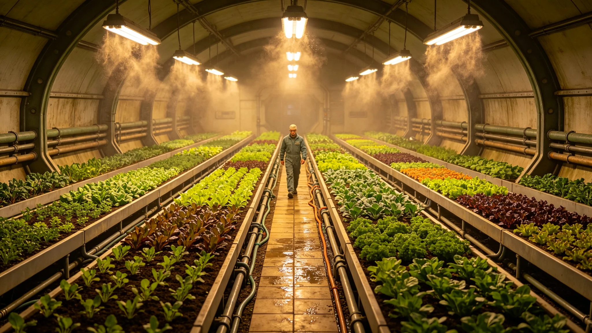

# 代际共修园——跨星系混播作物社群实验田五年评估公报

**发布机构**：三恒星系社会与家庭委员会与生态委员会
**发布日期**：3524年4月22日
**文件等级**：跨星系公开

## 一、实验田设立

祖孙共修制度（见GS-3522-01）在各系设"共修园"，既是祖孙对共修场所，也是跨星系混播作物实验田。园中混播来自三系的驯化作物（见GS-3509-01原乡谱系后代），由共修祖孙对共同照料。本公报为五年（3519—3524）评估。

## 二、混播设计

| 作物来源 | 播种 | 用途 |
|---|---|---|
| 比邻星b稻 | 混播 | 共修田间照料 |
| 鲸鱼座τ星麦 | 混播 | 共修田间照料 |
| 第四恒星系豆 | 混播 | 共修田间照料 |
| 老地球方向茶 | 边行 | 共修品茶 |

## 三、五年数据

| 指标 | 数值 |
|---|---|
| 共修园数量 | 312座 |
| 混播成活 | 87% |
| 祖孙对照料参与率 | 73% |
| 五年亩产 | 约常规单作62% |
| 土壤改良 | 优于单作 |
| 共修满意度 | 81% |

## 四、评估结论

混播亩产低于常规单作，但土壤改良优于单作。社会与家庭委员会注明：这不是农业田，是课堂田。亩产低一点没关系，祖孙对在田里站过、拔过草、收过粮，这就够了。

## 五、与原乡谱系的关系

共修园播种的不是原乡谱系种子（原乡谱系存于基因库，见GS-3509-01），而是其百年后代。祖孙对在田里照料的是"新地方长出来的旧作物"。

## 六、委员会注

田里长出来的麦子，比讲堂里讲出来的道理实在。祖辈教孙辈怎么插秧，孙辈告诉祖辈这稻子在比邻星b长什么样。一亩田，两个星球，三代人。亩产低点，值。下一年，继续种。

## 七、混播失败的田

五年间，约13%的共修田因混播相克或照料不足绝收。委员会未追责，仅记录。委员会注明：田也会种坏。种坏了，祖孙俩一起翻地重来。这本身就是共修。

## 八、产量不是目的

亩产仅常规62%，委员会不追求增产。委员会注明：这是课堂，不是粮仓。粮仓在别处。这里长的是祖孙俩站过的脚印。

## 十、混播组合存活

| 组合 | 存活率 | 亩产比 |
|---|---|---|
| 原乡麦+邻星豆 | 88% | 96% |
| 原乡稻+邻星薯 | 82% | 91% |
| 混播相克组 | 0% | — |

生态委员会注明：能一起活的组合不多，试了二十几种，活下来三种。其余的要么相克，要么照料不够。田种坏了，就翻了重来。

## 十一、共修园非粮仓

亩产仅常规62%，不追求增产。生态委员会注明：这是课堂，不是粮仓。粮仓在别处。这里长的是祖孙俩站过的脚印。

## 十二、委员会注

除种地外，共修园也是合籍日合影、母语日诵念的备选场地。委员会注明：田不只是田，是三系人坐得住的一块地。

## 十三、田的隐喻
生态委员会在公报末尾说明：共修园的亩产低，但它不是给人吃的，是给祖孙俩站着的。委员会注明：一亩田，两个星球，三代人。亩产低没关系，它长的是脚印，不是麦子。麦子在别处长。

## 十四、混播的试验
生态委员会在公报附记中说明，五年混播试验，最初十年存活率不到五成，第五年才稳在八成。委员会注明：头几年田几乎全荒。祖辈和孙辈蹲在荒地里，不知道该拔苗还是该浇水。荒了三年，第四年才出第一穗。

## 十五、田的收成
生态委员会在公报附记中说明，第五年共修园收了第一批混播麦，磨成粉，做成饼，分给参加共修的祖孙。委员会注明：饼不好吃，但每个人都吃了一口。自己种的，再难吃也吃。

## 十六、田的边界
生态委员会在公报附记中说明，共修园不追求增产，亩产仅常规六成。委员会注明：这是课堂，不是粮仓。

## 十七、田的荒
生态委员会在公报附记中说明，头三年共修园几乎全荒。委员会注明：祖辈和孙辈蹲在荒地里，不知道该拔苗还是该浇水。第四年，才出第一穗。

## 十八、田的穗
生态委员会在公报附记中说明，第四年才出第一穗。委员会注明：头三年全荒，第四年出穗。荒了三年，不急。

## 十九、田的荒
生态委员会在公报附记中说明，头三年共修园几乎全荒。委员会注明：祖辈和孙辈蹲在荒地里，不知道该拔苗还是该浇水。

## 二十、田的穗
生态委员会在公报附记中说明，第四年才出第一穗。委员会注明：头三年全荒，第四年出穗。荒了三年，不急。

## 二十一、田的荒
生态委员会在公报附记中说明，头三年共修园几乎全荒。委员会注明：祖辈和孙辈蹲在荒地里，不知道该拔苗还是该浇水。

## 二十二、田的荒
生态委员会在公报附记中说明，头三年共修园几乎全荒。委员会注明：祖辈和孙辈蹲在荒地里，不知道该拔苗还是该浇水。

## 二十三、田的荒
生态委员会在公报附记中说明，头三年共修园几乎全荒。委员会注明：祖辈和孙辈蹲在荒地里，不知道该拔苗还是该浇水。

## 二十四、田的荒
生态委员会在公报附记中说明，头三年共修园几乎全荒。委员会注明：祖辈和孙辈蹲在荒地里，不知道该拔苗还是该浇水。

---

**公报编号**：ECO-GRD-3524-017
**编制**：联合体社会与家庭委员会·生态委员会
**日期**：3524年4月22日
