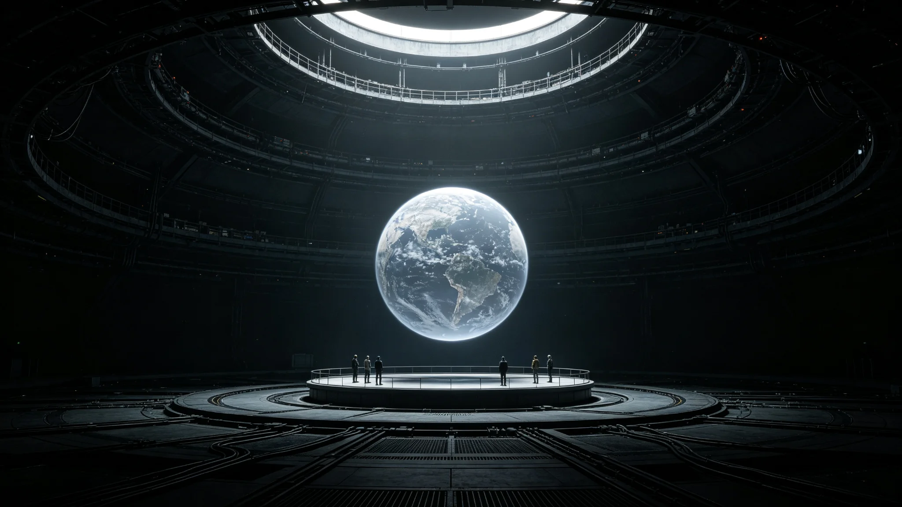

# 代际文化断层弥合"记忆桥"全息回放装置技术规范报告

**编制单位**：三恒星系文明记忆工程技术组
**报告日期**：3525年12月8日
**文件等级**：跨星系公开

## 一、技术目的

祖孙共修（见GS-3522-01）中，纯本土出生孙辈常对祖辈口述的"老地球景象"缺乏直观感受。技术组开发"记忆桥"全息回放装置，将口述史库（见GS-3536-01）中的原音与史料影像合成回放，供祖孙共修时共看。

## 二、装置构成

| 模块 | 功能 |
|---|---|
| 回放舱 | 加压密闭，可容祖孙二人对坐 |
| 全息投影 | 半透明影像，不遮真人 |
| 原音播放 | 第四代保真（见GS-3511-01） |
| 交互 | 孙辈可暂停、追问，不与祖辈抢话 |

## 三、技术原则

技术组特别强调三条：

1. **影像不盖过真人**：全息影像透明度设为60%，祖孙二人始终可见；
2. **原音不替换真人**：装置只回放老人当年的录音，不替老人说话；
3. **不美化**：老地球影像按史料还原，不调色、不滤镜、不做成风景片。

技术组注明：这装置不是让孙辈"看电影"，是让他看见祖辈当年看见的东西。电影是别人演的，记忆是真的。

## 四、使用场景

祖孙对共修时，祖辈讲述一段老地球经历，孙辈可请装置调出同期影像共看。装置不自动播放，由孙辈发起。

## 五、性能

| 指标 | 数值 |
|---|---|
| 回放影像分辨率 | 4K半透明 |
| 原音保真 | 第四代 |
| 单次回放时长 | 不限 |
| 延迟 | 本地<0.1秒 |

## 六、与去伪存真的关系

回放影像若与口述有出入，装置自动提示"此处与封存史料有出入，详见去伪标注"（见GS-3534-01），不强行统一。

## 七、技术组注

我们造这台机器，不是为了让孙辈爱地球，是为了让他看见祖辈说的那个地球长什么样。看见，是认不认的前提。下一批祖孙对，配上这台机器。技术到此，桥搭好了，走不走随他们。

## 八、不做沉浸式

装置不做全包围沉浸式，只做半透明投影。技术组注明：全包围了，祖孙俩就看不见对方了。我们要的是祖孙共看，不是孙辈独自看电影。

## 九、影像可暂停可追问

孙辈可随时暂停、追问，但追问由祖辈回答，不由装置配音。技术组注明：机器只放影像，解释权在祖辈。别让机器替老人说话。

## 十一、影像库

| 层 | 内容 | 时长占比 |
|---|---|---|
| 原乡影像 | 老地球海、日出 | 34% |
| 初代航行 | 启程、舱内 | 28% |
| 定居后 | 建城、耕作 | 38% |

技术组注明：影像只放三段，不剪辑成"宣传片"。放老地球的海，也放建城后的灰地。真实的祖辈，不是只看过海。

## 十二、不做沉浸式

半透明投影，不全包围。技术组注明：全包围了，祖孙俩就看不见对方了。我们要的是祖孙共看，不是孙辈独自看电影。

## 十三、技术组注

装置任何故障，当场停机，不勉强继续。技术组注明：桥塌了，就别走了。祖孙俩面对面聊，比机器坏着强。

## 十四、装置的边界
技术组在报告末尾说明：记忆桥只回放影像，不替祖辈解释。技术组注明：机器放完，解释权在祖辈。别让机器替老人说话。祖孙俩看完影像，愿意聊，就聊；不愿意，就散。装置只是桥，不是师。

## 十五、影像的选择
技术组在报告附记中说明，记忆桥的影像库不选最美的镜头，选最普通的。技术组注明：我们不放老地球最蓝的海，放地下城最灰的走廊；不放启程时的欢呼，放舱里洗碗的日常。普通的画面，才接得住普通人的一生。

## 十六、装置的退役
技术组在报告附记中说明，记忆桥装置设计寿命二十年，到期不升级，整体更换。技术组注明：装置是工具，不是文物。坏了就换，不情怀。影像库不变，换台机器放而已。

## 十七、影像的暂停
技术组在报告附记中说明，孙辈可随时暂停影像、追问，但追问由祖辈回答。技术组注明：机器只放影像，解释权在祖辈。

## 十八、影像的旧
技术组在报告附记中说明，影像库全部用原始素片，不调色、不修复。技术组注明：老地球的海本来就有点灰。调成蔚蓝色，就是假海。

## 十九、影像的灰
技术组在报告附记中说明，影像全部用原始素片，不调色。技术组注明：老地球的海本来就有点灰。

## 二十、影像的暂停
技术组在报告附记中说明，孙辈可随时暂停、追问，但追问由祖辈回答。技术组注明：机器只放影像，解释权在祖辈。

## 二十一、影像的灰
技术组在报告附记中说明，影像全部用原始素片，不调色。技术组注明：老地球的海本来就有点灰。调成蔚蓝，就是假海。

## 二十二、影像的暂停
技术组在报告附记中说明，孙辈可随时暂停、追问，但追问由祖辈回答。技术组注明：机器只放影像，解释权在祖辈。

## 二十三、影像的灰
技术组在报告附记中说明，影像全部用原始素片，不调色。技术组注明：老地球的海本来就有点灰。调成蔚蓝，就是假海。

## 二十四、影像的灰
技术组在报告附记中说明，影像全部用原始素片，不调色。技术组注明：老地球的海本来就有点灰。调成蔚蓝，就是假海。

---

**报告编号**：ENG-MBR-3525-024
**编制**：联合体文明记忆工程技术组
**日期**：3525年12月8日
